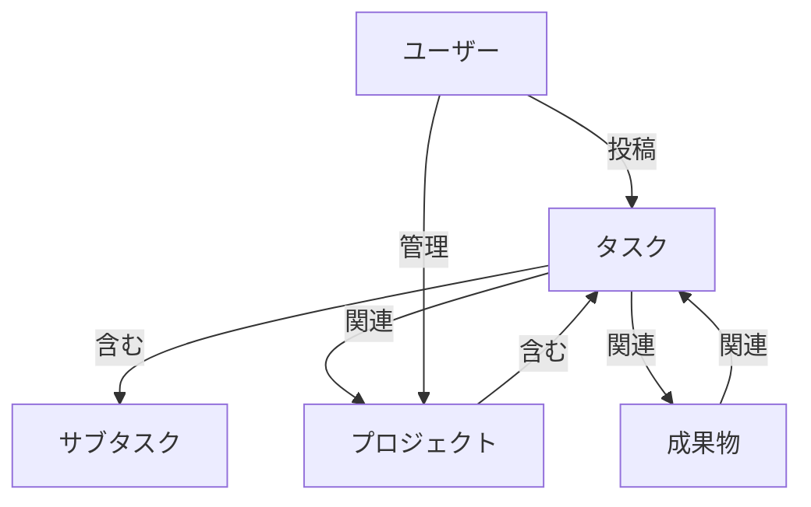
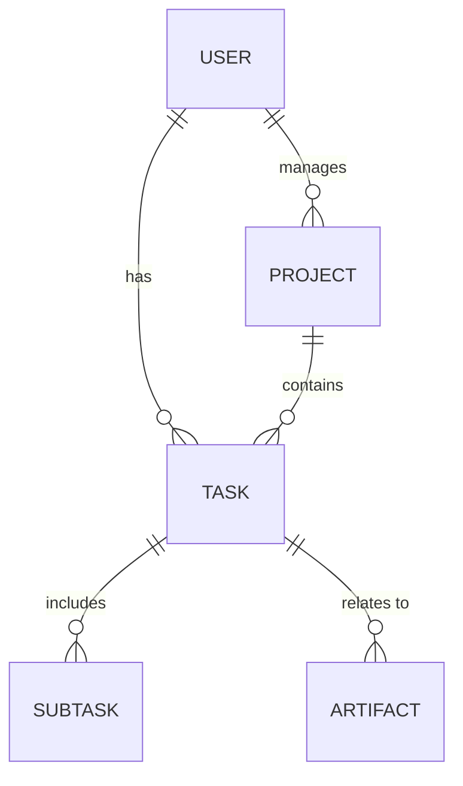
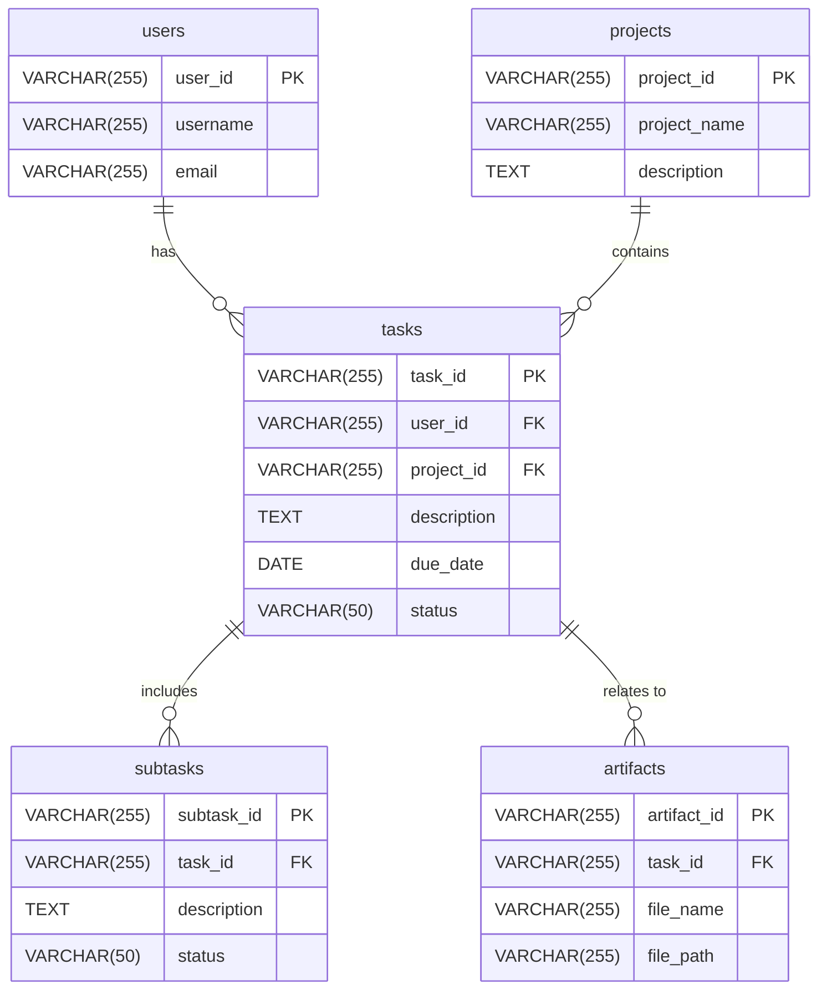
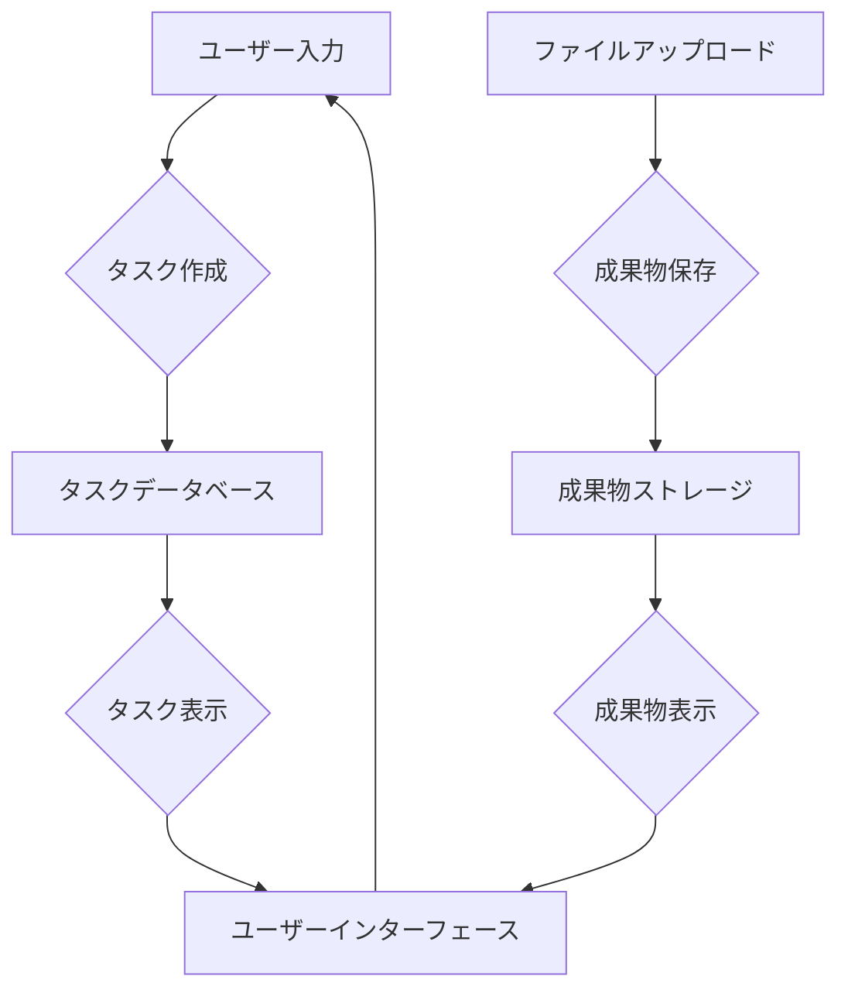

# データモデル定義書

## ID

DMD-2025-001

## 1. はじめに (Introduction)

### 目的 (Purpose)

このデータモデル定義書は、プロジェクト「tas9s10ream」におけるデータ構造の全体像を明確にし、データベース設計およびAPI設計の基礎を提供することを目的とします。関係者間でデータ構造に関する共通認識を形成し、一貫性のあるデータ管理を実現します。

### 対象読者 (Intended Audience)

本ドキュメントの対象読者は、開発者、データベース管理者、ビジネスアナリスト、テスター、およびデータ構造に関心のあるすべてのプロジェクト関係者です。

### ドキュメントの構成 (Document Conventions)

本ドキュメントでは、Markdown記法を使用し、Mermaid記法によるダイアグラムを多用します。用語、略語については、プロジェクトの用語集 (`docs/glossary.md`) を参照してください。

### 参照ドキュメント (References)

- 要件定義書: `docs/requirements/requirements-definition.md`
- 用語集: `docs/glossary.md`

## 2. 概念データモデル (Conceptual Data Model)

システムが扱う主要なビジネス概念と、それらの間の高レベルな関係性を記述します。技術的な詳細には踏み込まず、ビジネスの視点からデータを表現します。

### 2.1. 主要エンティティ (Key Entities)

- **ユーザー**: システムを利用する個人。
- **タスク**: ユーザーが実行すべき作業単位。
- **サブタスク**: タスクを構成するより小さな作業単位。
- **プロジェクト**: 関連するタスクの集合。
- **成果物**: タスクやプロジェクトに関連するファイルやドキュメント。

## 3. 論理データモデル (Logical Data Model)

概念データモデルを基に、具体的なデータ構造と関係性を論理的な視点から詳細に記述します。特定のデータベースシステムに依存しない形で、エンティティ、属性、リレーションシップ、データ型、制約などを定義します。

### 3.1. エンティティ定義 (Entity Definitions)

<!-- 各エンティティの詳細を記述します。
     ※詳細は `entities/` ディレクトリ内の各エンティティファイルを参照し、以下にエンティティをリストしてください。 -->

- [ENT-2025-001 (User)](entities/user.md)
- [ENT-2025-002 (Task)](entities/task.md)
- [ENT-2025-003 (Subtask)](entities/subtask.md)
- [ENT-2025-004 (Project)](entities/project.md)
- [ENT-2025-005 (Artifact)](entities/artifact.md)

### 3.2. リレーションシップ定義 (Relationship Definitions)

- **ユーザー - タスク**: ユーザーは複数のタスクを投稿できる (1対多)。
- **タスク - サブタスク**: タスクは複数のサブタスクを含むことができる (1対多)。
- **プロジェクト - タスク**: プロジェクトは複数のタスクを含むことができる (1対多)。
- **タスク - 成果物**: タスクは複数の成果物に関連付けることができる (1対多)。
- **ユーザー - プロジェクト**: ユーザーは複数のプロジェクトを管理できる (1対多)。

## 4. 物理データモデル (Physical Data Model)

論理データモデルを基に、特定のデータベースシステムに合わせた物理的なデータ構造を記述します。テーブル、カラム、データ型、インデックス、制約、パーティショニングなどの詳細を定義します。

### 4.1. テーブル定義 (Table Definitions)

- **users テーブル**
  - `user_id`: VARCHAR(255), PK, ユーザーの一意の識別子
  - `username`: VARCHAR(255), ユーザー名
  - `email`: VARCHAR(255), ユーザーのメールアドレス
- **tasks テーブル**
  - `task_id`: VARCHAR(255), PK, タスクの一意の識別子
  - `user_id`: VARCHAR(255), FK, ユーザーID (users.user_id を参照)
  - `project_id`: VARCHAR(255), FK, プロジェクトID (projects.project_id を参照)
  - `description`: TEXT, タスクの内容
  - `due_date`: DATE, 期限日
  - `status`: VARCHAR(50), タスクのステータス (例: '未着手', '進行中', '完了')
- **subtasks テーブル**
  - `subtask_id`: VARCHAR(255), PK, サブタスクの一意の識別子
  - `task_id`: VARCHAR(255), FK, 親タスクのID (tasks.task_id を参照)
  - `description`: TEXT, サブタスクの内容
  - `status`: VARCHAR(50), サブタスクのステータス
- **projects テーブル**
  - `project_id`: VARCHAR(255), PK, プロジェクトの一意の識別子
  - `project_name`: VARCHAR(255), プロジェクト名
  - `description`: TEXT, プロジェクトの説明
- **artifacts テーブル**
  - `artifact_id`: VARCHAR(255), PK, 成果物の一意の識別子
  - `task_id`: VARCHAR(255), FK, 関連するタスクのID (tasks.task_id を参照)
  - `file_name`: VARCHAR(255), ファイル名
  - `file_path`: VARCHAR(255), ファイルパス

## 5. データ辞書 (Data Dictionary)

システム内で使用されるすべてのデータ要素の定義を記述します。

- **user_id**:
  VARCHAR(255), ユーザーの一意の識別子。システム内でユーザーを特定するために使用される。
- **username**: VARCHAR(255), ユーザーがシステムに表示される名前。
- **email**:
  VARCHAR(255), ユーザーの連絡先メールアドレス。ログインにも使用される。
- **task_id**: VARCHAR(255), タスクの一意の識別子。タスク管理の基本単位。
- **description**: TEXT, タスクやプロジェクト、成果物の詳細な内容を記述する。
- **due_date**: DATE, タスクの完了期限。カレンダー表示やリマインダー機能に利用。
- **status**: VARCHAR(50), タスクやサブタスクの現在の状態。例: '未着手',
  '進行中', '完了', '保留'。
- **project_id**:
  VARCHAR(255), プロジェクトの一意の識別子。関連するタスクをグループ化する。
- **artifact_id**:
  VARCHAR(255), 成果物の一意の識別子。ファイルやドキュメントを管理する。
- **file_name**: VARCHAR(255), 成果物のファイル名。
- **file_path**: VARCHAR(255), ファイルパス

## 6. データフロー (Data Flow)

システム内でのデータの流れを記述します。データの生成、変換、保存、利用のプロセスを明確にします。

## 7. データ移行要件 (Data Migration Requirements)

既存システムからのデータ移行が必要な場合の要件を記述します。

- **移行対象データ**: 既存のタスク管理システムから、ユーザー情報、タスク、プロジェクト、および関連する成果物データを移行する。
- **移行方法**: 既存システムからCSV形式でデータをエクスポートし、新システムでインポートするバッチ処理を開発する。
- **移行スケジュール**: システムリリース前の1週間でデータ移行を完了させる。
- **データ変換ルール**: 既存システムのステータス値を新システムのステータス値にマッピングする。日付形式をYYYY-MM-DDに統一する。
- **移行時の検証方法**: 移行後のデータ件数と主要なデータの整合性を確認するSQLクエリを実行し、ランダムサンプリングでデータ内容を目視確認する。

## 8. データセキュリティ要件 (Data Security Requirements)

データの機密性、完全性、可用性に関する要件を記述します。

- **アクセス制御**: ユーザーの役割に基づいたアクセス制御を実装し、不適切なデータアクセスを防止する。
- **暗号化**: データベースに保存される機密性の高いデータ（例: パスワード）は、ハッシュ化または暗号化して保存する。通信経路はHTTPSで暗号化する。
- **バックアップとリカバリ**: 毎日自動でデータベースのフルバックアップを取得し、オフサイトに保存する。障害発生時には24時間以内にデータを復旧できる体制を確立する。
- **監査ログ**: 重要なデータ操作（作成、更新、削除、アクセス）については、操作日時、操作ユーザー、操作内容を監査ログとして記録し、不正アクセスやデータ改ざんの追跡を可能にする。

## 9. 備考 (Notes)

- 今後の機能拡張として、タスク間の依存関係管理機能の追加を検討する。
- 大規模データに対応するため、データベースのシャーディングやレプリケーションの導入を将来的に検討する。
