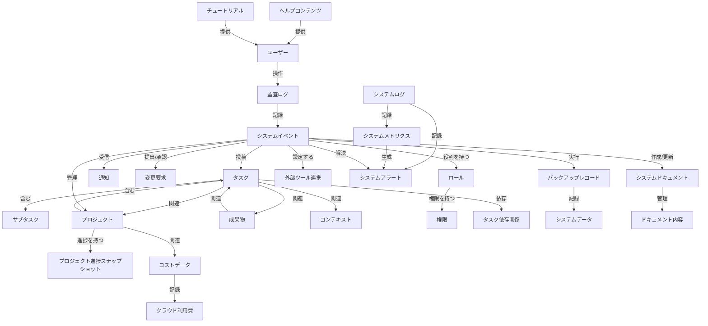
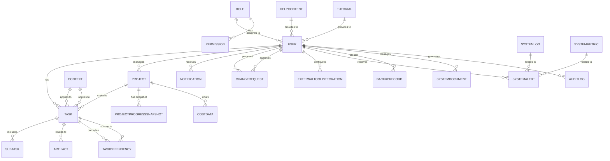
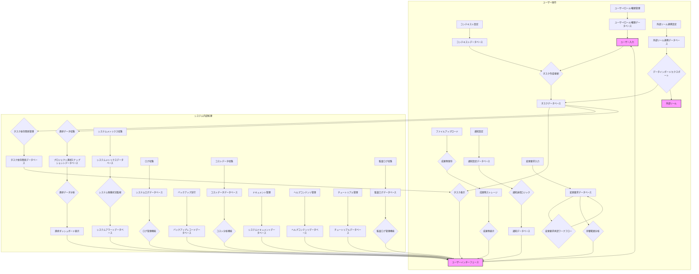

# データモデル定義書

## ID

DMD-2025-001

## 1. はじめに (Introduction)

### 目的 (Purpose)

このデータモデル定義書は、プロジェクト「tas9s10ream」におけるデータ構造の全体像を明確にし、データベース設計およびAPI設計の基礎を提供することを目的とします。関係者間でデータ構造に関する共通認識を形成し、一貫性のあるデータ管理を実現します。

### 対象読者 (Intended Audience)

本ドキュメントの対象読者は、開発者、データベース管理者、ビジネスアナリスト、テスター、およびデータ構造に関心のあるすべてのプロジェクト関係者です。

### ドキュメントの構成 (Document Conventions)

本ドキュメントでは、Markdown記法を使用し、Mermaid記法によるダイアグラムを多用します。用語、略語については、プロジェクトの用語集 (`../../standards-and-templates/glossary.md`) を参照してください。

### 参照ドキュメント (References)

- 要件定義書: `../../deliverables/requirements/requirements-definition.md`
- 用語集: `../../standards-and-templates/glossary.md`

## 2. 概念データモデル (Conceptual Data Model)

システムが扱う主要なビジネス概念と、それらの間の高レベルな関係性を記述します。技術的な詳細には踏み込まず、ビジネスの視点からデータを表現します。

### 2.1. 主要エンティティ (Key Entities)

- **ユーザー**: システムを利用する個人。
- **タスク**: ユーザーが実行すべき作業単位。
- **サブタスク**: タスクを構成するより小さな作業単位。
- **プロジェクト**: 関連するタスクの集合。
- **成果物**: タスクやプロジェクトに関連するファイルやドキュメント。
- **コンテキスト**: タスクを実行する際の状況や環境。
- **通知**: システムからの通知履歴や詳細。
- **変更要求**: プロジェクトに対する要求変更。
- **ロール**: ユーザーの役割。
- **権限**: 各ロールに紐付けられる機能へのアクセス権限。
- **タスク依存関係**: タスク間の依存関係のタイプや詳細。
- **プロジェクト進捗スナップショット**: 特定時点のプロジェクト進捗に関する詳細データ。
- **外部ツール連携**: 外部ツールとの連携設定。

## 3. 論理データモデル (Logical Data Model)

概念データモデルを基に、具体的なデータ構造と関係性を論理的な視点から詳細に記述します。特定のデータベースシステムに依存しない形で、エンティティ、属性、リレーションシップ、データ型、制約などを定義します。

### 3.1. エンティティ定義 (Entity Definitions)

- [ENT-2025-001 (User)](entities/user.md)
- [ENT-2025-002 (Task)](entities/task.md)
- [ENT-2025-003 (Subtask)](entities/subtask.md)
- [ENT-2025-004 (Project)](entities/project.md)
- [ENT-2025-005 (Artifact)](entities/artifact.md)
- [ENT-2025-006 (Context)](entities/context.md)
- [ENT-2025-007 (Notification)](entities/notification.md)
- [ENT-2025-008 (ChangeRequest)](entities/change-request.md)
- [ENT-2025-009 (Role)](entities/role.md)
- [ENT-2025-010 (Permission)](entities/permission.md)
- [ENT-2025-011 (TaskDependency)](entities/task-dependency.md)
- [ENT-2025-012 (ProjectProgressSnapshot)](entities/project-progress-snapshot.md)
- [ENT-2025-013 (ExternalToolIntegration)](entities/external-tool-integration.md)
- [ENT-2025-014 (SystemLog)](entities/system-log.md)
- [ENT-2025-015 (SystemMetric)](entities/system-metric.md)
- [ENT-2025-016 (SystemAlert)](entities/system-alert.md)
- [ENT-2025-017 (BackupRecord)](entities/backup-record.md)
- [ENT-2025-018 (CostData)](entities/cost-data.md)
- [ENT-2025-019 (SystemDocument)](entities/system-document.md)
- [ENT-2025-020 (HelpContent)](entities/help-content.md)
- [ENT-2025-021 (Tutorial)](entities/tutorial.md)
- [ENT-2025-022 (AuditLog)](entities/audit-log.md)

### 3.2. リレーションシップ定義 (Relationship Definitions)

- **ユーザー - タスク**: ユーザーは複数のタスクを投稿できる (1対多)。
- **タスク - サブタスク**: タスクは複数のサブタスクを含むことができる (1対多)。
- **プロジェクト - タスク**: プロジェクトは複数のタスクを含むことができる (1対多)。
- **タスク - 成果物**: タスクは複数の成果物に関連付けることができる (1対多)。
- **ユーザー - プロジェクト**: ユーザーは複数のプロジェクトを管理できる (1対多)。
- **コンテキスト - タスク**: コンテキストは複数のタスクに適用される (1対多)。
- **ユーザー - 通知**: ユーザーは複数の通知を受信する (1対多)。
- **ユーザー - 変更要求 (提案者)**: ユーザーは複数の変更要求を提案できる (1対多)。
- **ユーザー - 変更要求 (承認者)**: ユーザーは複数の変更要求を承認できる (1対多)。
- **ロール - ユーザー**: ロールは複数のユーザーに割り当てられる (1対多)。
- **ロール - 権限**: ロールは複数の権限を持つ (1対多)。
- **タスク - タスク依存関係 (先行)**: タスクは複数のタスク依存関係の先行タスクとなる (1対多)。
- **タスク - タスク依存関係 (後続)**: タスクは複数のタスク依存関係の後続タスクとなる (1対多)。
- **プロジェクト - プロジェクト進捗スナップショット**: プロジェクトは複数の進捗スナップショットを持つ (1対多)。
- **ユーザー - 外部ツール連携**: ユーザーは複数の外部ツール連携を設定できる (1対多)。

## 4. 物理データモデル (Physical Data Model)

論理データモデルを基に、特定のデータベースシステムに合わせた物理的なデータ構造を記述します。テーブル、カラム、データ型、インデックス、制約、パーティショニングなどの詳細を定義します。

```mermaid
erDiagram
    users {
        VARCHAR(255) user_id PK
        VARCHAR(255) username
        VARCHAR(255) email
    }
    tasks {
        VARCHAR(255) task_id PK
        VARCHAR(255) user_id FK
        VARCHAR(255) project_id FK
        VARCHAR(255) context_id FK
        TEXT description
        DATE due_date
        VARCHAR(50) status
    }
    subtasks {
        VARCHAR(255) subtask_id PK
        VARCHAR(255) task_id FK
        TEXT description
        VARCHAR(50) status
    }
    projects {
        VARCHAR(255) project_id PK
        VARCHAR(255) project_name
        TEXT description
    }
    artifacts {
        VARCHAR(255) artifact_id PK
        VARCHAR(255) task_id FK
        VARCHAR(255) file_name
        VARCHAR(255) file_path
    }
    contexts {
        VARCHAR(255) context_id PK
        VARCHAR(100) context_name
        TEXT description
    }
    notifications {
        VARCHAR(255) notification_id PK
        VARCHAR(255) user_id FK
        VARCHAR(50) type
        TEXT message
        VARCHAR(50) status
        DATETIME created_at
        DATETIME read_at
    }
    change_requests {
        VARCHAR(255) change_request_id PK
        VARCHAR(255) title
        TEXT description
        TEXT reason
        VARCHAR(255) proposer_user_id FK
        VARCHAR(50) urgency
        VARCHAR(50) status
        VARCHAR(255) approved_by_user_id FK
        TEXT approval_comment
        DATETIME created_at
        DATETIME updated_at
    }
    roles {
        VARCHAR(255) role_id PK
        VARCHAR(100) role_name
        TEXT description
    }
    permissions {
        VARCHAR(255) permission_id PK
        VARCHAR(100) permission_name
        TEXT description
    }
    task_dependencies {
        VARCHAR(255) dependency_id PK
        VARCHAR(255) predecessor_task_id FK
        VARCHAR(255) successor_task_id FK
        VARCHAR(50) type
    }
    project_progress_snapshots {
        VARCHAR(255) snapshot_id PK
        VARCHAR(255) project_id FK
        DATETIME timestamp
        DECIMAL overall_progress
        INT completed_tasks_count
        INT remaining_tasks_count
        TEXT bottleneck_tasks
        TEXT delay_risk_tasks
        TEXT resource_allocation_data
        TEXT budget_consumption_data
        TEXT plan_deviation_alerts
    }
    external_tool_integrations {
        VARCHAR(255) integration_id PK
        VARCHAR(255) user_id FK
        VARCHAR(100) tool_name
        TEXT auth_info
        VARCHAR(50) sync_direction
        VARCHAR(50) sync_frequency
        TEXT data_mapping_rules
        DATETIME last_sync_at
    }
    system_logs {
        VARCHAR(255) log_id PK
        DATETIME timestamp
        VARCHAR(50) level
        VARCHAR(100) source
        TEXT message
        VARCHAR(255) user_id FK
        VARCHAR(255) request_id
        VARCHAR(50) ip_address
        TEXT details
    }
    system_metrics {
        VARCHAR(255) metric_id PK
        DATETIME timestamp
        VARCHAR(100) name
        FLOAT value
        VARCHAR(50) unit
        VARCHAR(255) resource_id
    }
    system_alerts {
        VARCHAR(255) alert_id PK
        DATETIME timestamp
        VARCHAR(100) type
        TEXT message
        VARCHAR(50) severity
        VARCHAR(50) status
        VARCHAR(255) related_log_id FK
        VARCHAR(255) related_metric_id FK
        DATETIME resolved_at
        VARCHAR(255) resolved_by FK
    }
    backup_records {
        VARCHAR(255) backup_id PK
        DATETIME backup_time
        VARCHAR(50) status
        VARCHAR(50) type
        TEXT location
        BIGINT size_bytes
        VARCHAR(255) created_by FK
        TEXT error_message
    }
    cost_data {
        VARCHAR(255) cost_id PK
        DATE date
        VARCHAR(100) service_name
        DECIMAL amount
        VARCHAR(10) currency
        VARCHAR(255) resource_id
        VARCHAR(255) project_id FK
    }
    system_documents {
        VARCHAR(255) document_id PK
        VARCHAR(255) title
        VARCHAR(50) version
        TEXT content_path
        VARCHAR(50) type
        VARCHAR(50) status
        DATETIME created_at
        DATETIME updated_at
        VARCHAR(255) created_by FK
        VARCHAR(255) updated_by FK
    }
    help_contents {
        VARCHAR(255) help_id PK
        VARCHAR(255) title
        TEXT content
        VARCHAR(100) category
        VARCHAR(255) related_screen_id
        TEXT keywords
        DATETIME created_at
        DATETIME updated_at
    }
    tutorials {
        VARCHAR(255) tutorial_id PK
        VARCHAR(255) title
        TEXT description
        TEXT steps
        VARCHAR(100) type
        DATETIME created_at
        DATETIME updated_at
    }
    audit_logs {
        VARCHAR(255) audit_id PK
        DATETIME timestamp
        VARCHAR(255) user_id FK
        VARCHAR(100) operation_type
        VARCHAR(100) entity_type
        VARCHAR(255) entity_id
        TEXT details
        VARCHAR(50) ip_address
    }

    users ||--o{ tasks : "has"
    tasks ||--o{ subtasks : "includes"
    projects ||--o{ tasks : "contains"
    tasks ||--o{ artifacts : "relates to"
    users ||--o{ projects : "manages"
    contexts ||--o{ tasks : "applies to"
    users ||--o{ notifications : "receives"
    users ||--o{ change_requests : "proposes"
    users ||--o{ change_requests : "approves"
    roles ||--o{ users : "assigned to"
    roles ||--o{ permissions : "has"
    tasks ||--o{ task_dependencies : "precedes"
    tasks ||--o{ task_dependencies : "succeeds"
    projects ||--o{ project_progress_snapshots : "has snapshot"
    users ||--o{ external_tool_integrations : "configures"
    system_logs ||--o{ system_alerts : "related to"
    system_metrics ||--o{ system_alerts : "related to"
    users ||--o{ system_alerts : "resolves"
    users ||--o{ backup_records : "creates"
    projects ||--o{ cost_data : "incurs"
    users ||--o{ system_documents : "manages"
    help_contents ||--o{ users : "provides to"
    tutorials ||--o{ users : "provides to"
    users ||--o{ audit_logs : "generates"
```

### 4.1. テーブル定義 (Table Definitions)

各テーブルの定義は、対応するエンティティ定義ファイルを参照してください。

- [users テーブル](entities/user.md)
- [tasks テーブル](entities/task.md)
- [subtasks テーブル](entities/subtask.md)
- [projects テーブル](entities/project.md)
- [artifacts テーブル](entities/artifact.md)
- [contexts テーブル](entities/context.md)
- [notifications テーブル](entities/notification.md)
- [change_requests テーブル](entities/change-request.md)
- [roles テーブル](entities/role.md)
- [permissions テーブル](entities/permission.md)
- [task_dependencies テーブル](entities/task-dependency.md)
- [project_progress_snapshots テーブル](entities/project-progress-snapshot.md)
- [external_tool_integrations テーブル](entities/external-tool-integration.md)
- [system_logs テーブル](entities/system-log.md)
- [system_metrics テーブル](entities/system-metric.md)
- [system_alerts テーブル](entities/system-alert.md)
- [backup_records テーブル](entities/backup-record.md)
- [cost_data テーブル](entities/cost-data.md)
- [system_documents テーブル](entities/system-document.md)
- [help_contents テーブル](entities/help-content.md)
- [tutorials テーブル](entities/tutorial.md)
- [audit_logs テーブル](entities/audit-log.md)

## 5. データ辞書 (Data Dictionary)

システム内で使用されるすべてのデータ要素の定義は、[データ辞書](data-dictionary.md)を参照してください。

## 6. データフロー (Data Flow)

システム内でのデータの流れを記述します。データの生成、変換、保存、利用のプロセスを明確にします。

## 7. データ移行要件 (Data Migration Requirements)

既存システムからのデータ移行が必要な場合の要件を記述します。

- **移行対象データ**: 既存のタスク管理システムから、ユーザー情報、タスク、プロジェクト、および関連する成果物データを移行する。
- **移行方法**: 既存システムからCSV形式でデータをエクスポートし、新システムでインポートするバッチ処理を開発する。
- **移行スケジュール**: システムリリース前の1週間でデータ移行を完了させる。
- **データ変換ルール**: 既存システムのステータス値を新システムのステータス値にマッピングする。日付形式をYYYY-MM-DDに統一する。
- **移行時の検証方法**: 移行後のデータ件数と主要なデータの整合性を確認するSQLクエリを実行し、ランダムサンプリングでデータ内容を目視確認する。

## 8. データセキュリティ要件 (Data Security Requirements)

データの機密性、完全性、可用性に関する要件を記述します。

- **アクセス制御**: ユーザーの役割に基づいたアクセス制御を実装し、不適切なデータアクセスを防止する。
- **暗号化**: データベースに保存される機密性の高いデータ（例: パスワード）は、ハッシュ化または暗号化して保存する。通信経路はHTTPSで暗号化する。
- **バックアップとリカバリ**: 毎日自動でデータベースのフルバックアップを取得し、オフサイトに保存する。障害発生時には24時間以内にデータを復旧できる体制を確立する。
- **監査ログ**: 重要なデータ操作（作成、更新、削除、アクセス）については、操作日時、操作ユーザー、操作内容を監査ログとして記録し、不正アクセスやデータ改ざんの追跡を可能にする。

## 9. データパフォーマンス要件 (Data Performance Requirements)

システムの応答時間とスループットを最適化するためのデータ設計に関する要件を記述します。

- **インデックス戦略**: 頻繁に検索されるカラムや結合条件に使用されるカラムには、適切なインデックスを定義する。特に、外部キーにはインデックスを付与することを検討する。
- **クエリ最適化**: 複雑なクエリや大量のデータを扱うクエリについては、実行計画を分析し、最適化を行う。必要に応じて、ビューやマテリアライズドビューを活用する。
- **データ構造の検討**: データの読み書きパターンに応じて、非正規化や集約データの利用を検討する。例えば、リアルタイムダッシュボード表示のために、集計結果を別途保存する。
- **キャッシュ戦略**: 頻繁にアクセスされるが更新頻度の低いデータについては、アプリケーションレベルまたはデータベースレベルでのキャッシュを導入し、データベースへの負荷を軽減する。

## 10. データスケーラビリティ要件 (Data Scalability Requirements)

システムがユーザー数やデータ量、トランザクションの増加といった需要の変動に対応できるよう、データ層の拡張性に関する要件を記述します。

- **水平スケーリング**: データベースの負荷分散のため、リードレプリカの導入や、将来的にはシャーディング（データ分割）を検討する。
- **データベーススケーリング**: データベースの垂直スケーリング（リソース増強）だけでなく、水平スケーリング（ノード追加）を容易にする設計とする。
- **キューイング/非同期処理**: 大量のデータ処理や時間のかかる処理（例: レポート生成、データインポート/エクスポート）は、キューイングシステムを介した非同期処理とし、メインシステムの応答性を維持する。
- **マイクロサービス/モジュラーアーキテクチャ**: 各機能が独立してスケールできるよう、疎結合なアーキテクチャを検討する。データモデルも、各サービスが責任を持つデータ範囲を明確にする。

## 11. 備考 (Notes)

- 今後の機能拡張として、タスク間の依存関係管理機能の追加を検討する。
- 大規模データに対応するため、データベースのシャーディングやレプリケーションの導入を将来的に検討する。
