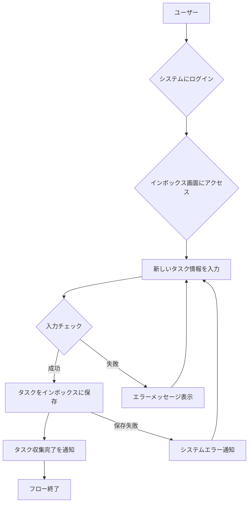

# ID: RDD-BFL-2025-001

# 業務フロー: タスク収集フロー

## 概要

GTDの「収集」フェーズをデジタルで支援するフローです。ユーザーが思いついたタスクや情報をインボックスに迅速に記録します。

### アクター

- [ACT-001 (ITプロジェクトメンバー)](../actors/act-001-it-project-member.md)
- [ACT-002 (ITプロジェクト管理者)](../actors/act-002-it-project-manager.md)

### トリガー

ユーザーが新しいタスクやアイデアを思いついた時、または外部から情報が入力された時。

### フロー

1. ユーザーがシステムにログインする。
1. ユーザーがインボックス画面にアクセスする。
1. ユーザーが新しいタスクのタイトル、詳細、期限などの情報を入力する。
1. システムが入力されたタスクをインボックスに保存する。
1. システムがタスクの収集完了をユーザーに通知する。

タスク収集フローの業務プロセスを示します。

### 例外処理

- 入力情報が不足している場合、システムはエラーメッセージを表示し、再入力を促す。
- システムエラーにより保存に失敗した場合、システムはエラーを通知し、ユーザーは再試行する。

### 関連する機能要件

- [FR-001 (タスク収集機能)](../functional-requirements/fr-001-task-collection-function.md)
- [FR-025 (ユーザー登録機能)](../functional-requirements/fr-025-user-registration-function.md)

### 関連するアクター

- [ACT-001](../actors/act-001-it-project-member.md)
- [ACT-002](../actors/act-002-it-project-manager.md)

### 関連する画面

- [SCR-001 (ログイン画面)](../screens/scr-001-login-screen.md)
- [SCR-002 (インボックス画面)](../screens/scr-002-inbox-screen.md)
