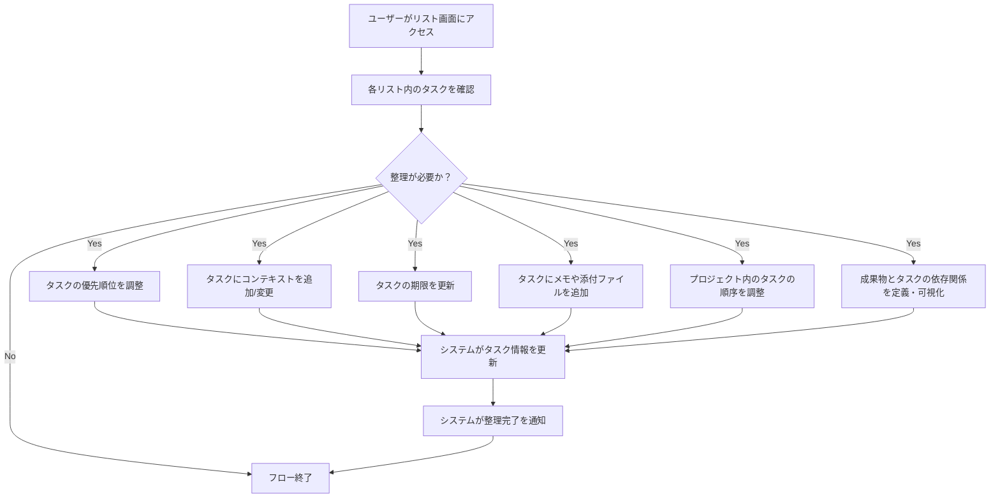

# ID: RDD-BFL-2025-003

# 業務フロー: タスク整理フロー

## 概要

GTDの「整理」フェーズをデジタルで支援するフローです。処理されたタスクを適切なリスト（プロジェクト、次の行動、連絡待ち、いつか/多分）に配置し、関連情報を整理します。

### アクター

- [ACT-001 (ITプロジェクトメンバー)](../actors/act-001-it-project-member.md)
- [ACT-002 (ITプロジェクト管理者)](../actors/act-002-it-project-manager.md)

### トリガー

タスク処理後、または定期的な整理時間になった時。

### フロー

1. ユーザーがプロジェクト一覧画面、次の行動リスト画面、連絡待ちリスト画面、またはいつか/多分リスト画面にアクセスする。
1. ユーザーは各リスト内のタスクを確認し、必要に応じて以下の整理を行う。
   - タスクの優先順位を調整する。
   - タスクにコンテキストを追加または変更する。
   - タスクの期限を更新する。
   - タスクにメモや添付ファイルを追加する。
   - プロジェクト内のタスクの順序を調整する。
   - 成果物とタスクの依存関係を定義・可視化する。
1. システムはユーザーの操作に基づいてタスク情報を更新する。
1. システムは整理完了をユーザーに通知する。

タスク整理フローの業務プロセスを示します。

### 例外処理

- 入力された情報が無効な場合、システムはエラーメッセージを表示する。
- システムエラーにより更新に失敗した場合、システムはエラーを通知し、ユーザーは再試行する。

### 関連する機能要件

- [FR-003 (タスク整理機能)](../functional-requirements/fr-003-task-organization-function.md)
- [FR-006 (プロジェクト管理機能)](../functional-requirements/fr-006-project-management-function.md)
- [FR-007 (コンテキスト管理機能)](../functional-requirements/fr-007-context-management-function.md)
- [FR-011 (成果物依存関係可視化機能)](../functional-requirements/fr-011-artifact-dependency-visualization-function.md)

### 関連するアクター

- [ACT-001](../actors/act-001-it-project-member.md)
- [ACT-002](../actors/act-002-it-project-manager.md)

### 関連する画面

- [SCR-003 (プロジェクト一覧画面)](../screens/scr-003-project-list-screen.md)
- [SCR-004 (次の行動リスト画面)](../screens/scr-004-next-action-list-screen.md)
- [SCR-007 (タスク詳細画面)](../screens/scr-007-task-detail-screen.md)
- [SCR-012 (成果物管理画面)](../screens/scr-012-artifact-management-screen.md)
