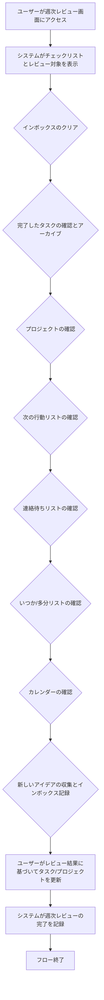

# ID: RDD-BFL-2025-004

# 業務フロー: 週次レビューフロー

## 概要

GTDの「省察」フェーズをデジタルで支援するフローです。週次レビューを通じて、過去のタスク、現在のプロジェクト、今後の計画を見直し、システムを最新の状態に保ちます。

### アクター

- [ACT-001 (ITプロジェクトメンバー)](../actors/act-001-it-project-member.md)
- [ACT-002 (ITプロジェクト管理者)](../actors/act-002-it-project-manager.md)

### トリガー

毎週決まった曜日・時間、またはユーザーが週次レビューを開始する時。

### フロー

1. ユーザーが週次レビュー画面にアクセスする。
1. システムは週次レビューのチェックリストと、レビュー対象となるタスクやプロジェクトを表示する。
1. ユーザーは以下の項目を順にレビューする。
   - インボックスのクリア: 未処理のタスクがないか確認し、処理する。
   - 完了したタスクの確認: 過去1週間に完了したタスクを確認し、アーカイブする。
   - プロジェクトの確認: 各プロジェクトの進捗、次の行動、未解決の問題を確認する。
   - 次の行動リストの確認: 最新の状態か、実行可能かを確認する。
   - 連絡待ちリストの確認: 返信があったか、次のアクションが必要かを確認する。
   - いつか/多分リストの確認: 新しいアイデアやプロジェクトがないか確認する。
   - カレンダーの確認: 今後の予定とタスクの整合性を確認する。
   - 新しいアイデアの収集: レビュー中に思いついたことをインボックスに記録する。
1. ユーザーはレビュー結果に基づいてタスクやプロジェクトの状態を更新する。
1. システムは週次レビューの完了を記録する。

週次レビューフローの業務プロセスを示します。

### 例外処理

- レビュー中にシステムエラーが発生した場合、システムはエラーを通知し、ユーザーは再試行する。

### 関連する機能要件

- [FR-005 (週次レビュー機能)](../functional-requirements/fr-005-weekly-review-function.md)
- [FR-001 (タスク収集機能)](../functional-requirements/fr-001-task-collection-function.md)
- [FR-002 (タスク処理機能)](../functional-requirements/fr-002-task-processing-function.md)
- [FR-003 (タスク整理機能)](../functional-requirements/fr-003-task-organization-function.md)
- [FR-006 (プロジェクト管理機能)](../functional-requirements/fr-006-project-management-function.md)

### 関連するアクター

- [ACT-001](../actors/act-001-it-project-member.md)
- [ACT-002](../actors/act-002-it-project-manager.md)

### 関連する画面

- [SCR-005 (週次レビュー画面)](../screens/scr-005-weekly-review-screen.md)
- [SCR-002 (インボックス画面)](../screens/scr-002-inbox-screen.md)
- [SCR-003 (プロジェクト一覧画面)](../screens/scr-003-project-list-screen.md)
- [SCR-004 (次の行動リスト画面)](../screens/scr-004-next-action-list-screen.md)
