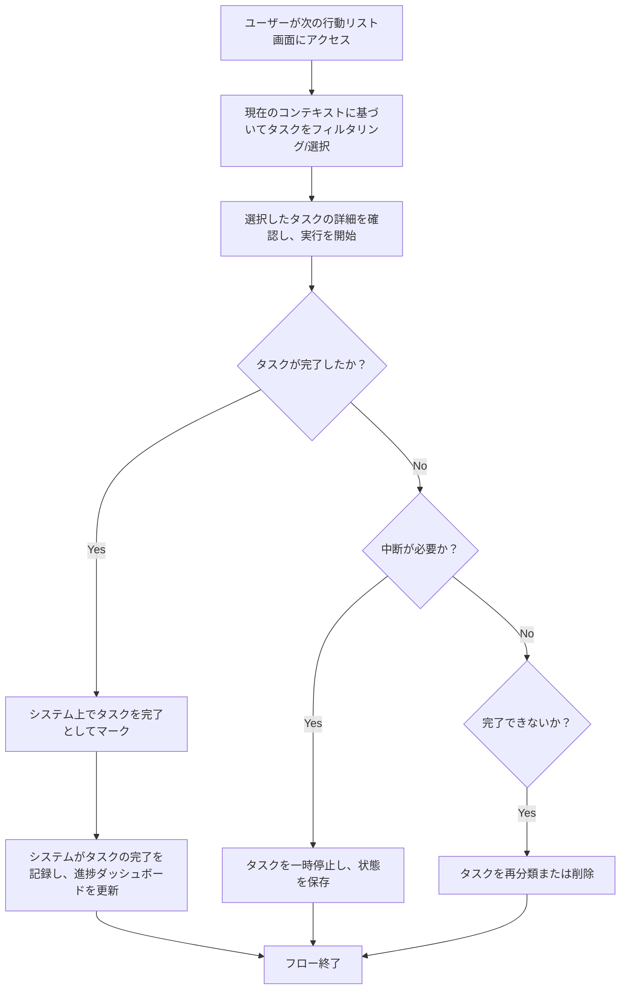

# ID: RDD-BFL-2025-005

# 業務フロー: タスク実行フロー

## 概要

GTDの「実行」フェーズをデジタルで支援するフローです。次の行動リストから、コンテキストや優先順位に基づいてタスクを選択し、実行します。

### アクター

- [ACT-001 (ITプロジェクトメンバー)](../actors/act-001-it-project-member.md)
- [ACT-002 (ITプロジェクト管理者)](../actors/act-002-it-project-manager.md)

### トリガー

ユーザーがタスクを実行しようとする時。

### フロー

1. ユーザーが次の行動リスト画面にアクセスする。
1. ユーザーは現在のコンテキスト（場所、利用可能なツール、エネルギーレベル、時間）に基づいて、実行可能なタスクをフィルタリングまたは選択する。
1. ユーザーは選択したタスクの詳細を確認し、実行を開始する。
1. タスクが完了したら、ユーザーはシステム上でタスクを完了としてマークする。
1. システムはタスクの完了を記録し、関連する進捗ダッシュボードを更新する。

タスク実行フローの業務プロセスを示します。

### 例外処理

- タスクの実行中に中断が必要になった場合、ユーザーはタスクを一時停止し、後で再開できるように状態を保存する。
- タスクが完了できない場合、ユーザーはタスクを再分類するか、削除する。

### 関連する機能要件

- [FR-004 (タスク実行機能)](../functional-requirements/fr-004-task-execution-function.md)
- [FR-007 (コンテキスト管理機能)](../functional-requirements/fr-007-context-management-function.md)
- [FR-016 (進捗ダッシュボード表示機能)](../functional-requirements/fr-016-progress-dashboard-display-function.md)

### 関連するアクター

- [ACT-001](../actors/act-001-it-project-member.md)
- [ACT-002](../actors/act-002-it-project-manager.md)

### 関連する画面

- [SCR-004 (次の行動リスト画面)](../screens/scr-004-next-action-list-screen.md)
- [SCR-007 (タスク詳細画面)](../screens/scr-007-task-detail-screen.md)
