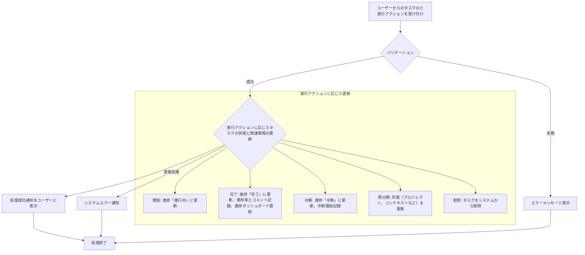

# ID: RDD-FRQ-2025-004

# 機能: タスク実行機能

## 概要

GTDの実行フェーズをデジタルで支援する機能です。ユーザーは「次の行動リスト」からタスクを選択し、実行を開始・完了・中断・再分類・削除できます。タスクの進捗状況をシステムに反映し、プロジェクト全体の進捗をリアルタイムで更新します。

### 入力

- 実行対象タスクID: 文字列, 必須, 実行するタスクの一意な識別子
- 実行アクション: 文字列, 必須, 「開始」「完了」「中断」「再分類」「削除」のいずれか
- (実行アクションが「完了」の場合)
  - 進捗率: 数値, オプション, 0-100, タスクの進捗度をパーセンテージで表示
  - コメント: テキストエリア, オプション, タスクに関するコメント
- (実行アクションが「中断」の場合)
  - 中断理由: テキストエリア, オプション, タスク中断の理由
- (実行アクションが「再分類」の場合)
  - 新しい分類情報: オブジェクト, 必須, プロジェクトID、コンテキストID、期限など、タスクを再分類するための情報

### 処理内容

1. ユーザーからの実行対象タスクIDと実行アクションを受け付ける。
1. 実行アクションに応じて以下のバリデーションを行う。
   - 「完了」の場合: 進捗率が0-100の範囲内であること。
   - 「再分類」の場合: 新しい分類情報が有効であること。
1. バリデーションが成功した場合、実行アクションに基づいてタスクの状態と関連情報を更新する。
   1. **「開始」**: タスクの進捗状況を「進行中」に更新する。
   1. **「完了」**: タスクの進捗状況を「完了」に更新し、進捗率とコメントを記録する。関連する進捗ダッシュボードを更新する。
   1. **「中断」**: タスクの進捗状況を「中断」に更新し、中断理由を記録する。
   1. **「再分類」**: タスクの所属（プロジェクト、コンテキストなど）を更新する。
   1. **「削除」**: タスクをシステムから削除する。
1. タスクの更新が完了したら、ユーザーに処理成功の通知を行う。

タスク実行機能の処理フローを示します。

### 出力

- 成功時: 「タスクを更新しました。」というメッセージ
- エラー時: エラーメッセージ (後述)

### エラー処理

- 無効な入力値: 「[項目名]の入力値が不正です。」, 画面上の該当入力フィールドの下にメッセージを表示, タスクは処理されない。
- 無効なタスクID: 「指定されたタスクが見つかりません。」, 画面上部にメッセージを表示, タスクは処理されない。
- システムエラー: 「タスクの処理中にエラーが発生しました。再度お試しください。」, 画面上部にメッセージを表示, タスクは処理されない。

### 関連するユースケース

- [UC-005 (次の行動リストからタスクを実行する)](../use-cases/uc-005-execute-next-action-task.md)
- [UC-007 (タスクの進捗を更新する)](../use-cases/uc-007-update-task-progress.md)

### 関連する業務フロー

- [BF-005 (タスク実行フロー)](../business-flows/bf-005-task-execution-flow.md)

### 関連する非機能要件

- [NFR-008 (ユーザビリティ)](../non-functional-requirements/nfr-008-usability.md): タスクの実行状況を容易に管理できること。
- [NFR-003 (信頼性)](../non-functional-requirements/nfr-003-reliability.md): 処理中のエラー発生時にもユーザーに適切なフィードバックを提供し、データの整合性を保つこと。
- [NFR-016 (リアルタイム進捗ダッシュボード表示機能)](../non-functional-requirements/nfr-016-realtime-progress-dashboard-display-function.md)
  と連携し、進捗状況を即座に反映すること。

### 関連する画面

- [SCR-004 (次の行動リスト画面)](../screens/scr-004-next-action-list-screen.md)
- [SCR-007 (タスク詳細画面)](../screens/scr-007-task-detail-screen.md)
