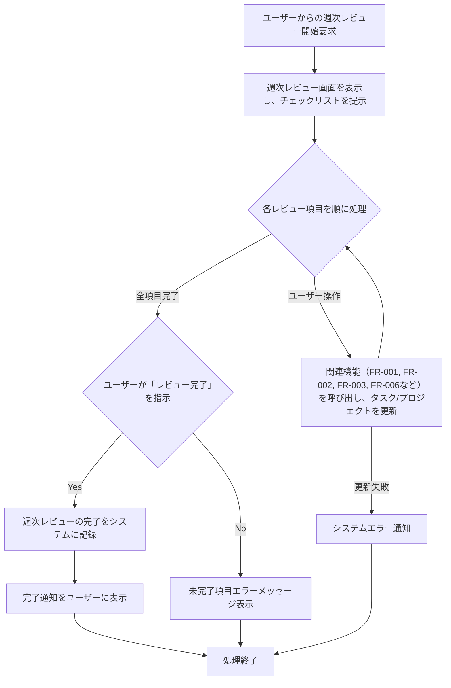

# ID: RDD-FRQ-2025-005

# 機能: 週次レビュー機能

## 概要

GTDの省察フェーズをデジタルで支援する機能です。ユーザーは週次レビューを通じて、過去のタスク、現在のプロジェクト、今後の計画を見直し、システムを最新の状態に保つことができます。週次レビューのチェックリストを提供し、各項目を順に進めることで、レビュープロセスをガイドします。

### 入力

- レビュー開始トリガー: ユーザー操作（週次レビュー画面へのアクセス）
- 各レビュー項目でのユーザー操作: タスクの処理、更新、新規タスクの記録など、関連機能の入力に準ずる。

### 処理内容

1. ユーザーからの週次レビュー開始要求を受け付ける。
1. 週次レビュー画面を表示し、レビューチェックリスト（インボックスのクリア、完了タスクの確認、プロジェクトの確認、次の行動リストの確認、連絡待ちリストの確認、いつか/多分リストの確認、カレンダーの確認、新しいアイデアの収集）を提示する。
1. 各レビュー項目において、ユーザーの操作（タスクの処理、更新、新規タスクの記録など）を受け付け、関連する機能（FR-001,
   FR-002, FR-003,
   [FR-006](../functional-requirements/fr-006-project-management-function.md)など）を呼び出してタスクやプロジェクトの状態を更新する。
1. ユーザーがすべてのレビュー項目を完了し、「レビュー完了」を指示した場合、週次レビューの完了をシステムに記録する。
1. 週次レビューの完了後、ユーザーに完了通知を行う。

週次レビュー機能の処理フローを示します。

### 出力

- 成功時: 「週次レビューが完了しました。」というメッセージ
- エラー時: エラーメッセージ (後述)

### エラー処理

- 未完了項目あり: 「未処理の項目があります。レビューを完了するにはすべての項目を処理してください。」, 画面上部にメッセージを表示, レビューは完了とされない。
- システムエラー: 「週次レビュー中にエラーが発生しました。再度お試しください。」, 画面上部にメッセージを表示, レビューは完了とされない。

### 関連するユースケース

- [UC-004 (週次レビューを実施する)](../use-cases/uc-004-perform-weekly-review.md)

### 関連する業務フロー

- [BF-004 (週次レビューフロー)](../business-flows/bf-004-weekly-review-flow.md)

### 関連する非機能要件

- [NFR-008 (ユーザビリティ)](../non-functional-requirements/nfr-008-usability.md): 週次レビュープロセスを直感的にガイドし、ユーザーの負担を軽減すること。
- [NFR-003 (信頼性)](../non-functional-requirements/nfr-003-reliability.md): レビュー中のデータ更新の整合性を保ち、エラー発生時に適切なフィードバックを提供すること。

### 関連する画面

- [SCR-005 (週次レビュー画面)](../screens/scr-005-weekly-review-screen.md)
- [SCR-002 (インボックス画面)](../screens/scr-002-inbox-screen.md)
- [SCR-003 (プロジェクト一覧画面)](../screens/scr-003-project-list-screen.md)
- [SCR-004 (次の行動リスト画面)](../screens/scr-004-next-action-list-screen.md)
