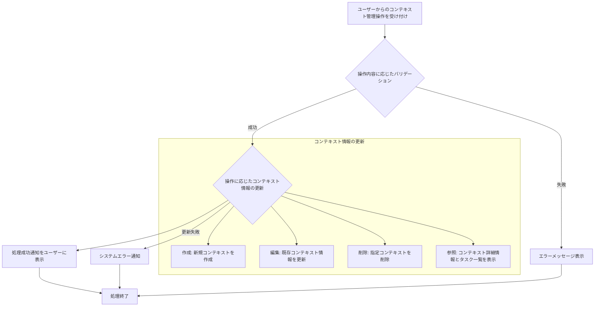

# ID: RDD-FRQ-2025-007

# 機能: コンテキスト管理機能

## 概要

ユーザーがタスクにコンテキスト（場所、ツール、エネルギーレベルなど）を紐付け、管理できる機能です。GTDのコンテキスト概念をデジタルで支援し、特定の状況下で実行可能なタスクを効率的に見つけられるようにします。

### 入力

- コンテキストID: 文字列, 必須, 処理対象のコンテキストの一意な識別子
- コンテキスト名: 文字列, 最大100文字, 必須, コンテキストの名称
- 説明: テキストエリア, オプション, コンテキストの詳細な説明

### 処理内容

1. ユーザーからのコンテキスト管理操作（作成、編集、削除、参照）を受け付ける。
1. 操作内容に応じて以下のバリデーションを行う。
   - 作成・編集時: コンテキスト名が空でないこと、100文字以内であること。
   - 参照・編集・削除時: 指定されたコンテキストIDが存在すること。
1. バリデーションが成功した場合、操作に基づいてコンテキスト情報と関連するタスク情報を更新する。
   - **作成**: 新規コンテキストを作成する。
   - **編集**: 既存コンテキストの名称、説明などを更新する。
   - **削除**: 指定されたコンテキストを削除する。関連するタスクはコンテキストとの紐付けを解除し、タスク自体は削除しない。
   - **参照**: コンテキストの詳細情報と、それに紐づくタスク一覧を表示する。
1. コンテキスト情報の更新が完了したら、ユーザーに処理成功の通知を行う。

コンテキスト管理機能の処理フローを示します。

### 出力

- 成功時: 「コンテキストを[作成/更新/削除]しました。」というメッセージ
- エラー時: エラーメッセージ (後述)

### エラー処理

- コンテキスト名未入力: 「コンテキスト名を入力してください。」, 画面上の該当入力フィールドの下にメッセージを表示, コンテキストは作成/更新されない。
- 無効なコンテキストID: 「指定されたコンテキストが見つかりません。」, 画面上部にメッセージを表示, コンテキストは処理されない。
- システムエラー: 「コンテキストの[作成/更新/削除]中にエラーが発生しました。再度お試しください。」, 画面上部にメッセージを表示, コンテキストは処理されない。

### 関連するユースケース

- [UC-002 (インボックスのタスクを処理する)](../use-cases/uc-002-process-inbox-task.md)
- [UC-005 (次の行動リストからタスクを実行する)](../use-cases/uc-005-execute-next-action-task.md)

### 関連する業務フロー

- [BF-002 (タスク処理フロー)](../business-flows/bf-002-task-processing-flow.md)
- [BF-003 (タスク整理フロー)](../business-flows/bf-003-task-organization-flow.md)
- [BF-005 (タスク実行フロー)](../business-flows/bf-005-task-execution-flow.md)

### 関連する非機能要件

- [NFR-008 (ユーザビリティ)](../non-functional-requirements/nfr-008-usability.md): コンテキストの作成・管理が容易であること。
- [NFR-003 (信頼性)](../non-functional-requirements/nfr-003-reliability.md): データ更新時の整合性を保ち、エラー発生時に適切なフィードバックを提供すること。

### 関連する画面

- [SCR-004 (次の行動リスト画面)](../screens/scr-004-next-action-list-screen.md)
- [SCR-007 (タスク詳細画面)](../screens/scr-007-task-detail-screen.md)
