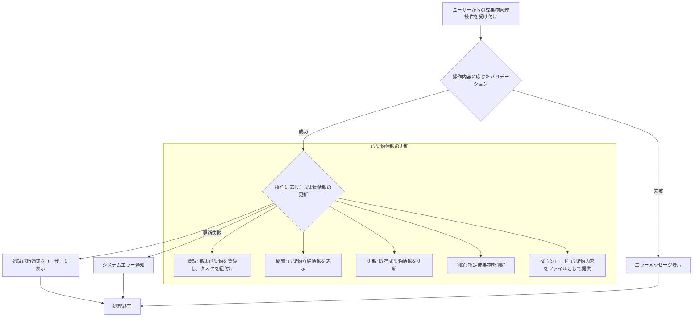

# ID: RDD-FRQ-2025-009

# 機能: 成果物管理機能

## 概要

プロジェクトに関連する成果物（ドキュメント、設計書、コード、画像など）の登録、閲覧、更新、削除、およびタスクとの紐付けを行う機能です。プロジェクトの成果物を一元的に管理し、情報へのアクセスを容易にします。

### 入力

- 成果物ID: 文字列, 必須, 処理対象の成果物の一意な識別子
- 成果物名: 文字列, 最大255文字, 必須, 成果物の名称
- 種類: 文字列, 必須, 「ドキュメント」「コード」「画像」など
- 関連プロジェクトID: 文字列, オプション, 成果物が紐づくプロジェクトのID
- 概要: テキストエリア, オプション, 成果物の簡単な説明内容: テキストエリア/ファイルデータ, オプション, 成果物の詳細内容またはファイルデータ
- 紐付けるタスクID: 文字列配列, オプション, 成果物に紐付けるタスクのID

### 処理内容

1. ユーザーからの成果物管理操作（登録、閲覧、更新、削除、ダウンロード）を受け付ける。
1. 操作内容に応じて以下のバリデーションを行う。
   - 登録・更新時: 成果物名、種類が空でないこと、成果物名が255文字以内であること。
   - 閲覧・更新・削除・ダウンロード時: 指定された成果物IDが存在すること。
1. バリデーションが成功した場合、操作に基づいて成果物情報と関連するタスク情報を更新する。
   - **登録**: 新規成果物を登録し、必要に応じてタスクを紐付ける。
   - **閲覧**: 指定された成果物の詳細情報（名称、種類、関連プロジェクト、最終更新日、概要、内容など）を表示する。
   - **更新**: 既存成果物の名称、種類、関連プロジェクト、概要、内容などを更新する。
   - **削除**: 指定された成果物を削除する。
   - **ダウンロード**: 指定された成果物の内容をファイルとして提供する。
1. 成果物情報の更新が完了したら、ユーザーに処理成功の通知を行う。
1. ダウンロードの場合、ファイルを提供し、ユーザーにダウンロード完了を通知する。

成果物管理機能の処理フローを示します。

### 出力

- 成功時: 「成果物を[登録/更新/削除]しました。」というメッセージ
- エラー時: エラーメッセージ (後述)

### エラー処理

- 成果物名/種類未入力: 「成果物名と種類を入力してください。」, 画面上の該当入力フィールドの下にメッセージを表示, 成果物は登録/更新されない。
- 無効な成果物ID: 「指定された成果物が見つかりません。」, 画面上部にメッセージを表示, 成果物は処理されない。
- システムエラー: 「成果物の[登録/更新/削除]中にエラーが発生しました。再度お試しください。」, 画面上部にメッセージを表示, 成果物は処理されない。

### 関連するユースケース

- [UC-010 (成果物とタスクの依存関係を可視化する)](../use-cases/uc-010-visualize-artifact-task-dependencies.md)

### 関連する業務フロー

- [BF-003 (タスク整理フロー)](../business-flows/bf-003-task-organization-flow.md)

### 関連する非機能要件

- [NFR-008 (ユーザビリティ)](../non-functional-requirements/nfr-008-usability.md): 成果物の登録・管理が容易であること。
- [NFR-003 (信頼性)](../non-functional-requirements/nfr-003-reliability.md): データ更新時の整合性を保ち、エラー発生時に適切なフィードバックを提供すること。

### 関連する画面

- [SCR-012 (成果物管理画面)](../screens/scr-012-artifact-management-screen.md)
- [SCR-020 (成果物詳細画面)](../screens/scr-020-artifact-detail-screen.md)
- [SCR-009 (プロジェクト詳細画面)](../screens/scr-009-project-detail-screen.md)
