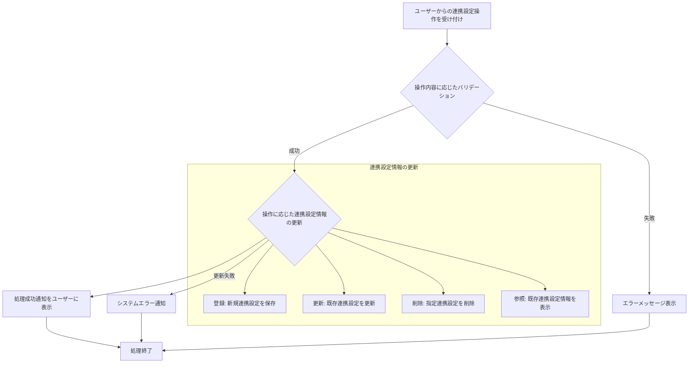

# ID: RDD-FRQ-2025-022

# 機能: 既存ツール連携設定機能

## 概要

Tas9s10reamと外部のプロジェクト管理ツールやタスク管理ツールとの連携を設定・管理する機能です。連携するツールの選択、認証情報の入力、同期設定（同期方向、同期頻度）、およびデータマッピングルールの定義を可能にします。

### 入力

- 連携ツール名: 文字列, 必須, 連携する外部ツールの名称（例: Jira, Asana,
  Trello）
- 認証情報: オブジェクト, 必須, 外部ツール連携用の認証情報（APIキー、OAuthトークンなど）
- 同期設定: オブジェクト, 必須, 同期方向（双方向、外部からTas9s10reamへ、Tas9s10reamから外部へ）、同期頻度（リアルタイム、1時間ごと、毎日など）
- データマッピングルール: オブジェクト配列, 任意, 外部ツールの項目名とTas9s10reamの項目名のマッピング定義

### 処理内容

1. ユーザーからの既存ツール連携設定の登録、更新、削除、参照要求を受け付ける。
1. 操作内容に応じて以下のバリデーションを行う。
   - 連携ツール名、認証情報、同期設定が空でないこと。
   - 認証情報が有効であること（接続テストを通じて確認）。
1. バリデーションが成功した場合、操作に基づいて連携設定情報を更新する。
   - **登録**: 新規連携設定をシステムに保存する。
   - **更新**: 既存の連携設定を変更する。
   - **削除**: 指定された連携設定を削除する。
   - **参照**: 既存の連携設定情報を表示する。
1. 連携設定の更新が完了したら、ユーザーに処理成功の通知を行う。

既存ツール連携設定機能の処理フローを示します。

### 出力

- 成功時: 「連携設定を[登録/更新/削除]しました。」というメッセージ
- エラー時: エラーメッセージ (後述)

### エラー処理

- 必須項目不足: 「[項目名]を入力してください。」, 画面上の該当入力フィールドの下にメッセージを表示, 設定は保存されない。
- 認証情報エラー: 「認証情報が正しくありません。再度ご確認ください。」, 認証情報入力フィールドの下にメッセージを表示, 設定は保存されない。
- 接続テスト失敗: 「外部ツールとの接続に失敗しました。設定を確認してください。」, 画面上部にメッセージを表示, 設定は保存されない。
- システムエラー: 「連携設定の[登録/更新/削除]中にエラーが発生しました。再度お試しください。」, 画面上部にメッセージを表示, 設定は保存されない。

### 関連するユースケース

- [UC-006 (既存ツールからタスクをインポートする)](../use-cases/uc-006-import-tasks-from-existing-tool.md)

### 関連する業務フロー

- [BF-006 (既存ツール連携フロー)](../business-flows/bf-006-existing-tool-integration-flow.md)

### 関連する非機能要件

- [NFR-002 (セキュリティ)](../non-functional-requirements/nfr-002-security.md): 認証情報の安全な管理。
- [NFR-003 (信頼性)](../non-functional-requirements/nfr-003-reliability.md): 外部ツールとの安定した接続。

### 関連する画面

- [SCR-016 (既存ツール連携詳細設定画面)](../screens/scr-016-external-tool-integration-settings-screen.md)
