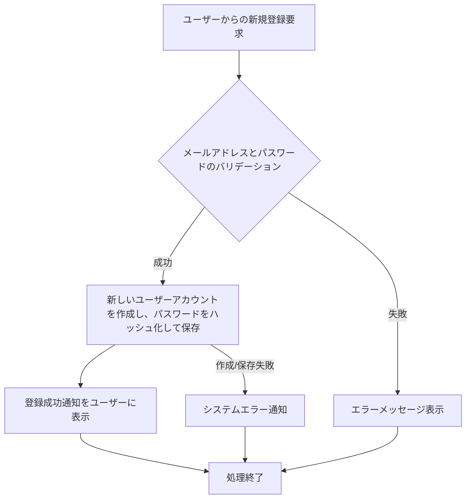

# ID: RDD-FRQ-2025-025

# 機能: ユーザー登録機能

## 概要

新規ユーザーがTas9s10reamシステムにアカウントを登録するための機能です。メールアドレスとパスワードを入力し、システムへのアクセス権を取得します。ITプロジェクト管理者がユーザーを登録するケースも含まれます。

### 入力

- メールアドレス: 文字列, 必須, 有効なメールアドレス形式, ログインIDとして使用
- パスワード: 文字列, 必須, 8文字以上、英数字記号を含む
- (ITプロジェクト管理者による登録の場合)
  - 氏名: 文字列, 必須, ユーザーの氏名
  - ロール: 文字列, 必須, 「ITプロジェクトメンバー」「ITプロジェクト管理者」のいずれか

### 処理内容

1. ユーザーからの新規登録要求を受け付ける。
1. 入力されたメールアドレスとパスワードのバリデーションを行う。
   - メールアドレスが有効な形式であること。
   - パスワードが8文字以上で、英数字記号を含むこと。
   - メールアドレスが既に登録されていないこと。
1. バリデーションが成功した場合、新しいユーザーアカウントを作成し、パスワードをハッシュ化して保存する。
1. ユーザーアカウントの作成が完了したら、ユーザーに登録成功の通知を行う。
   - ITプロジェクト管理者による登録の場合、登録されたユーザーに初期パスワードまたはパスワード設定リンクを通知する。

ユーザー登録機能の処理フローを示します。

### 出力

- 成功時: 「ユーザー登録が完了しました。」というメッセージ
- エラー時: エラーメッセージ (後述)

### エラー処理

- メールアドレス形式無効: 「有効なメールアドレスを入力してください。」, 該当入力フィールドの下にメッセージを表示, 登録は行われない。
- パスワード形式無効: 「パスワードは8文字以上で、英数字記号を組み合わせてください。」, 該当入力フィールドの下にメッセージを表示, 登録は行われない。
- メールアドレス重複: 「このメールアドレスは既に登録されています。」, 該当入力フィールドの下にメッセージを表示, 登録は行われない。
- システムエラー: 「ユーザー登録中にエラーが発生しました。再度お試しください。」, 画面上部にメッセージを表示, 登録は行われない。

### 関連するユースケース

- [UC-013 (ユーザーを管理する)](../use-cases/uc-013-manage-users.md)

### 関連する業務フロー

- [BF-001 (タスク収集フロー)](../business-flows/bf-001-task-collection-flow.md) - ログインの前提

### 関連する非機能要件

- [NFR-002 (セキュリティ)](../non-functional-requirements/nfr-002-security.md): パスワードの安全な管理（ハッシュ化など）。
- [NFR-003 (信頼性)](../non-functional-requirements/nfr-003-reliability.md): ユーザー登録処理の安定性。

### 関連する画面

- [SCR-001 (ログイン画面)](../screens/scr-001-login-screen.md)
- [SCR-017 (ユーザー管理画面)](../screens/scr-017-user-management-screen.md)
