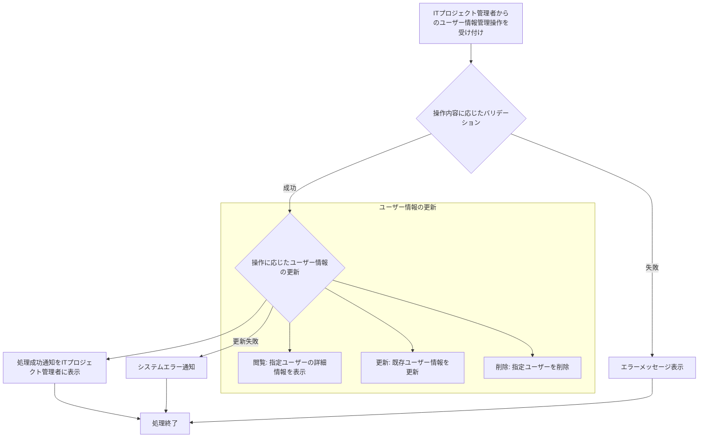

# ID: RDD-FRQ-2025-026

# 機能: ユーザー情報管理機能

## 概要

ITプロジェクト管理者がシステムに登録されているユーザーの情報を管理（閲覧、更新、削除）できる機能です。ユーザーの氏名、メールアドレス、パスワードなどの基本情報を変更できます。

### 入力

- ユーザーID: 文字列, 必須, 処理対象のユーザーの一意な識別子
- (オプション) 氏名: 文字列, 最大100文字, オプション, ユーザーの氏名
- (オプション) メールアドレス: 文字列, 有効なメールアドレス形式, オプション, ログインIDとして使用
- (オプション) パスワード: 文字列,
  8文字以上、英数字記号を含む, オプション, パスワード

### 処理内容

1. ITプロジェクト管理者からのユーザー情報管理操作（閲覧、更新、削除）を受け付ける。
1. 操作内容に応じて以下のバリデーションを行う。
   - 更新時: 氏名、メールアドレス、パスワードの形式が正しいこと。
   - 閲覧・更新・削除時: 指定されたユーザーIDが存在すること。
   - メールアドレス更新時: 新しいメールアドレスが既に登録されていないこと。
1. バリデーションが成功した場合、操作に基づいてユーザー情報を更新する。
   - **閲覧**: 指定されたユーザーの詳細情報を表示する。
   - **更新**: 既存ユーザーの氏名、メールアドレス、パスワードなどを更新する。パスワードはハッシュ化して保存する。
   - **削除**: 指定されたユーザーをシステムから削除する。
1. ユーザー情報の更新が完了したら、ITプロジェクト管理者に処理成功の通知を行う。

ユーザー情報管理機能の処理フローを示します。

### 出力

- 成功時: 「ユーザー情報を[更新/削除]しました。」というメッセージ
- エラー時: エラーメッセージ (後述)

### エラー処理

- 無効なユーザーID: 「指定されたユーザーが見つかりません。」, 画面上部にメッセージを表示, 処理は行われない。
- メールアドレス重複: 「このメールアドレスは既に登録されています。」, 該当入力フィールドの下にメッセージを表示, 更新は行われない。
- パスワード形式無効: 「パスワードは8文字以上で、英数字記号を組み合わせてください。」, 該当入力フィールドの下にメッセージを表示, 更新は行われない。
- システムエラー: 「ユーザー情報の[更新/削除]中にエラーが発生しました。再度お試しください。」, 画面上部にメッセージを表示, 処理は行われない。

### 関連するユースケース

- [UC-013 (ユーザーを管理する)](../use-cases/uc-013-manage-users.md)

### 関連する業務フロー

- なし (システム管理)

### 関連する非機能要件

- [NFR-002 (セキュリティ)](../non-functional-requirements/nfr-002-security.md): ユーザー情報の安全な管理。
- [NFR-003 (信頼性)](../non-functional-requirements/nfr-003-reliability.md): ユーザー情報管理処理の安定性。

### 関連する画面

- [SCR-017 (ユーザー管理画面)](../screens/scr-017-user-management-screen.md)
