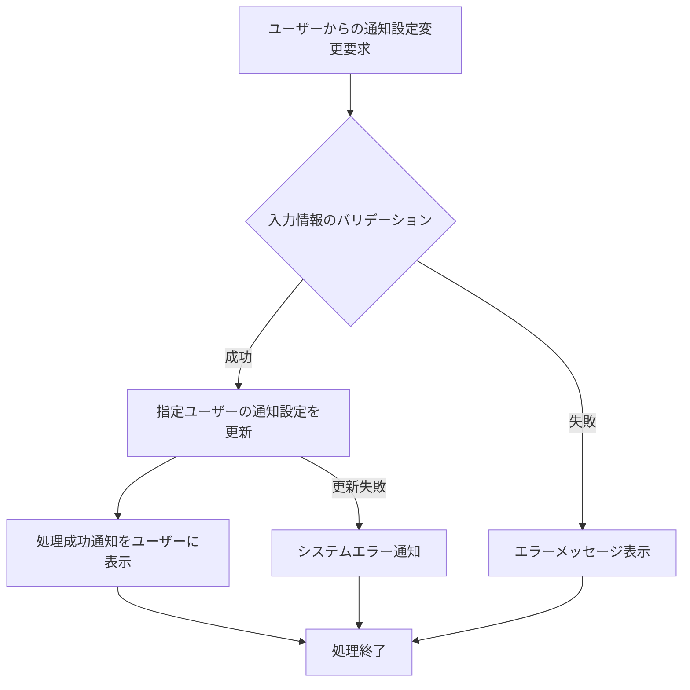

# ID: RDD-FRQ-2025-029

# 機能: 通知設定機能

## 概要

ユーザーがシステムからの通知の受け取り方法や内容をカスタマイズできる機能です。通知の有効/無効、通知の種類、通知方法（メール、システム内通知）、通知の頻度や時間帯などを設定できます。

### 入力

- ユーザーID: 文字列, 必須, 設定を変更するユーザーの一意な識別子
- 全体通知ON/OFF: 真偽値, オプション, 全ての通知の有効/無効
- 通知カテゴリごとの設定: オブジェクト, オプション, 各通知カテゴリ（例: タスク期日、タスク割り当て、プロジェクト進捗）に対する以下の設定
  - ON/OFF: 真偽値, オプション
  - 通知タイミング/頻度: 文字列/数値, オプション
  - 通知方法: 文字列配列, オプション, 「メール」「アプリ内」など

### 処理内容

1. ユーザーからの通知設定変更要求を受け付ける。
1. 入力された設定情報のバリデーションを行う。
   - 各設定値が有効な形式であること。
1. バリデーションが成功した場合、指定されたユーザーの通知設定を更新する。
1. 通知設定の更新が完了したら、ユーザーに処理成功の通知を行う。

通知設定機能の処理フローを示します。

### 出力

- 成功時: 「通知設定を保存しました。」というメッセージ
- エラー時: エラーメッセージ (後述)

### エラー処理

- 無効な入力値: 「[項目名]の入力値が不正です。」, 画面上の該当入力フィールドの下にメッセージを表示, 設定は保存されない。
- システムエラー: 「通知設定の保存中にエラーが発生しました。再度お試しください。」, 画面上部にメッセージを表示, 設定は保存されない。

### 関連するユースケース

- [UC-014 (システム通知を設定する)](../use-cases/uc-014-configure-notifications.md)

### 関連する業務フロー

- なし (システム設定)

### 関連する非機能要件

- [NFR-008 (ユーザビリティ)](../non-functional-requirements/nfr-008-usability.md): 通知設定が容易であること。
- [NFR-003 (信頼性)](../non-functional-requirements/nfr-003-reliability.md): 設定変更が確実に反映されること。

### 関連する画面

- [SCR-010 (通知設定画面)](../screens/scr-010-notification-settings-screen.md)
