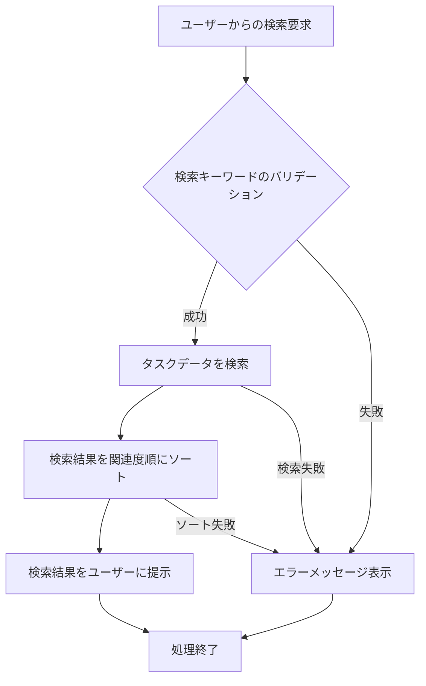

# ID: RDD-FRQ-2025-030

# 機能: タスク検索機能

## 概要

ユーザーがシステム内のタスクをキーワードで検索し、目的のタスクを効率的に見つけられる機能です。タスクのタイトル、説明、コメントなどのテキスト情報から関連するタスクを抽出します。

### 入力

- 検索キーワード: 文字列, 必須, 検索対象のキーワード

### 処理内容

1. ユーザーからのタスク検索要求を受け付ける。
1. 検索キーワードに基づいて、システム内のタスクデータ（タイトル、説明、コメントなど）を検索する。
1. 検索結果を関連度順にソートし、ユーザーに提示する。

タスク検索機能の処理フローを示します。

### 出力

- 成功時: 検索結果に合致するタスクのリスト
- エラー時: エラーメッセージ (後述)

### エラー処理

- 検索キーワード未入力: 「検索キーワードを入力してください。」, 画面上の検索入力フィールドの下にメッセージを表示, 検索は実行されない。
- 検索結果なし: 「該当するタスクは見つかりませんでした。」, 画面中央にメッセージを表示, 空のリストが返される。
- システムエラー: 「タスクの検索中にエラーが発生しました。再度お試しください。」, 画面上部にメッセージを表示, 検索は実行されない。

### 関連するユースケース

- [UC-015 (タスクを検索・フィルタリングする)](../use-cases/uc-015-search-filter-tasks.md)

### 関連する業務フロー

- なし (情報検索)

### 関連する非機能要件

- [NFR-004 (パフォーマンス)](../non-functional-requirements/nfr-004-performance.md): 迅速に検索結果を返却できること。
- [NFR-008 (ユーザビリティ)](../non-functional-requirements/nfr-008-usability.md): 直感的な操作でタスクを検索できること。

### 関連する画面

- [SCR-008 (検索画面)](../screens/scr-008-search-screen.md)
