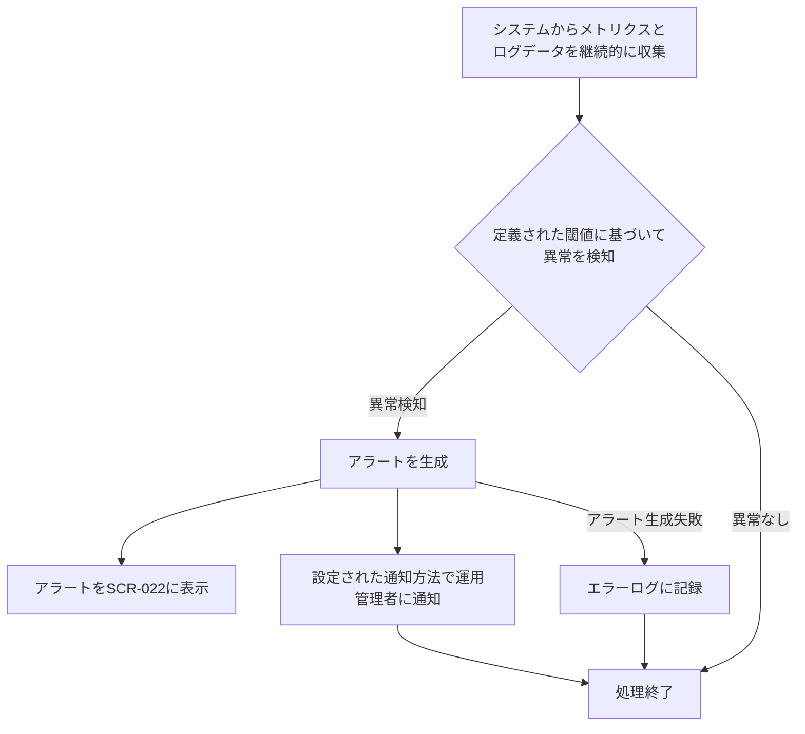

# ID: RDD-FRQ-2025-038

# 機能: システム稼働状況監視・アラート機能

## 概要

システムのCPU、メモリ、ディスクI/O、ネットワークトラフィック、アプリケーションエラー率などの稼働状況をリアルタイムで監視し、異常を検知した場合にアラートを生成する機能です。これにより、運用管理者はシステムの問題を早期に発見し、迅速な対応を可能にします。

### 入力

- システムメトリクスデータ（CPU使用率、メモリ使用量、ディスクI/O、ネットワークトラフィックなど）
- アプリケーションログデータ（エラー、警告など）

### 処理内容

1. システムから継続的にメトリクスデータとログデータを収集する。
1. 収集したデータに対して、事前に定義された閾値（例:
   CPU使用率が80%を5分以上継続、エラーログが1分間に10件以上発生）に基づいて異常を検知する。
1. 異常を検知した場合、以下の情報を含むアラートを生成する。
   - アラートID
   - 発生日時
   - アラートの種類（例: CPU高負荷、メモリ不足、アプリケーションエラー）
   - 影響範囲（例: どのサーバー、どのサービス）
   - 重要度（例: 緊急、高、中、低）
   - 詳細メッセージ
1. 生成されたアラートは、システム運用管理画面（SCR-022）に表示されるとともに、設定された通知方法（メール、チャットなど）で運用管理者に通知される。
1. アラートは、問題が解決されるまで継続的に監視され、解決された場合はステータスが「解決済み」に更新される。

システム稼働状況監視・アラート機能の処理フローを示します。

### 出力

- 成功時: 生成されたアラート情報
- エラー時: エラーログへの記録

### エラー処理

- データ収集失敗: メトリクスやログデータの収集に失敗した場合、エラーログに記録し、システム管理者に通知する。
- アラート生成失敗: アラートの生成や通知に失敗した場合、エラーログに記録し、システム管理者に通知する。

### 関連するユースケース

- UC-XXX (システム稼働状況を監視する) ※新規作成を想定

### 関連する業務フロー

- BF-008 (システム運用フロー)

### 関連する非機能要件

- [NFR-001 (運用性)](../non-functional-requirements/nfr-001-operability.md): システムの稼働状況を24時間365日監視可能であること。
- [NFR-003 (信頼性)](../non-functional-requirements/nfr-003-reliability.md): 異常検知の正確性。
- [NFR-004 (パフォーマンス)](../non-functional-requirements/nfr-004-performance.md): リアルタイムでのデータ収集と分析。

### 関連する画面

- SCR-022 (システム運用管理画面) ※新規作成を想定
