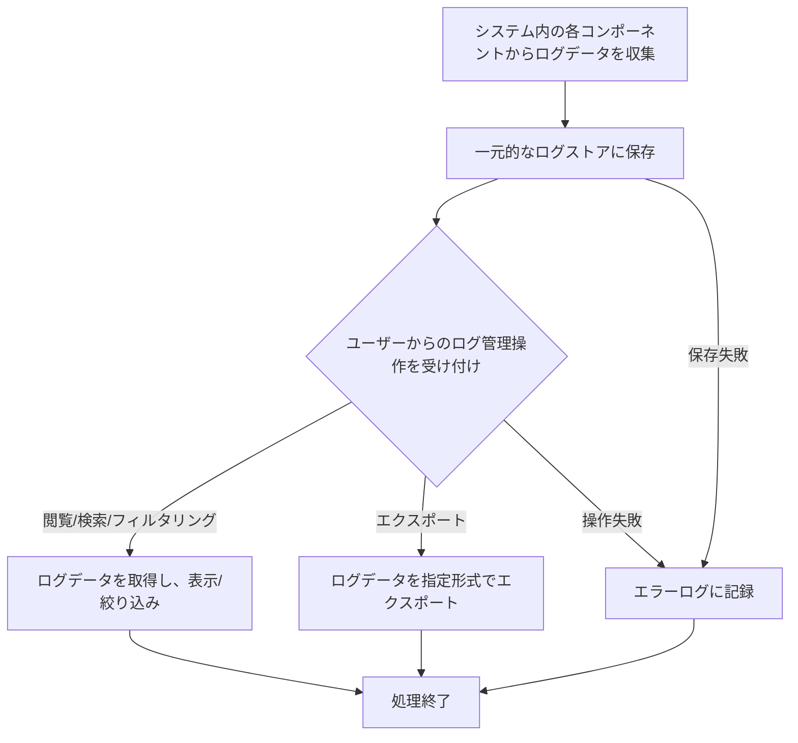

# ID: RDD-FRQ-2025-039

# 機能: システムログ管理機能

## 概要

システム全体で発生するログ（アプリケーションログ、認証ログ、エラーログなど）を一元的に収集、保存し、閲覧、検索、フィルタリング、エクスポートを可能にする機能です。これにより、問題発生時の原因究明やシステム監査を効率的に行えます。

### 入力

- システム内の各種ログデータ（アプリケーションログ、認証ログ、エラーログ、操作ログなど）
- ユーザーからのログ閲覧・検索・フィルタリング・エクスポート要求

### 処理内容

1. システム内の各コンポーネントからログデータを収集し、一元的なログストアに保存する。
1. 保存されたログデータに対して、以下の操作を提供する。
   - **閲覧**: ログを時系列順に表示する。
   - **検索**: キーワード、ログレベル、期間、ソースなどの条件でログを検索する。
   - **フィルタリング**: ログレベル、ソース、ユーザーIDなどの条件でログを絞り込む。
   - **エクスポート**: 検索・フィルタリングされたログデータをCSVやJSON形式でエクスポートする。
1. ログの保存期間やローテーション設定を管理する。

システムログ管理機能の処理フローを示します。

### 出力

- 成功時: ログデータ表示、またはエクスポートされたファイル
- エラー時: エラーログへの記録

### エラー処理

- ログ収集失敗: ログデータの収集に失敗した場合、エラーログに記録し、システム管理者に通知する。
- ログストア保存失敗: 収集したログデータの保存に失敗した場合、エラーログに記録し、システム管理者に通知する。
- ログ操作失敗: ログの閲覧、検索、フィルタリング、エクスポート中にエラーが発生した場合、エラーメッセージをユーザーに表示し、エラーログに記録する。

### 関連するユースケース

- UC-XXX (システムログを閲覧・検索する) ※新規作成を想定

### 関連する業務フロー

- BF-008 (システム運用フロー)

### 関連する非機能要件

- [NFR-001 (運用性)](../non-functional-requirements/nfr-001-operability.md): ログは適切に記録され、問題発生時の原因究明に利用できること。
- [NFR-010 (監査性)](../non-functional-requirements/nfr-010-auditability.md): ユーザーの操作履歴やデータ変更履歴が記録されること。

### 関連する画面

- SCR-022 (システム運用管理画面) ※新規作成を想定
