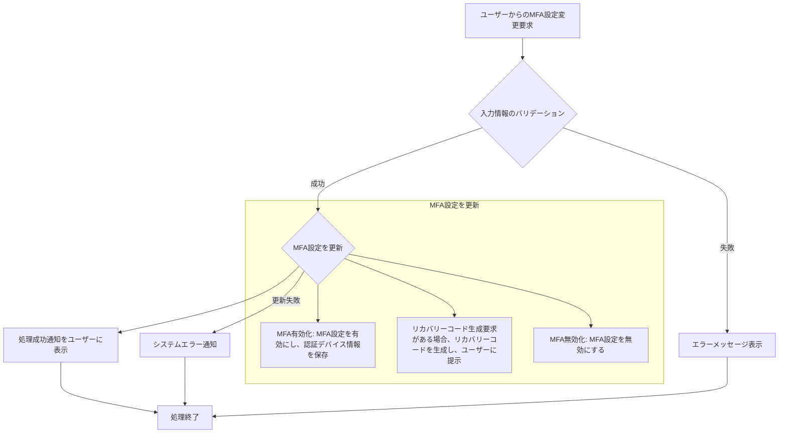

# ID: RDD-FRQ-2025-040

# 機能: 多要素認証管理機能

## 概要

ユーザーが多要素認証（MFA）を有効化・無効化し、認証デバイスの登録、およびリカバリーコードの管理を行える機能です。これにより、アカウントのセキュリティを強化します。

### 入力

- ユーザーID: 文字列, 必須, 設定を変更するユーザーの一意な識別子
- MFA有効/無効: 真偽値, 必須, MFAを有効にするか無効にするか
- (MFA有効化時)
  - 認証デバイス情報: オブジェクト, 必須, 認証アプリのシークレットキー、QRコードなど
  - リカバリーコード生成要求: 真偽値, オプション, リカバリーコードの生成を要求するか
- (MFA無効化時)
  - パスワード: 文字列, 必須, ユーザーのパスワード
  - MFAコード: 文字列, 必須, 現在のMFAコード

### 処理内容

1. ユーザーからのMFA設定変更要求を受け付ける。
1. 入力された情報のバリデーションを行う。
   - MFA有効化時: 認証デバイス情報が有効であること。
   - MFA無効化時: パスワードとMFAコードが正しいこと。
1. バリデーションが成功した場合、MFA設定を更新する。
   - **MFA有効化**: ユーザーのMFA設定を有効にし、認証デバイス情報を保存する。リカバリーコード生成要求がある場合、リカバリーコードを生成し、ユーザーに提示する。
   - **MFA無効化**: ユーザーのMFA設定を無効にする。
1. MFA設定の更新が完了したら、ユーザーに処理成功の通知を行う。

多要素認証管理機能の処理フローを示します。

### 出力

- 成功時: 「MFA設定を更新しました。」というメッセージ、またはリカバリーコード
- エラー時: エラーメッセージ (後述)

### エラー処理

- 無効な認証デバイス情報: 「認証デバイス情報が不正です。」, 画面上部にメッセージを表示, 設定は保存されない。
- パスワード/MFAコード不一致: 「パスワードまたはMFAコードが正しくありません。」, 画面上部にメッセージを表示, 設定は保存されない。
- システムエラー: 「MFA設定の更新中にエラーが発生しました。再度お試しください。」, 画面上部にメッセージを表示, 設定は保存されない。

### 関連するユースケース

- UC-XXX (多要素認証を設定する) ※新規作成を想定

### 関連する業務フロー

- なし (ユーザー設定)

### 関連する非機能要件

- [NFR-002 (セキュリティ)](../non-functional-requirements/nfr-002-security.md): ユーザー認証は多要素認証に対応すること。
- [NFR-008 (ユーザビリティ)](../non-functional-requirements/nfr-008-usability.md):
  MFA設定が容易であること。

### 関連する画面

- SCR-XXX (多要素認証設定画面) ※新規作成を想定
- [SCR-006 (設定画面)](../screens/scr-006-settings-screen.md)
- [SCR-017 (ユーザー管理画面)](../screens/scr-017-user-management-screen.md)
