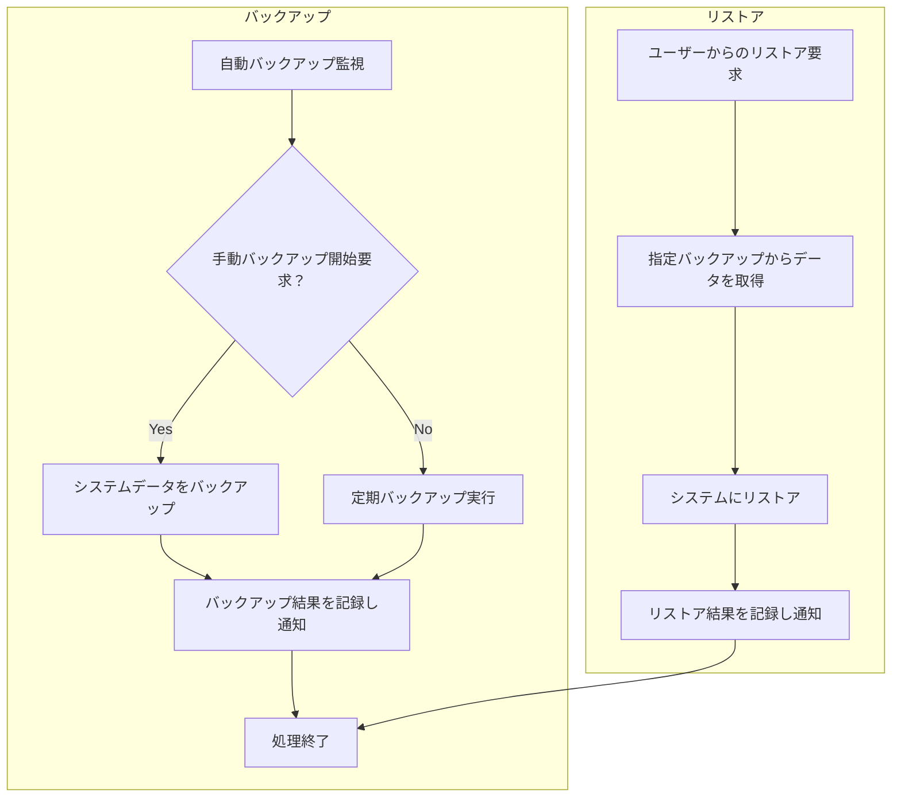

# ID: RDD-FRQ-2025-041

# 機能: バックアップ・リストア管理機能

## 概要

システムデータのバックアップの実行状況を監視し、必要に応じて手動でのバックアップ開始や、過去のバックアップからのデータリストアを行える機能です。これにより、データ損失のリスクを最小限に抑え、障害発生時の迅速な復旧を可能にします。

### 入力

- ユーザーからのバックアップ開始要求
- ユーザーからのリストア要求（リストア対象のバックアップID、リストア範囲など）

### 処理内容

1. **バックアップ処理**
   - 定期的な自動バックアップの実行状況を監視する。
   - ユーザーからの手動バックアップ開始要求を受け付ける。
   - システムのデータベースおよび関連ファイルを指定されたストレージ（例: オフサイトストレージ）にバックアップする。
   - バックアップの完了または失敗を記録し、運用管理者に通知する。
1. **リストア処理**
   - ユーザーからのリストア要求を受け付ける。
   - 指定されたバックアップIDからデータを取得し、システムにリストアする。
   - リストアの完了または失敗を記録し、運用管理者に通知する。

バックアップ・リストア管理機能の処理フローを示します。

### 出力

- 成功時: バックアップ/リストアの実行結果
- エラー時: エラーログへの記録

### エラー処理

- バックアップ失敗: バックアップ処理中にエラーが発生した場合、エラーログに記録し、運用管理者に通知する。
- リストア失敗: リストア処理中にエラーが発生した場合、エラーログに記録し、運用管理者に通知する。

### 関連するユースケース

- UC-XXX (システムをバックアップ・リストアする) ※新規作成を想定

### 関連する業務フロー

- BF-008 (システム運用フロー)

### 関連する非機能要件

- [NFR-003 (信頼性)](../non-functional-requirements/nfr-003-reliability.md): データのバックアップは日次で取得され、オフサイトに保管されること。
- [NFR-001 (運用性)](../non-functional-requirements/nfr-001-operability.md): 定期的なメンテナンス（バックアップ、パッチ適用など）が計画的に実施できること。

### 関連する画面

- SCR-022 (システム運用管理画面)
- SCR-XXX (バックアップ・リストア管理画面) ※新規作成を想定
