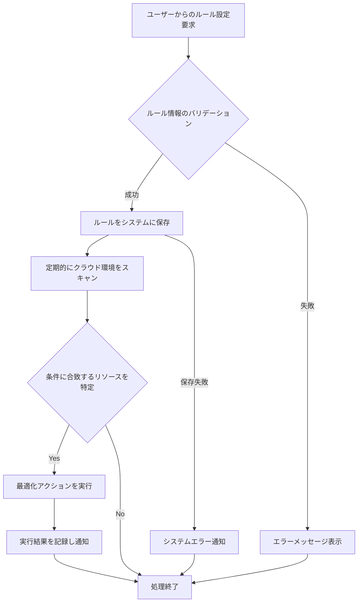

# ID: RDD-FRQ-2025-042

# 機能: リソース最適化管理機能

## 概要

クラウドサービス利用におけるコスト最適化のため、不要なリソースの自動停止、削除、スケールダウンなどのルールを設定し、管理できる機能です。これにより、無駄なコスト発生を抑制します。

### 入力

- ユーザーからのリソース最適化ルール設定要求
  - ルール名: 文字列, 必須
  - 対象リソースタイプ: 文字列, 必須（例: 'EC2 Instance', 'RDS Database', 'S3
    Bucket'）
  - 最適化アクション: 文字列, 必須（例: 'STOP', 'TERMINATE', 'SCALE_DOWN'）
  - 条件: オブジェクト, 必須（例: 'CPU使用率が5%以下を7日間継続',
    '最終アクセスから30日経過'）
  - スケジュール: オブジェクト, オプション（例: '毎日22時に実行', '毎週土曜日'）

### 処理内容

1. ユーザーからのリソース最適化ルール設定要求を受け付ける。
1. 入力されたルール情報のバリデーションを行う。
1. バリデーションが成功した場合、指定されたルールをシステムに保存する。
1. 保存されたルールに基づいて、定期的にクラウド環境をスキャンし、条件に合致するリソースに対して最適化アクションを実行する。
1. 最適化アクションの実行結果を記録し、運用管理者に通知する。

リソース最適化管理機能の処理フローを示します。

### 出力

- 成功時: ルール設定の保存結果、または最適化アクションの実行結果
- エラー時: エラーメッセージ、またはエラーログへの記録

### エラー処理

- 無効なルール設定: 「[項目名]の入力値が不正です。」, 画面上部にメッセージを表示, 設定は保存されない。
- システムエラー: 「リソース最適化管理中にエラーが発生しました。再度お試しください。」, 画面上部にメッセージを表示, 処理は行われない。

### 関連するユースケース

- UC-XXX (リソース利用コストを最適化する) ※新規作成を想定

### 関連する業務フロー

- BF-008 (システム運用フロー)

### 関連する非機能要件

- [NFR-006 (コスト効率)](../non-functional-requirements/nfr-006-cost-efficiency.md): 不要なリソースは自動的に停止または削除される仕組みを導入すること。
- [NFR-001 (運用性)](../non-functional-requirements/nfr-001-operability.md): 運用コストを最適化できること。

### 関連する画面

- SCR-022 (システム運用管理画面)
- SCR-XXX (リソース最適化管理画面) ※新規作成を想定
