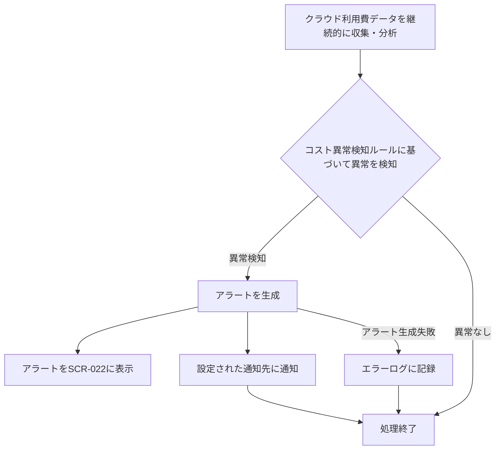

# ID: RDD-FRQ-2025-043

# 機能: コスト異常検知・アラート機能

## 概要

クラウド利用費の傾向を分析し、異常なコスト増加や予期せぬ支出を検知した場合に、運用管理者にアラートを通知する機能です。これにより、コスト超過のリスクを早期に発見し、迅速な対応を促します。

### 入力

- クラウド利用費データ（月次レポート、日次データなど）
- ユーザーからのコスト異常検知ルール設定要求
  - ルール名: 文字列, 必須
  - 検知タイプ: 文字列, 必須（例: '急激な増加', '予算超過', '予測超過'）
  - 閾値: 数値, 必須（例: '前日比10%増', '予算の90%到達'）
  - 通知先: 文字列配列, 必須（例: 'メールアドレス', 'チャットルームID'）

### 処理内容

1. クラウド利用費データを継続的に収集し、分析する。
1. 事前に設定されたコスト異常検知ルールに基づいて、異常なコストパターンを検知する。
1. 異常を検知した場合、以下の情報を含むアラートを生成する。
   - アラートID
   - 発生日時
   - アラートの種類（例: コスト急増、予算超過）
   - 影響サービス/リソース
   - 重要度（例: 緊急、高、中、低）
   - 詳細メッセージ
1. 生成されたアラートは、システム運用管理画面（SCR-022）に表示されるとともに、設定された通知先（メール、チャットなど）に通知される。

コスト異常検知・アラート機能の処理フローを示します。

### 出力

- 成功時: 生成されたアラート情報
- エラー時: エラーログへの記録

### エラー処理

- データ収集失敗: クラウド利用費データの収集に失敗した場合、エラーログに記録し、システム管理者に通知する。
- ルール設定無効: 「[項目名]の入力値が不正です。」, 画面上部にメッセージを表示, 設定は保存されない。
- アラート生成失敗: アラートの生成や通知に失敗した場合、エラーログに記録し、システム管理者に通知する。

### 関連するユースケース

- UC-XXX (コスト異常を検知する) ※新規作成を想定

### 関連する業務フロー

- BF-008 (システム運用フロー)

### 関連する非機能要件

- [NFR-006 (コスト効率)](../non-functional-requirements/nfr-006-cost-efficiency.md): コスト監視ツールを導入し、異常なコスト発生を検知できること。
- [NFR-001 (運用性)](../non-functional-requirements/nfr-001-operability.md): 運用コストを最適化できること。

### 関連する画面

- SCR-022 (システム運用管理画面)
- SCR-XXX (コスト異常検知・アラート設定画面) ※新規作成を想定
