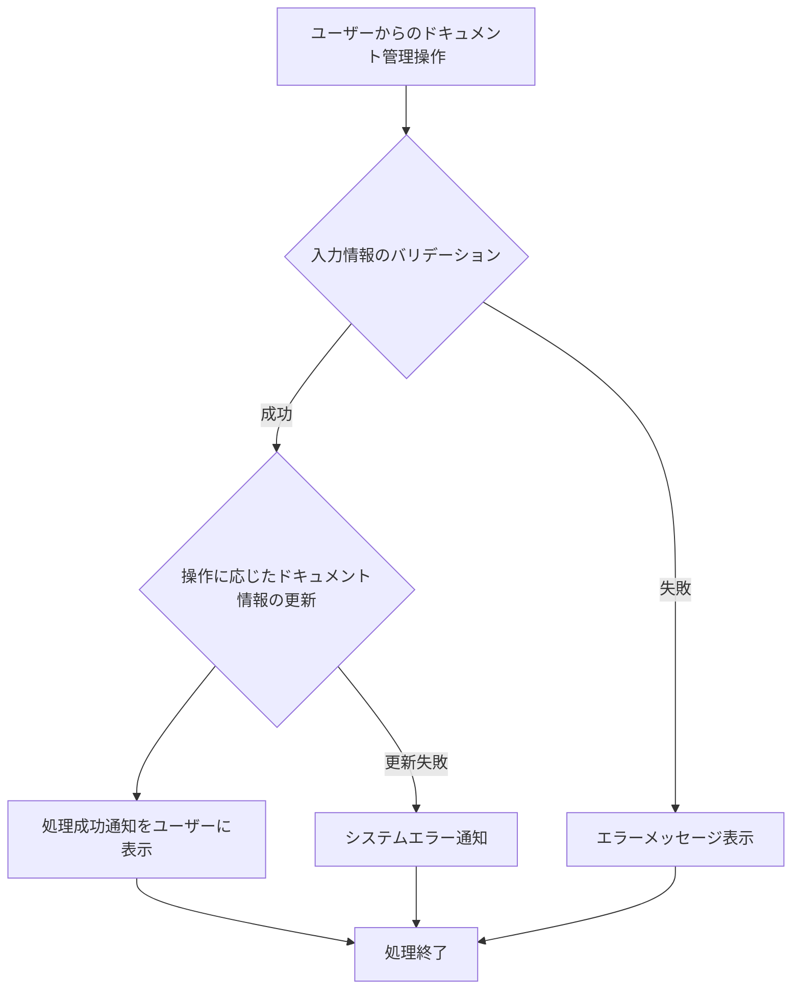

# ID: RDD-FRQ-2025-044

# 機能: ドキュメント管理機能

## 概要

システムの設計書、仕様書、運用手順書などのドキュメントをバージョン管理し、閲覧、検索、更新、公開/非公開設定を行える機能です。これにより、ドキュメントの整合性と最新性を保ち、システムの保守性を向上させます。

### 入力

- ユーザーからのドキュメント管理操作（登録、閲覧、更新、削除、公開/非公開設定）
  - ドキュメントID: 文字列, 必須, 処理対象のドキュメントの一意な識別子
  - タイトル: 文字列, 必須, ドキュメントのタイトル
  - 内容: テキストエリア, 必須, ドキュメントの内容
  - バージョン: 文字列, オプション, ドキュメントのバージョン
  - 公開ステータス: 真偽値, オプション, ドキュメントの公開/非公開

### 処理内容

1. ユーザーからのドキュメント管理操作を受け付ける。
1. 入力された情報のバリデーションを行う。
1. バリデーションが成功した場合、操作に基づいてドキュメント情報を更新する。
   - **登録**: 新規ドキュメントを登録する。
   - **閲覧**: 指定されたドキュメントの内容を表示する。
   - **更新**: 既存ドキュメントの内容を更新し、必要に応じて新しいバージョンとして記録する。
   - **削除**: 指定されたドキュメントを削除する。
   - **公開/非公開設定**: ドキュメントの公開ステータスを変更する。
1. ドキュメント情報の更新が完了したら、ユーザーに処理成功の通知を行う。

ドキュメント管理機能の処理フローを示します。

### 出力

- 成功時: ドキュメント表示、または操作結果メッセージ
- エラー時: エラーメッセージ、またはエラーログへの記録

### エラー処理

- 無効な入力値: 「[項目名]の入力値が不正です。」, 画面上部にメッセージを表示, 処理は行われない。
- システムエラー: 「ドキュメント管理中にエラーが発生しました。再度お試しください。」, 画面上部にメッセージを表示, 処理は行われない。

### 関連するユースケース

- UC-XXX (システムドキュメントを管理する) ※新規作成を想定

### 関連する業務フロー

- BF-008 (システム運用フロー)

### 関連する非機能要件

- [NFR-007 (持続可能性)](../non-functional-requirements/nfr-007-sustainability.md): ドキュメントは常に最新の状態に保たれること。
- [NFR-011 (保守性)](../non-functional-requirements/nfr-011-maintainability.md): ドキュメントは最新の状態に保たれ、システムの理解を助けること。

### 関連する画面

- SCR-XXX (ドキュメント管理画面) ※新規作成を想定
