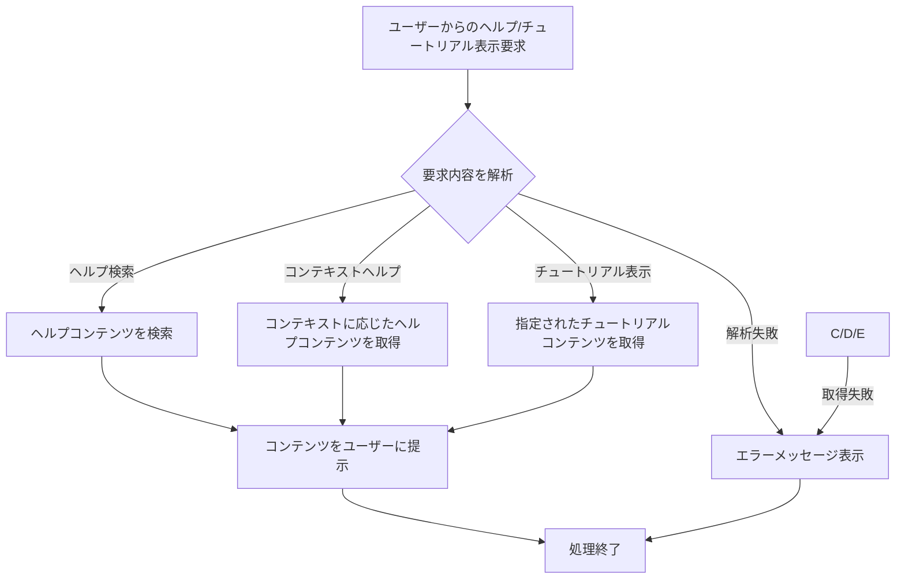

# ID: RDD-FRQ-2025-045

# 機能: ヘルプ・チュートリアル機能

## 概要

システムの各機能や画面に関するヘルプコンテンツを提供し、新規ユーザー向けのチュートリアルを表示する機能です。これにより、ユーザーがシステムを円滑に利用できるよう支援し、学習コストを低減します。

### 入力

- ユーザーからのヘルプ/チュートリアル表示要求
  - 検索キーワード: 文字列, オプション, ヘルプコンテンツ検索用
  - 画面ID/機能ID: 文字列, オプション, コンテキストに応じたヘルプ表示用
  - チュートリアルID: 文字列, オプション, 特定のチュートリアル表示用

### 処理内容

1. ユーザーからのヘルプ/チュートリアル表示要求を受け付ける。
1. 要求内容に基づいて、適切なヘルプコンテンツまたはチュートリアルコンテンツを取得する。
   - 検索キーワードがある場合、ヘルプコンテンツを検索し、関連度順に表示する。
   - 画面ID/機能IDがある場合、そのコンテキストに特化したヘルプコンテンツを表示する。
   - チュートリアルIDがある場合、指定されたチュートリアルコンテンツを表示する。
1. 取得したコンテンツをユーザーに提示する。

ヘルプ・チュートリアル機能の処理フローを示します。

### 出力

- 成功時: ヘルプコンテンツ、またはチュートリアルコンテンツ
- エラー時: エラーメッセージ

### エラー処理

- コンテンツ見つからず: 「該当するヘルプコンテンツ/チュートリアルは見つかりませんでした。」, 画面上部にメッセージを表示。
- システムエラー: 「ヘルプ/チュートリアル表示中にエラーが発生しました。再度お試しください。」, 画面上部にメッセージを表示。

### 関連するユースケース

- UC-XXX (ヘルプを参照する) ※新規作成を想定
- UC-XXX (チュートリアルを閲覧する) ※新規作成を想定

### 関連する業務フロー

- なし (情報参照)

### 関連する非機能要件

- [NFR-008 (ユーザビリティ)](../non-functional-requirements/nfr-008-usability.md): ヘルプ機能やチュートリアルを提供し、ユーザーの学習を支援すること。
