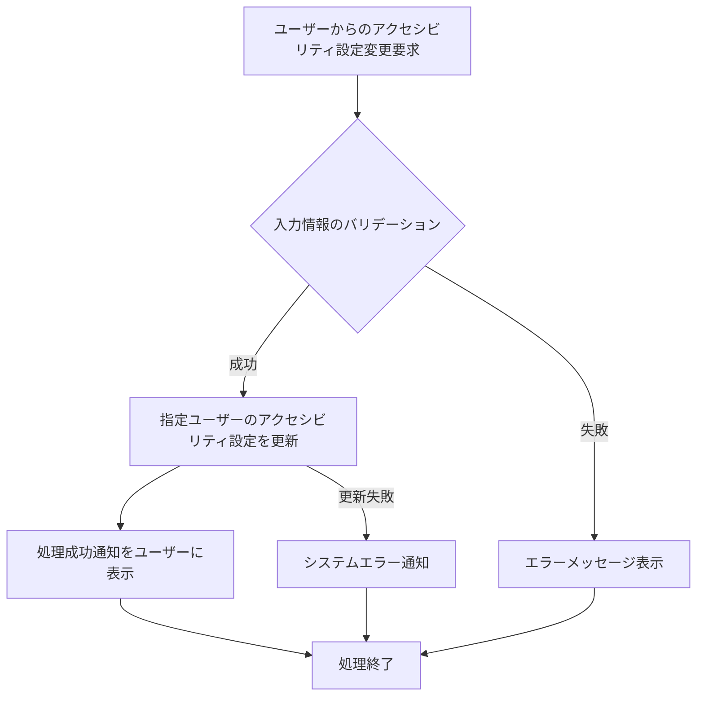

# ID: RDD-FRQ-2025-046

# 機能: アクセシビリティ設定機能

## 概要

ユーザーがシステムの表示に関するアクセシビリティオプション（例: 文字サイズ、コントラストモード、色覚サポートテーマ）を調整できる機能です。これにより、多様なユーザーがシステムを快適に利用できるよう支援します。

### 入力

- ユーザーID: 文字列, 必須, 設定を変更するユーザーの一意な識別子
- 文字サイズ: 文字列, オプション（例: 'Small', 'Medium', 'Large'）
- コントラストモード: 文字列, オプション（例: 'Default', 'High Contrast'）
- 色覚サポートテーマ: 文字列, オプション（例: 'Default', 'Protanopia',
  'Deuteranopia', 'Tritanopia'）

### 処理内容

1. ユーザーからのアクセシビリティ設定変更要求を受け付ける。
1. 入力された設定情報のバリデーションを行う。
1. バリデーションが成功した場合、指定されたユーザーのアクセシビリティ設定を更新する。
1. アクセシビリティ設定の更新が完了したら、ユーザーに処理成功の通知を行う。

アクセシビリティ設定機能の処理フローを示します。

### 出力

- 成功時: 「アクセシビリティ設定を保存しました。」というメッセージ
- エラー時: エラーメッセージ

### エラー処理

- 無効な入力値: 「[項目名]の入力値が不正です。」, 画面上部にメッセージを表示, 設定は保存されない。
- システムエラー: 「アクセシビリティ設定の保存中にエラーが発生しました。再度お試しください。」, 画面上部にメッセージを表示, 設定は保存されない。

### 関連するユースケース

- UC-XXX (アクセシビリティ設定を調整する) ※新規作成を想定

### 関連する業務フロー

- なし (ユーザー設定)

### 関連する非機能要件

- [NFR-009 (アクセシビリティ)](../non-functional-requirements/nfr-009-accessibility.md):
  WCAG 2.1 AAレベルに準拠すること。
- [NFR-008 (ユーザビリティ)](../non-functional-requirements/nfr-008-usability.md): アクセシビリティ設定が容易であること。

### 関連する画面

- SCR-XXX (アクセシビリティ設定画面) ※新規作成を想定
- [SCR-006 (設定画面)](../screens/scr-006-settings-screen.md)
