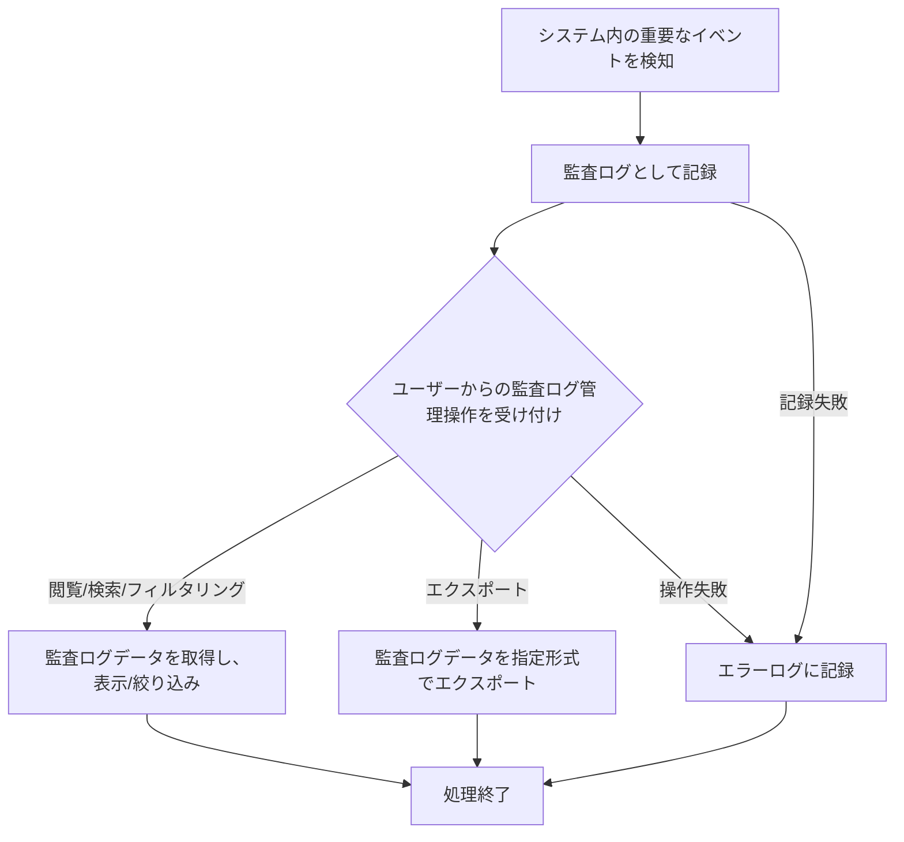

# ID: RDD-FRQ-2025-047

# 機能: システム監査ログ管理機能

## 概要

ユーザーのログイン/ログアウト履歴、システム操作履歴、データの作成/更新/削除履歴など、システム内のあらゆる重要なイベントを監査ログとして記録し、管理者が閲覧、検索、フィルタリング、エクスポートできる機能です。これにより、セキュリティインシデントの調査、コンプライアンス要件への対応、および問題発生時の原因究明を支援します。

### 入力

- システム内の各種イベント（ログイン、ログアウト、データ操作、設定変更など）
- ユーザーからの監査ログ閲覧・検索・フィルタリング・エクスポート要求

### 処理内容

1. システム内で発生する以下の重要なイベントをリアルタイムで検知し、監査ログとして記録する。
   - ユーザー認証関連（ログイン、ログアウト、パスワード変更、MFA設定変更）
   - データ操作（タスク、プロジェクト、成果物、変更要求などの作成、更新、削除）
   - ユーザー管理関連（ユーザー登録、情報変更、ロール・権限変更）
   - システム設定変更
1. 記録された監査ログデータに対して、以下の操作を提供する。
   - **閲覧**: ログを時系列順に表示する。
   - **検索**: キーワード、ユーザーID、操作タイプ、期間などの条件でログを検索する。
   - **フィルタリング**: ユーザーID、操作タイプ、対象エンティティなどの条件でログを絞り込む。
   - **エクスポート**: 検索・フィルタリングされたログデータをCSVやJSON形式でエクスポートする。
1. 監査ログの改ざん防止対策を施し、一定期間（例: 7年間）保存する。

システム監査ログ管理機能の処理フローを示します。

### 出力

- 成功時: 監査ログデータ表示、またはエクスポートされたファイル
- エラー時: エラーログへの記録

### エラー処理

- 監査ログ記録失敗: イベントデータの記録に失敗した場合、エラーログに記録し、システム管理者に通知する。
- 監査ログ操作失敗: 監査ログの閲覧、検索、フィルタリング、エクスポート中にエラーが発生した場合、エラーメッセージをユーザーに表示し、エラーログに記録する。

### 関連するユースケース

- UC-XXX (システム監査ログを閲覧する) ※新規作成を想定

### 関連する業務フロー

- BF-008 (システム運用フロー)

### 関連する非機能要件

- [NFR-010 (監査性)](../non-functional-requirements/nfr-010-auditability.md): ユーザーのログイン・ログアウト履歴、操作履歴が記録されること。
- [NFR-002 (セキュリティ)](../non-functional-requirements/nfr-002-security.md): 監査ログの改ざん防止対策が施され、一定期間保存されること。

### 関連する画面

- SCR-022 (システム運用管理画面)
- SCR-XXX (監査ログ管理画面) ※新規作成を想定
