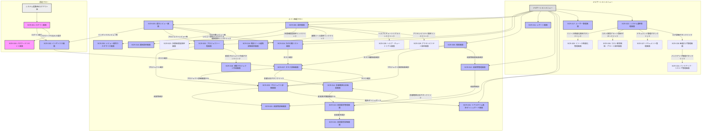

# 全画面遷移図

## 概要

本ドキュメントは、システム内のすべての主要な画面間の遷移を統合的に視覚化したものです。

## 全画面遷移フローチャート

```mermaid
graph TD
    subgraph 認証フロー
        Start[システム起動時/ログアウト後] --> SCR001[SCR-001: ログイン画面]
        SCR001 -->|ログイン成功| SCR002[SCR-002: インボックス画面]
        SCR001 -->|パスワードを忘れた場合| SCR019[SCR-019: パスワードリセット画面]
    end

    subgraph メイン機能フロー
        SCR002[SCR-002: インボックス画面] -->|タスク選択| SCR007[SCR-007: タスク詳細画面]
        SCR003[SCR-003: プロジェクト一覧画面] -->|プロジェクト選択| SCR009[SCR-009: プロジェクト詳細画面]
        SCR003 -->|新規プロジェクト作成ボタンクリック| SCR018[SCR-018: 新規プロジェクト作成画面]
        SCR004[SCR-004: 次の行動リスト画面] -->|タスク選択| SCR007
        SCR005[SCR-005: 週次レビュー画面] -->|インボックスレビュー時| SCR002
        SCR005 -->|プロジェクトレビュー時| SCR003
        SCR005 -->|次の行動レビュー時| SCR004
        SCR005 -->|レビュー項目カスタマイズ| SCR035[SCR-035: レビュー項目カスタマイズ画面]
        SCR006[SCR-006: 設定画面] -->|通知設定リンククリック| SCR010[SCR-010: 通知設定画面]
        SCR006 -->|多要素認証設定リンククリック| SCR023[SCR-023: 多要素認証設定画面]
        SCR006 -->|連携ツール設定リンククリック| SCR016[SCR-016: 既存ツール連携詳細設定画面]
        SCR006 -->|ヘルプとチュートリアルリンククリック| SCR028[SCR-028: ヘルプ・チュートリアル画面]
        SCR006 -->|アクセシビリティ設定リンククリック| SCR029[SCR-029: アクセシビリティ設定画面]
        SCR007 -->|プロジェクト詳細画面から| SCR009
        SCR007 -->|影響分析ボタンクリック| SCR014[SCR-014: 影響範囲分析結果画面]
        SCR008[SCR-008: 検索画面] -->|タスク検索結果選択| SCR007
        SCR008 -->|プロジェクト検索結果選択| SCR009
        SCR008 -->|成果物検索結果選択| SCR012[SCR-012: 成果物管理画面]
        SCR009 -->|タスク選択| SCR007
        SCR009 -->|成果物選択| SCR020[SCR-020: 成果物詳細画面]
        SCR009 -->|進捗ダッシュボード| SCR015[SCR-015: リアルタイム進捗ダッシュボード画面]
        SCR012 -->|成果物選択| SCR020[SCR-020: 成果物詳細画面]
        SCR013[SCR-013: 変更要求管理画面] -->|変更要求選択| SCR021[SCR-021: 変更要求詳細画面]
        SCR013 -->|影響範囲分析ボタンクリック| SCR014
        SCR014 -->|変更要求管理画面から| SCR013
    end

    subgraph ナビゲーションメニュー
        NavMenu[ナビゲーションメニュー] --> SCR003
        NavMenu --> SCR004
        NavMenu --> SCR005
        NavMenu --> SCR006
        NavMenu --> SCR008
        NavMenu --> SCR011[SCR-011: レポート画面]
        NavMenu --> SCR012
        NavMenu --> SCR013
        NavMenu --> SCR015
        NavMenu --> SCR017[SCR-017: ユーザー管理画面]
        NavMenu -->         SCR022[SCR-022: システム運用管理画面] -->|リソース最適化設定ボタンクリック| SCR025[SCR-025: リソース最適化管理画面]
        SCR022 -->|コスト異常アラート設定ボタンクリック| SCR026[SCR-026: コスト異常検知・アラート設定画面]
        SCR022 -->|ドキュメント管理ボタンクリック| SCR027[SCR-027: ドキュメント管理画面]
        SCR022 -->|ログ詳細ボタンクリック| SCR030[SCR-030: 監査ログ管理画面] -->|バックアップ管理ボタンクリック| SCR024[SCR-024: バックアップ・リストア管理画面]
    end

    style SCR001 fill:#f9f,stroke:#333,stroke-width:2px
    style SCR002 fill:#bbf,stroke:#333,stroke-width:2px
    style SCR003 fill:#bbf,stroke:#333,stroke-width:2px
    style SCR004 fill:#bbf,stroke:#333,stroke-width:2px
    style SCR005 fill:#bbf,stroke:#333,stroke-width:2px
    style SCR006 fill:#bbf,stroke:#333,stroke-width:2px
    style SCR007 fill:#bbf,stroke:#333,stroke-width:2px
    style SCR008 fill:#bbf,stroke:#333,stroke-width:2px
    style SCR009 fill:#bbf,stroke:#333,stroke-width:2px
    style SCR010 fill:#bbf,stroke:#333,stroke-width:2px
    style SCR011 fill:#bbf,stroke:#333,stroke-width:2px
    style SCR012 fill:#bbf,stroke:#333,stroke-width:2px
    style SCR013 fill:#bbf,stroke:#333,stroke-width:2px
    style SCR014 fill:#bbf,stroke:#333,stroke-width:2px
    style SCR015 fill:#bbf,stroke:#333,stroke-width:2px
    style SCR016 fill:#bbf,stroke:#333,stroke-width:2px
    style SCR017 fill:#bbf,stroke:#333,stroke-width:2px
    style SCR018 fill:#bbf,stroke:#333,stroke-width:2px
    style SCR019 fill:#f9f,stroke:#333,stroke-width:2px
    style SCR020 fill:#bbf,stroke:#333,stroke-width:2px
    style SCR021 fill:#bbf,stroke:#333,stroke-width:2px
    style SCR022 fill:#bbf,stroke:#333,stroke-width:2px
    style SCR035 fill:#bbf,stroke:#333,stroke-width:2px
    style NavMenu fill:#ddd,stroke:#333,stroke-width:2px
    style Start fill:#eee,stroke:#333,stroke-width:2px
```
