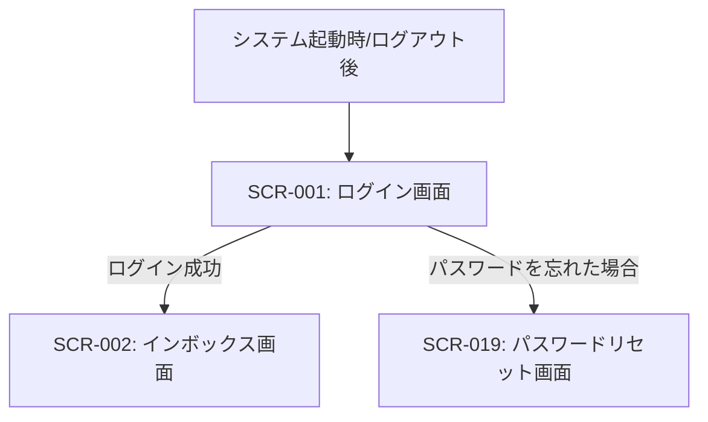

# ID: RDD-SCR-2025-001

# 画面: ログイン画面

## 画面概要

本画面は、Tas9s10reamシステムへのアクセスを認証するための画面です。ユーザーは登録済みのメールアドレスとパスワードを入力してログインします。

### 画面遷移

### 画面レイアウト

- 中央にログインフォームを配置。
- フォーム上部にシステムロゴとタイトル。
- フォーム下部に「パスワードを忘れた場合」リンクと「新規登録」リンク（将来的な拡張）。
- ログインボタン。

### 入力項目

- メールアドレス: 文字列, [有効なメールアドレス形式],
  [なし], 必須, ユーザーの登録済みメールアドレス
- パスワード: 文字列, [8文字以上、英数字記号を含む],
  [なし], 必須, ユーザーのパスワード

### 表示項目

- エラーメッセージ: 文字列,
  [赤字で表示], ログイン失敗時のエラーメッセージ（例: 「メールアドレスまたはパスワードが正しくありません。」）

### 操作とイベント

- ログインボタンクリック: ユーザーが入力したメールアドレスとパスワードで認証を試行。認証成功時はインボックス画面へ遷移。失敗時はエラーメッセージを表示。
- 「パスワードを忘れた場合」リンククリック: パスワードリセット画面へ遷移。
- 「新規登録」リンククリック: (将来的な拡張) 新規ユーザー登録画面へ遷移。

### エラーメッセージ

- [認証失敗]: 「メールアドレスまたはパスワードが正しくありません。」, 画面上にメッセージを表示
- [入力形式エラー（メールアドレス）]: 「有効なメールアドレスを入力してください。」, 該当入力フィールドの下にメッセージを表示
- [入力形式エラー（パスワード）]: 「パスワードは8文字以上で、英数字記号を組み合わせてください。」, 該当入力フィールドの下にメッセージを表示

### 関連する機能要件

- [FR-025 (ユーザー登録機能)](../functional-requirements/fr-025-user-registration-function.md) - ログイン機能自体はFRに直接紐づかないが、ユーザー管理の一部として関連
- [FR-026 (ユーザー情報管理機能)](../functional-requirements/fr-026-user-information-management-function.md) - 認証情報に関連
- [FR-034 (パスワードリセット機能)](../functional-requirements/fr-034-password-reset-function.md) - パスワードリセットフローの入り口

### 関連する業務フロー

- なし (システムへの入り口のため)

### 関連するユースケース

- なし (システムへの入り口のため)
