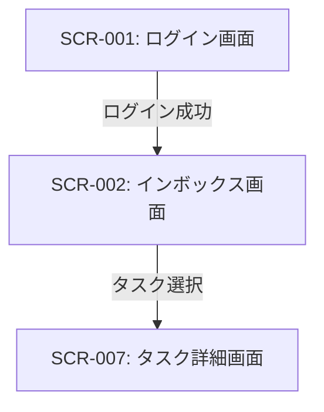

# ID: RDD-SCR-2025-002

# 画面: インボックス画面

## 画面概要

本画面は、ユーザーがタスクやアイデアを一時的に記録する「インボックス」の役割を果たす画面です。ユーザーはここに思いついたことを素早く入力し、後で処理するために保存できます。

### 画面遷移

### 画面レイアウト

- 上部にタスク入力フィールドと「保存」ボタン。
- その下に、インボックスに登録されたタスクの一覧が表示される。
- 各タスクは、タイトル、登録日時、簡単なプレビューが表示される。
- タスク一覧はスクロール可能。

### 入力項目

- タスク内容: 文字列, [最大255文字],
  [なし], 必須, インボックスに記録するタスクのタイトルまたは簡単な説明

### 表示項目

- タスク一覧: リスト形式
  - 各タスク:
    - タスクタイトル: 文字列, [なし], タスクのタイトル
    - 登録日時: 日時, [YYYY/MM/DD HH:MM], タスクがインボックスに登録された日時
    - プレビュー: 文字列, [最大50文字], タスク内容の冒頭部分

### 操作とイベント

- 「保存」ボタンクリック: 入力フィールドのタスク内容をインボックスに登録。登録後、入力フィールドはクリアされる。保存成功時は「タスクをインボックスに保存しました。」というメッセージを画面上部に表示する。
- タスククリック: 選択されたタスクの詳細画面 (SCR-007) へ遷移。
- タスク削除アイコンクリック: 選択されたタスクをインボックスから削除（確認ダイアログ表示後）。

### エラーメッセージ

- [タスク内容未入力]: 「タスク内容を入力してください。」, 入力フィールドの下にメッセージを表示
- [タスク内容文字数オーバー]: 「タスク内容は255文字以内で入力してください。」, 入力フィールドの下にメッセージを表示

### 関連する機能要件

- [FR-001 (タスク収集機能)](../functional-requirements/fr-001-task-collection-function.md)

### 関連する業務フロー

- [BF-001 (タスク収集フロー)](../business-flows/bf-001-task-collection-flow.md)

### 関連するユースケース

- [UC-001 (タスクをインボックスに記録する)](../use-cases/uc-001-record-task-to-inbox.md)
- [UC-004 (週次レビューを実施する)](../use-cases/uc-004-perform-weekly-review.md)
