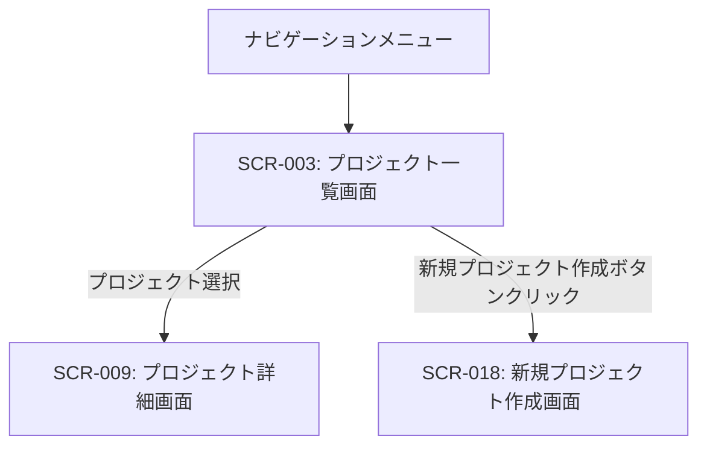

# ID: RDD-SCR-2025-003

# 画面: プロジェクト一覧画面

## 画面概要

本画面は、ユーザーが管理しているプロジェクトの一覧を表示し、各プロジェクトの詳細を確認したり、新規プロジェクトを作成したりするための画面です。

### 画面遷移

### 画面レイアウト

- 上部に「新規プロジェクト作成」ボタン。
- その下に、プロジェクトの一覧がカード形式またはリスト形式で表示される。
- プロジェクトの階層表示（ツリービューやインデント表示）。
- 各プロジェクトカード/リストには、プロジェクト名、概要、進捗状況（パーセンテージやステータス）、担当者、次の行動サマリーなどが表示される。
- プロジェクト一覧はフィルタリング・ソート機能を持つ。

### 入力項目

- 検索/フィルタリング: 文字列, [なし],
  [なし], 任意, プロジェクト名や担当者名で一覧を絞り込む

### 表示項目

- プロジェクト一覧: リスト形式
  - 各プロジェクト:
    - プロジェクト名: 文字列, [なし], プロジェクトの名称
    - 概要: 文字列, [最大100文字], プロジェクトの簡単な説明
    - 進捗状況: 数値/文字列, [0-100%], プロジェクトの現在の進捗度
    - ステータス: 文字列, [進行中/完了/保留など], プロジェクトの現在の状態
    - 担当者: 文字列, [なし], プロジェクトの主要担当者またはチーム名
    - 次の行動サマリー: 文字列,
      [なし], 紐づく「次の行動」タスクの数や最も近い期日

### 操作とイベント

- 「新規プロジェクト作成」ボタンクリック: 新規プロジェクト作成画面へ遷移。
- プロジェクトカード/リストクリック: 選択されたプロジェクトの詳細画面 (SCR-009) へ遷移。
- 検索/フィルタリング入力: 入力内容に基づいてプロジェクト一覧をリアルタイムで絞り込み表示。
- プロジェクト名/ステータスのインライン編集（FR-052）

### エラーメッセージ

- [検索結果なし]: 「該当するプロジェクトは見つかりませんでした。」, 画面中央にメッセージを表示
- [紐付け完了]: 「タスクをプロジェクトに紐付けました。」, 画面上部にメッセージを表示

### 関連する機能要件

- [FR-006 (プロジェクト管理機能)](../functional-requirements/fr-006-project-management-function.md)
- [FR-051 (プロジェクト階層表示機能)](../functional-requirements/fr-051-project-hierarchy-display-function.md)
- [FR-052 (プロジェクトクイック編集機能)](../functional-requirements/fr-052-project-quick-edit-function.md)
- [FR-053 (プロジェクト次の行動サマリー表示機能)](../functional-requirements/fr-053-project-next-action-summary-display-function.md)

### 関連する業務フロー

- なし (プロジェクト管理の入り口)

### 関連するユースケース

- [UC-003 (タスクをプロジェクトに紐付ける)](../use-cases/uc-003-link-task-to-project.md) - プロジェクト選択の起点
- [UC-008 (プロジェクトの状況を確認する)](../use-cases/uc-008-check-project-status.md) - プロジェクト一覧から状況を確認
- [UC-004 (週次レビューを実施する)](../use-cases/uc-004-perform-weekly-review.md)
