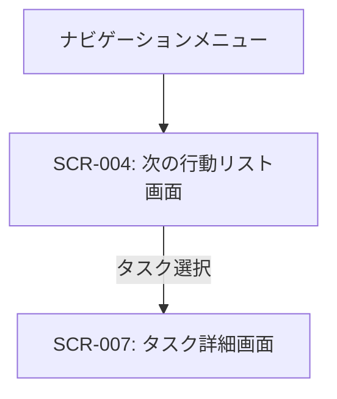

# ID: RDD-SCR-2025-004

# 画面: 次の行動リスト画面

## 画面概要

本画面は、ユーザーが次に取るべき具体的な行動（タスク）を一覧表示する画面です。コンテキストやプロジェクトに基づいてタスクをフィルタリングし、実行に移すことができます。

### 画面遷移

### 画面レイアウト

- 上部にコンテキストやプロジェクトによるフィルタリングオプション。
- その下に、次の行動リストに登録されたタスクの一覧が表示される。
- 各タスクは、タイトル、関連プロジェクト、コンテキスト、期日などが表示される。
- タスク一覧はソート可能。

### 入力項目

- フィルタリング（コンテキスト）: ドロップダウン, [コンテキスト一覧],
  [なし], 任意, 特定のコンテキストに紐づくタスクのみ表示
- フィルタリング（プロジェクト）: ドロップダウン, [プロジェクト一覧],
  [なし], 任意, 特定のプロジェクトに紐づくタスクのみ表示

### 表示項目

- タスク一覧: リスト形式
  - 各タスク:
    - タスクタイトル: 文字列, [なし], タスクの名称
    - 関連プロジェクト: 文字列, [なし], タスクが紐づくプロジェクト名
    - コンテキスト: 文字列, [なし], タスクが紐づくコンテキスト名（例: @PC,
      @電話）
    - 期日: 日付, [YYYY/MM/DD], タスクの期日
    - 優先度: 文字列, [高/中/低], タスクの優先度

### 操作とイベント

- タスククリック: 選択されたタスクの詳細画面 (SCR-007) へ遷移。
- タスク完了チェックボックス: タスクを完了状態に更新し、リストから非表示にする。
- タスク中断ボタン: タスクを中断状態に更新し、リスト上で中断中として表示する。
- フィルタリングオプション変更: 選択されたフィルタに基づいてタスク一覧を更新。

### エラーメッセージ

- [該当タスクなし]: 「該当する次の行動は見つかりませんでした。」, 画面中央にメッセージを表示

### 関連する機能要件

- [FR-004 (タスク実行機能)](../functional-requirements/fr-004-task-execution-function.md)
- [FR-007 (コンテキスト管理機能)](../functional-requirements/fr-007-context-management-function.md)

### 関連する業務フロー

- [BF-005 (タスク実行フロー)](../business-flows/bf-005-task-execution-flow.md)

### 関連するユースケース

- [UC-005 (次の行動リストからタスクを実行する)](../use-cases/uc-005-execute-next-action-task.md)
- [UC-004 (週次レビューを実施する)](../use-cases/uc-004-perform-weekly-review.md)
