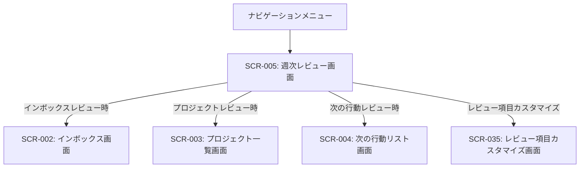

# ID: RDD-SCR-2025-005

# 画面: 週次レビュー画面

## 画面概要

本画面は、ユーザーがGTDの週次レビュープロセスを実行するための画面です。インボックスのクリア、プロジェクトの確認、次の行動の整理など、レビューに必要な項目を順に進めることができます。

### 画面遷移

### 画面レイアウト

- 週次レビューのステップが順に表示される。
- レビュー進捗プログレスバー（FR-057）。
- 各ステップには、以下のUI要素が含まれる。
  - **インボックスのクリア**: インボックスのタスク一覧（タスク処理ボタン付き）、またはインボックス画面へのリンク。
  - **完了したタスクの確認**: 完了済みタスクの一覧表示（アーカイブオプション付き）。
  - **プロジェクトの確認**: プロジェクト一覧（進捗、次の行動、未解決問題表示、更新ボタン付き）、またはプロジェクト一覧画面へのリンク。
  - **次の行動リストの確認**: 次の行動リスト（実行可能かどうかの表示、更新ボタン付き）、または次の行動リスト画面へのリンク。
  - **連絡待ちリストの確認**: 連絡待ちタスクの一覧表示（返信状況、次のアクション表示、更新ボタン付き）。
  - **いつか/多分リストの確認**: いつか/多分リストの一覧表示（インボックスへの記録、リスト更新オプション付き）。
  - **カレンダーの確認**: カレンダー表示（今後の予定とタスクの整合性表示）。
  - **新しいアイデアの収集**: テキスト入力フィールドと「インボックスに記録」ボタン。
- 「次へ」ボタンで次のステップに進む。
- 「レビュー完了」ボタンでレビューを終了する。
- レビュー結果サマリー表示エリア（FR-059）。
- 「レビュー項目カスタマイズ」ボタン。

### 入力項目

- 各ステップでの確認・処理に応じた入力項目（例: インボックスのタスク処理、プロジェクトの更新、新しいアイデアの入力など）

### 表示項目

- レビュー進捗状況: 文字列, [例: ステップ 3/7], 現在のレビューの進捗
- 各ステップのタイトルと説明: 文字列, [なし], 現在のステップの目的と操作ガイド
- レビュー結果サマリー: 文字列,
  [なし], レビューで更新されたタスク数、新規追加されたプロジェクト数など

### 操作とイベント

- 「次へ」ボタンクリック: 現在のステップを完了し、次のレビューステップへ進む。
- 各ステップ内のリンク/ボタンクリック: 関連する画面へ遷移、またはその場でタスク処理などを実行。
- 「レビュー完了」ボタンクリック: 週次レビューを終了し、レビュー履歴を記録。
- 「レビュー項目カスタマイズ」ボタンクリック: レビュー項目カスタマイズ画面へ遷移。

### エラーメッセージ

- [未完了項目あり]: 「未処理の項目があります。レビューを完了するにはすべての項目を処理してください。」, 画面上部にメッセージを表示

### 関連する機能要件

- [FR-005 (週次レビュー機能)](../functional-requirements/fr-005-weekly-review-function.md)
- [FR-057 (レビュー進捗視覚化機能)](../functional-requirements/fr-057-review-progress-visualization-function.md)
- [FR-058 (レビュー項目カスタマイズ機能)](../functional-requirements/fr-058-review-item-customization-function.md)
- [FR-059 (レビュー結果サマリー表示機能)](../functional-requirements/fr-059-review-summary-display-function.md)

### 関連する業務フロー

- [BF-004 (週次レビューフロー)](../business-flows/bf-004-weekly-review-flow.md)

### 関連するユースケース

- [UC-004 (週次レビューを実施する)](../use-cases/uc-004-perform-weekly-review.md)
