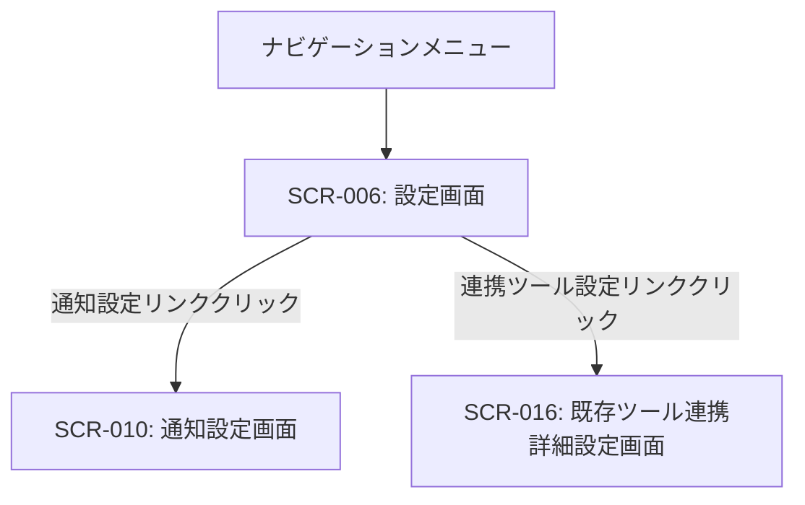

# ID: RDD-SCR-2025-006

# 画面: 設定画面

## 画面概要

本画面は、ユーザーがTas9s10reamの各種設定（プロフィール、通知、連携ツールなど）を管理するための画面です。複数の設定カテゴリに分かれており、ユーザーはそれぞれの設定をカスタマイズできます。

### 画面遷移

### 画面レイアウト

- 左側に設定カテゴリのリスト（例: プロフィール、通知、連携ツール、アカウント）。
- 右側に選択されたカテゴリの設定項目が表示される。
- 各設定項目は、入力フィールド、トグルスイッチ、ドロップダウンなどで構成される。
- 「保存」ボタンで変更を適用。

### 入力項目

- プロフィール設定:
  - ユーザー名: 文字列, [なし], [現在のユーザー名], 任意, 表示名
  - メールアドレス: 文字列, [有効なメールアドレス形式],
    [現在のメールアドレス], 必須, ログインIDとしても使用
  - パスワード: 文字列, [8文字以上、英数字記号を含む],
    [なし], 任意, パスワード変更時のみ入力
- 通知設定:
  - 通知ON/OFF: 真偽値, [ON], [ON], 任意, 全体通知の有効/無効
  - 通知方法: 複数選択, [メール, アプリ内], [メール,
    アプリ内], 任意, 通知を受け取る方法
- 連携ツール設定:
  - ツール名: 文字列, [なし], [なし], 任意, 連携する外部ツールの名称
  - APIキー: 文字列, [なし], [なし], 任意, 外部ツール連携用のAPIキー

### 表示項目

- 各設定カテゴリのタイトルと説明
- 現在の設定値

### 操作とイベント

- 設定カテゴリクリック: 選択されたカテゴリの設定項目を右側に表示。
- 各設定項目の変更: 入力値のバリデーションを行い、有効な場合は一時的に変更を保持。
- 「保存」ボタンクリック: 変更された設定値をシステムに保存。保存成功時はメッセージを表示。
- 「キャンセル」ボタンクリック: 変更を破棄し、元の設定値に戻す。

### エラーメッセージ

- [入力形式エラー]: 「[項目名]の形式が正しくありません。」, 該当入力フィールドの下にメッセージを表示
- [保存失敗]: 「設定の保存に失敗しました。再度お試しください。」, 画面上部にメッセージを表示

### 関連する機能要件

- [FR-026 (ユーザー情報管理機能)](../functional-requirements/fr-026-user-information-management-function.md)
- [FR-029 (通知設定機能)](../functional-requirements/fr-029-notification-settings-function.md)
- [FR-022 (既存ツール連携設定機能)](../functional-requirements/fr-022-external-tool-integration-settings-function.md)

### 関連する業務フロー

- なし (システム設定)

### 関連するユースケース

- [UC-013 (ユーザーを管理する)](../use-cases/uc-013-manage-users.md) - プロフィール設定に関連
- [UC-014 (システム通知を設定する)](../use-cases/uc-014-configure-notifications.md) - 通知設定に関連
- [UC-006 (既存ツールからタスクをインポートする)](../use-cases/uc-006-import-tasks-from-existing-tool.md) - 連携ツール設定に関連
