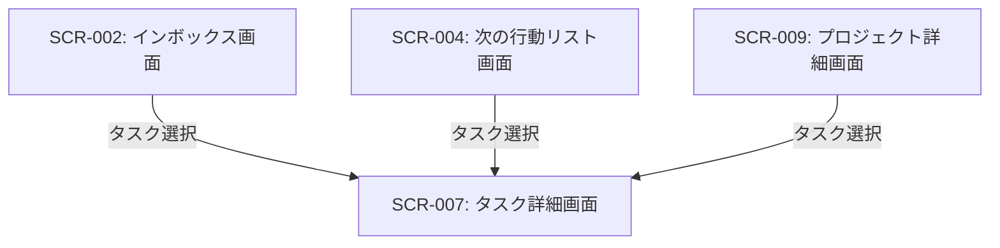

# ID: RDD-SCR-2025-007

# 画面: タスク詳細画面

## 画面概要

本画面は、個々のタスクの詳細情報を表示し、編集するための画面です。タスクのタイトル、説明、期日、プロジェクト、コンテキスト、優先度などを設定できます。

### 画面遷移

### 画面レイアウト

- タスクの各詳細項目（タイトル、説明、期日、プロジェクト、コンテキスト、優先度など）が編集可能なフォームとして表示される。
- GTDワークフローの視覚的ガイドUI（FR-060）。
- サブタスクインライン管理UI（FR-061）。
- 関連情報一元表示UI（FR-062）。
- 「保存」ボタン、「削除」ボタン、「完了」ボタン。
- コメント追加欄。

### 入力項目

- タイトル: 文字列, [最大255文字], [なし], 必須, タスクのタイトル
- 説明: テキストエリア, [なし], [なし], 任意, タスクの詳細な説明
- 期日: 日付, [YYYY/MM/DD], [なし], 任意, タスクの完了期限
- プロジェクト: ドロップダウン, [プロジェクト一覧, 新規プロジェクト作成],
  [なし], 任意, タスクが紐づくプロジェクト。新規プロジェクト作成を選択した場合、プロジェクト名入力フィールドを表示。
- 担当者: ドロップダウン, [ユーザー一覧], [なし], 任意, タスクの担当者
- コンテキスト: ドロップダウン, [コンテキスト一覧],
  [なし], 任意, タスクが紐づくコンテキスト
- 優先度: ドロップダウン, [高/中/低], [中], 任意, タスクの優先度
- 進捗状況: ドロップダウン, [未着手/進行中/完了/中断],
  [未着手], 任意, タスクの現在の進捗状況
- 進捗率: 数値, [0-100], [0], 任意, タスクの進捗度をパーセンテージで表示
- コメント: テキストエリア, [なし], [なし], 任意, タスクに関するコメント
- 添付ファイル: ファイルアップロード, [ファイル形式],
  [なし], 任意, タスクに関連するファイル

### 表示項目

- タスクID: 文字列, [なし], タスクの一意な識別子
- 作成日時: 日時, [YYYY/MM/DD HH:MM], タスクが作成された日時
- 更新日時: 日時, [YYYY/MM/DD HH:MM], タスクが最後に更新された日時
- コメント履歴: リスト形式, [なし], 過去のコメントと投稿者、日時
- 添付ファイル一覧: リスト形式,
  [なし], アップロード済みのファイル名とダウンロードリンク

### 操作とイベント

- 「保存」ボタンクリック: 変更されたタスク情報と添付ファイルを保存。保存成功時はメッセージを表示。
- 「削除」ボタンクリック: タスクを削除（確認ダイアログ表示後）。
- 「完了」ボタンクリック: タスクを完了状態に更新。
- コメント入力後「追加」ボタンクリック: コメントをタスクに追加。
- 「ファイルを選択」ボタンクリック: ファイル選択ダイアログを開く。

### エラーメッセージ

- [タイトル未入力]: 「タイトルを入力してください。」, タイトル入力フィールドの下にメッセージを表示
- [保存失敗]: 「タスク情報の保存に失敗しました。再度お試しください。」, 画面上部にメッセージを表示

### 関連する機能要件

- [FR-002 (タスク処理機能)](../functional-requirements/fr-002-task-processing-function.md)
- [FR-003 (タスク整理機能)](../functional-requirements/fr-003-task-organization-function.md)
- [FR-004 (タスク実行機能)](../functional-requirements/fr-004-task-execution-function.md)
- [FR-007 (コンテキスト管理機能)](../functional-requirements/fr-007-context-management-function.md)
- [FR-060 (GTDワークフロー視覚的ガイド機能)](../functional-requirements/fr-060-gtd-workflow-visual-guide-function.md)
- [FR-061 (サブタスクインライン管理機能)](../functional-requirements/fr-061-subtask-inline-management-function.md)
- [FR-062 (関連情報一元表示機能)](../functional-requirements/fr-062-related-information-unified-display-function.md)

### 関連する業務フロー

- [BF-002 (タスク処理フロー)](../business-flows/bf-002-task-processing-flow.md)
- [BF-003 (タスク整理フロー)](../business-flows/bf-003-task-organization-flow.md)
- [BF-005 (タスク実行フロー)](../business-flows/bf-005-task-execution-flow.md)

### 関連するユースケース

- [UC-002 (インボックスのタスクを処理する)](../use-cases/uc-002-process-inbox-task.md)
- [UC-003 (タスクをプロジェクトに紐付ける)](../use-cases/uc-003-link-task-to-project.md)
- [UC-005 (次の行動リストからタスクを実行する)](../use-cases/uc-005-execute-next-action-task.md)
- [UC-007 (タスクの進捗を更新する)](../use-cases/uc-007-update-task-progress.md)
