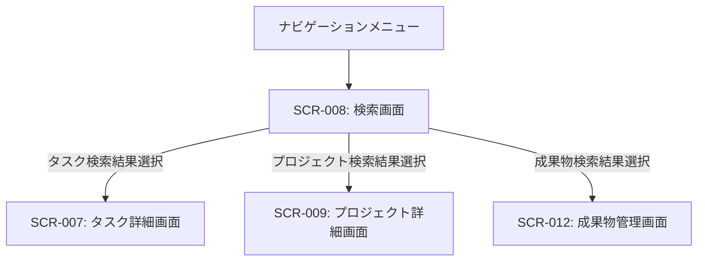

# ID: RDD-SCR-2025-008

# 画面: 検索画面

## 画面概要

本画面は、ユーザーがシステム内のタスク、プロジェクト、成果物などをキーワードやフィルタ条件で検索するための画面です。検索結果を一覧表示し、詳細へ遷移できます。

### 画面遷移

### 画面レイアウト

- 上部に検索入力フィールドと検索ボタン。
- 検索履歴/お気に入り検索UI。
- その下に、検索対象（タスク、プロジェクト、成果物など）を選択するタブまたはフィルタオプション。
- 選択された検索対象に応じたフィルタリングオプション（例: 期日、ステータス、担当者）。
- 検索結果が一覧表示される。
- 検索結果プレビューUI。

### 入力項目

- 検索キーワード: 文字列, [なし], [なし], 必須, 検索対象のキーワード
- 検索対象: ラジオボタン/タブ, [タスク, プロジェクト, 成果物],
  [タスク], 必須, 検索する情報の種類
- フィルタリングオプション: 各検索対象に応じた項目（例: 期日範囲、ステータス、担当者など）

### 表示項目

- 検索結果一覧: リスト形式
  - 各結果:
    - タイプ: 文字列, [タスク/プロジェクト/成果物], 検索結果の種別
    - タイトル/名称: 文字列, [なし], 検索結果のタイトルまたは名称
    - 概要/説明: 文字列, [最大100文字], 検索結果の簡単な説明
    - 関連情報: 文字列, [なし], 関連するプロジェクト名やコンテキストなど

### 操作とイベント

- 検索ボタンクリック: 入力されたキーワードとフィルタ条件に基づいて検索を実行し、結果を表示。
- 検索結果クリック: 選択された検索結果の詳細画面へ遷移。
- 検索対象タブ/フィルタオプション変更: 検索対象を切り替え、またはフィルタ条件を適用して結果を再表示。

### エラーメッセージ

- [検索キーワード未入力]: 「検索キーワードを入力してください。」, 検索入力フィールドの下にメッセージを表示
- [検索結果なし]: 「該当する情報は見つかりませんでした。」, 画面中央にメッセージを表示

### 関連する機能要件

- [FR-030 (タスク検索機能)](../functional-requirements/fr-030-task-search-function.md)
- [FR-031 (タスクフィルタリング機能)](../functional-requirements/fr-031-task-filtering-function.md)
- [FR-063 (自然言語検索機能)](../functional-requirements/fr-063-natural-language-search-function.md)
- [FR-064 (検索履歴/お気に入り検索機能)](../functional-requirements/fr-064-search-history-favorite-search-function.md)
- [FR-065 (検索結果プレビュー機能)](../functional-requirements/fr-065-search-result-preview-function.md)

### 関連する業務フロー

- なし (情報検索)

### 関連するユースケース

- [UC-015 (タスクを検索・フィルタリングする)](../use-cases/uc-015-search-filter-tasks.md)
- [UC-007 (タスクの進捗を更新する)](../use-cases/uc-007-update-task-progress.md)
- [UC-009 (タスクの優先順位をAIのレコメンデーションに基づいて決定する)](../use-cases/uc-009-ai-task-prioritization.md)
