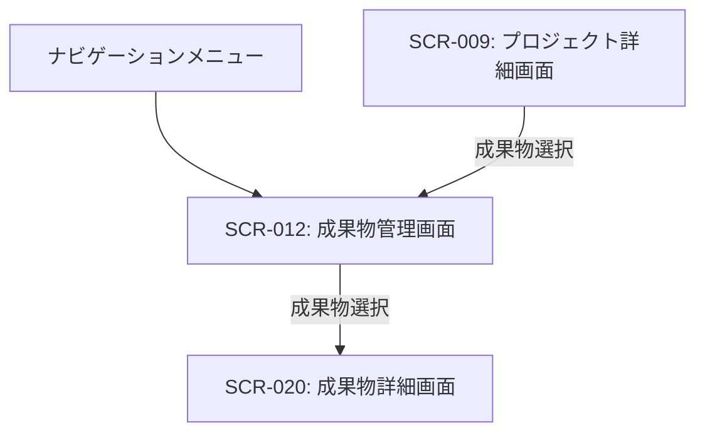

# ID: RDD-SCR-2025-012

# 画面: 成果物管理画面

## 画面概要

本画面は、プロジェクトに関連する成果物（ドキュメント、設計書、コード、画像など）を管理するための画面です。成果物の登録、閲覧、更新、削除、およびタスクとの紐付けが行えます。

### 画面遷移

### 画面レイアウト

- 上部に「新規成果物追加」ボタン。
- その下に、成果物の一覧がカード形式またはリスト形式で表示される。
- 各成果物カード/リストには、成果物名、種類、関連プロジェクト、最終更新日などが表示される。
- 成果物一覧はフィルタリング・ソート機能を持つ。

### 入力項目

- 検索/フィルタリング: 文字列, [なし],
  [なし], 任意, 成果物名や種類で一覧を絞り込む

### 表示項目

- 成果物一覧: リスト形式
  - 各成果物:
    - 成果物名: 文字列, [なし], 成果物の名称
    - 種類: 文字列, [ドキュメント/コード/画像など], 成果物の種類
    - 関連プロジェクト: 文字列, [なし], 成果物が紐づくプロジェクト名
    - 最終更新日: 日付, [YYYY/MM/DD], 成果物が最後に更新された日時
    - 概要: 文字列, [最大100文字], 成果物の簡単な説明

### 操作とイベント

- 「新規成果物追加」ボタンクリック: 新規成果物追加フォームを表示。
- 成果物カード/リストクリック: 選択された成果物の詳細画面へ遷移。
- 検索/フィルタリング入力: 入力内容に基づいて成果物一覧をリアルタイムで絞り込み表示。
- 成果物削除アイコンクリック: 選択された成果物を削除（確認ダイアログ表示後）。

### エラーメッセージ

- [検索結果なし]: 「該当する成果物は見つかりませんでした。」, 画面中央にメッセージを表示

### 関連する機能要件

- [FR-009 (成果物管理機能)](../functional-requirements/fr-009-artifact-management-function.md)
- [FR-011 (成果物依存関係可視化機能)](../functional-requirements/fr-011-artifact-dependency-visualization-function.md)

### 関連する業務フロー

- なし (成果物管理)

### 関連するユースケース

- [UC-010 (成果物とタスクの依存関係を可視化する)](../use-cases/uc-010-visualize-artifact-task-dependencies.md)
