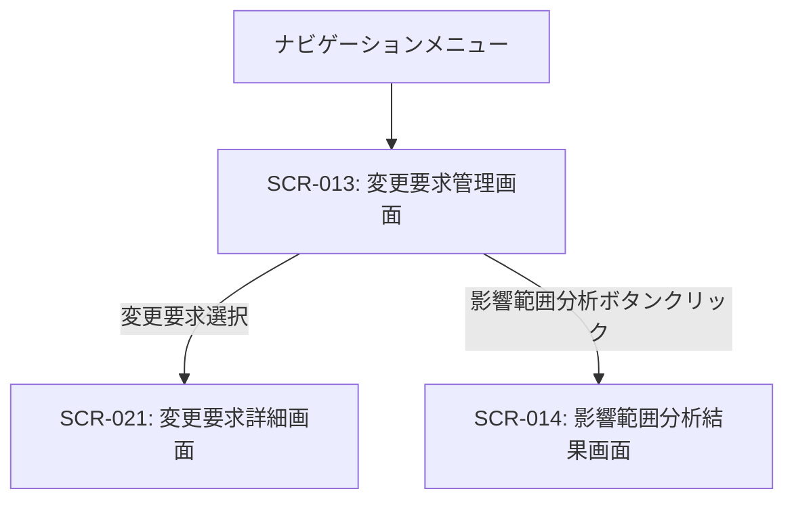

# ID: RDD-SCR-2025-013

# 画面: 変更要求管理画面

## 画面概要

本画面は、プロジェクトに対する変更要求を管理するための画面です。変更要求の登録、閲覧、ステータス更新、承認フローの管理などが行えます。

### 画面遷移

### 画面レイアウト

- 上部に「新規変更要求作成」ボタン。
- その下に、変更要求の一覧がリスト形式で表示される。
- 各変更要求リストには、タイトル、要求元、ステータス、承認状況、期日などが表示される。
- 変更要求一覧はフィルタリング・ソート機能を持つ。

### 入力項目

- 検索/フィルタリング: 文字列, [なし],
  [なし], 任意, タイトルや要求元で一覧を絞り込む

### 表示項目

- 変更要求一覧: リスト形式
  - 各変更要求:
    - タイトル: 文字列, [なし], 変更要求のタイトル
    - 要求元: 文字列, [なし], 変更要求を提出したユーザーまたは部門
    - ステータス: 文字列,
      [新規/承認待ち/承認済み/却下など], 変更要求の現在の状態
    - 承認状況: 文字列, [未承認/承認済み/一部承認など], 承認フローの進捗
    - 期日: 日付, [YYYY/MM/DD], 変更要求の対応期限

### 操作とイベント

- 「新規変更要求作成」ボタンクリック: 新規変更要求作成フォームを表示。
- 変更要求リストクリック: 選択された変更要求の詳細画面へ遷移。
- 検索/フィルタリング入力: 入力内容に基づいて変更要求一覧をリアルタイムで絞り込み表示。
- ステータス更新ボタンクリック: 変更要求のステータスを更新（権限がある場合）。
- 「承認ワークフローへ提出」ボタンクリック: 変更要求を承認ワークフローに提出する。
- 「承認」ボタンクリック: 選択された変更要求を承認する（承認者のみ）。
- 「却下」ボタンクリック: 選択された変更要求を却下する（承認者のみ）。
- 「影響範囲分析」ボタンクリック: 選択された変更要求の影響範囲分析を開始し、結果画面 (SCR-014) へ遷移。

### エラーメッセージ

- [検索結果なし]: 「該当する変更要求は見つかりませんでした。」, 画面中央にメッセージを表示

### 関連する機能要件

- [FR-012 (要求変更管理機能)](../functional-requirements/fr-012-change-request-management-function.md)

### 関連する業務フロー

- なし (変更管理)

### 関連するユースケース

- [UC-011 (要求変更を管理し、影響範囲を確認する)](../use-cases/uc-011-manage-change-requests.md)
