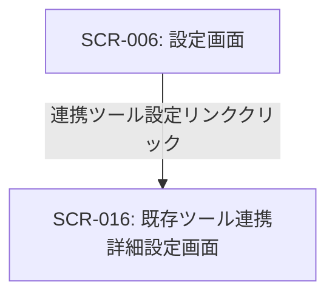

# ID: RDD-SCR-2025-016

# 画面: 既存ツール連携詳細設定画面

## 画面概要

本画面は、Tas9s10reamと外部のプロジェクト管理ツールやタスク管理ツールとの連携を詳細に設定するための画面です。連携するツールの認証情報、同期設定、マッピングルールなどを定義できます。

### 画面遷移

### 画面レイアウト

- 連携する外部ツールを選択するドロップダウンまたはリスト。
- 選択されたツールに応じた設定項目が表示される。
- 認証情報入力欄（APIキー、OAuth認証フロー開始ボタンなど）。
- 同期設定（同期方向、同期頻度など）。
- データマッピングルール設定（例: 外部ツールの「ステータス」をTas9s10reamの「進捗」にマッピング）。
- 「接続テスト」ボタン、「保存」ボタン。

### 入力項目

- 連携ツール選択: ドロップダウン, [Jira, Asana, Trelloなど],
  [なし], 必須, 連携する外部ツール
- 認証情報:
  - APIキー: 文字列, [なし], [なし], 必須, 外部ツール連携用のAPIキー
  - (OAuth認証の場合): 認証開始ボタンクリックで外部認証画面へ遷移
- 同期設定:
  - 同期方向: ラジオボタン, [双方向, 外部からTas9s10reamへ,
    Tas9s10reamから外部へ], [双方向], 必須
  - 同期頻度: ドロップダウン, [リアルタイム, 1時間ごと, 毎日], [1時間ごと], 必須
- データマッピングルール:
  - 外部項目名: 文字列, [なし], [なし], 必須, 外部ツールの項目名
  - 内部項目名: ドロップダウン, [Tas9s10reamの項目一覧], [なし], 必須,
    Tas9s10reamの項目名

### 表示項目

- 接続ステータス: 文字列, [接続済み/未接続/エラー], 外部ツールとの接続状況
- 最終同期日時: 日時, [YYYY/MM/DD HH:MM], 最後にデータが同期された日時
- 最終インポート結果: 文字列,
  [なし], 最終インポートの成功/失敗、インポートされたタスク数、エラー数などのサマリー

### 操作とイベント

- 連携ツール選択ドロップダウン変更: 選択されたツールに応じた設定項目を表示。
- 「接続テスト」ボタンクリック: 入力された認証情報で外部ツールとの接続をテストし、結果を表示。
- 「保存」ボタンクリック: 変更された連携設定をシステムに保存。保存成功時はメッセージを表示。
- 「インポート実行」ボタンクリック: 設定された条件に基づいて外部ツールからタスクをインポート。インポート完了後、結果サマリーを表示。
- データマッピングルール追加/削除ボタンクリック: マッピングルールの追加または削除。

### エラーメッセージ

- [認証情報エラー]: 「認証情報が正しくありません。再度ご確認ください。」, 認証情報入力フィールドの下にメッセージを表示
- [接続テスト失敗]: 「外部ツールとの接続に失敗しました。設定を確認してください。」, 画面上部にメッセージを表示
- [保存失敗]: 「連携設定の保存に失敗しました。再度お試しください。」, 画面上部にメッセージを表示

### 関連する機能要件

- [FR-022 (既存ツール連携設定機能)](../functional-requirements/fr-022-external-tool-integration-settings-function.md)
- [FR-023 (タスクインポート機能)](../functional-requirements/fr-023-task-import-function.md)
- [FR-024 (タスクエクスポート機能)](../functional-requirements/fr-024-task-export-function.md)

### 関連する業務フロー

- [BF-006 (既存ツール連携フロー)](../business-flows/bf-006-existing-tool-integration-flow.md)

### 関連するユースケース

- [UC-006 (既存ツールからタスクをインポートする)](../use-cases/uc-006-import-tasks-from-existing-tool.md)
