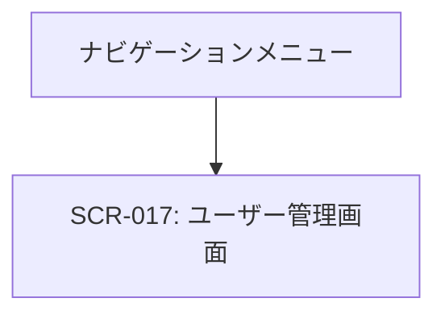

# ID: RDD-SCR-2025-017

# 画面: ユーザー管理画面

## 画面概要

本画面は、ITプロジェクト管理者がシステムに登録されているユーザーを管理するための画面です。ユーザーの登録、情報更新、ロール・権限の変更、削除などが行えます。

### 画面遷移

### 画面レイアウト

- 上部に「新規ユーザー登録」ボタン。
- その下に、登録されているユーザーの一覧がリスト形式で表示される。
- 各ユーザーリストには、氏名、メールアドレス、ロール、最終ログイン日時などが表示される。
- ユーザー一覧はフィルタリング・ソート機能を持つ。

### 入力項目

- 検索/フィルタリング: 文字列, [なし],
  [なし], 任意, 氏名やメールアドレスで一覧を絞り込む
- 新規ユーザー登録/ユーザー情報編集フォーム:
  - 氏名: 文字列, [最大100文字], [なし], 必須, ユーザーの氏名
  - メールアドレス: 文字列, [有効なメールアドレス形式],
    [なし], 必須, ログインIDとしても使用
  - パスワード: 文字列, [8文字以上、英数字記号を含む],
    [なし], 必須 (新規登録時のみ), パスワード
  - ロール: ドロップダウン, [ITプロジェクトメンバー, ITプロジェクト管理者],
    [ITプロジェクトメンバー], 必須, ユーザーの役割
  - 権限: 複数選択, [タスク作成, タスク編集, プロジェクト作成,
    ユーザー管理など], [なし], 任意, ユーザーに付与する権限

### 表示項目

- ユーザー一覧: リスト形式
  - 各ユーザー:
    - 氏名: 文字列, [なし], ユーザーの氏名
    - メールアドレス: 文字列, [なし], ユーザーのメールアドレス
    - ロール: 文字列, [なし], ユーザーの役割
    - 最終ログイン日時: 日時, [YYYY/MM/DD HH:MM], ユーザーの最終ログイン日時

### 操作とイベント

- 「新規ユーザー登録」ボタンクリック: 新規ユーザー登録フォームを表示。
- ユーザーリストクリック: 選択されたユーザーの情報編集フォームを表示。
- 「登録」ボタンクリック (新規ユーザー登録フォーム内): 入力された情報で新規ユーザーを登録。
- 「更新」ボタンクリック (ユーザー情報編集フォーム内): 変更されたユーザー情報を保存。
- 「ロール・権限変更」ボタンクリック (ユーザー情報編集フォーム内): ユーザーのロール・権限を変更。
- 「削除」ボタンクリック (ユーザー情報編集フォーム内): 選択されたユーザーを削除（確認ダイアログ表示後）。
- 検索/フィルタリング入力: 入力内容に基づいてユーザー一覧をリアルタイムで絞り込み表示。

### エラーメッセージ

- [入力情報不足/無効]: 「[項目名]の入力が不足しているか、形式が正しくありません。」, 該当入力フィールドの下にメッセージを表示
- [権限不足]: 「この操作を実行する権限がありません。」, 画面上部にメッセージを表示
- [操作失敗]: 「ユーザー情報の操作に失敗しました。再度お試しください。」, 画面上部にメッセージを表示

### 関連する機能要件

- [FR-026 (ユーザー情報管理機能)](../functional-requirements/fr-026-user-information-management-function.md)
- [FR-027 (ロール・権限管理機能)](../functional-requirements/fr-027-role-permission-management-function.md)

### 関連する業務フロー

- なし (システム管理)

### 関連するユースケース

- [UC-013 (ユーザーを管理する)](../use-cases/uc-013-manage-users.md)
