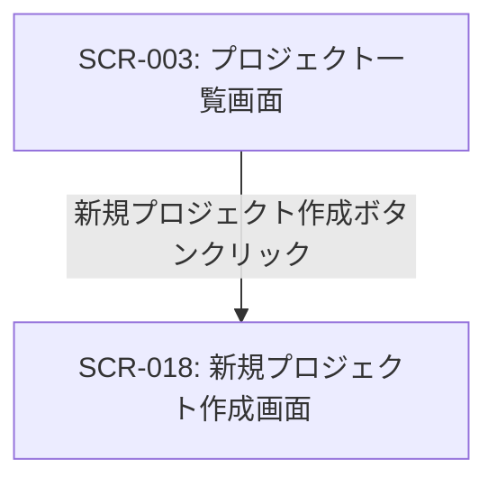

# ID: RDD-SCR-2025-018

# 画面: 新規プロジェクト作成画面

## 画面概要

本画面は、新しいプロジェクトを作成するための画面です。プロジェクト名、概要、期日などの基本情報を入力し、必要に応じてタスクを紐付けて作成できます。

### 画面遷移

### 画面レイアウト

- プロジェクトの基本情報を入力するフォーム。
- 「作成」ボタン、または「作成＆紐付け」ボタン。

### 入力項目

- プロジェクト名: 文字列, [最大255文字], [なし], 必須, 新規プロジェクトの名称
- 概要: テキストエリア, [なし], [なし], 任意, プロジェクトの詳細な説明
- 期日: 日付, [YYYY/MM/DD], [なし], 任意, プロジェクトの完了期限
- 紐付けるタスク: 複数選択, [タスク一覧],
  [なし], 任意, 作成するプロジェクトに紐付けるタスク

### 表示項目

- なし

### 操作とイベント

- 「作成」ボタンクリック: 入力された情報で新規プロジェクトを作成。作成成功時はメッセージを表示。
- 「作成＆紐付け」ボタンクリック: 入力された情報で新規プロジェクトを作成し、選択されたタスクを紐付ける。作成成功時はメッセージを表示。
- 「キャンセル」ボタンクリック: プロジェクト作成を中止し、前の画面に戻る。

### エラーメッセージ

- [プロジェクト名未入力]: 「プロジェクト名を入力してください。」, プロジェクト名入力フィールドの下にメッセージを表示
- [作成失敗]: 「プロジェクトの作成に失敗しました。再度お試しください。」, 画面上部にメッセージを表示

### 関連する機能要件

- [FR-006 (プロジェクト管理機能)](../functional-requirements/fr-006-project-management-function.md)

### 関連する業務フロー

- [BF-003 (タスク整理フロー)](../business-flows/bf-003-task-organization-flow.md)

### 関連するユースケース

- [UC-003 (タスクをプロジェクトに紐付ける)](../use-cases/uc-003-link-task-to-project.md)
