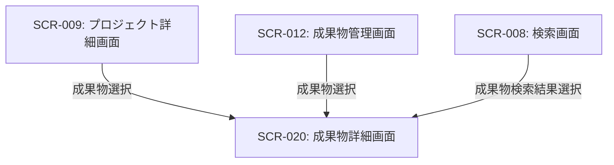

# ID: RDD-SCR-020

# 画面: 成果物詳細画面

## 画面概要

プロジェクトに関連する成果物の詳細情報を表示し、管理するための画面です。成果物の内容確認、編集、バージョン管理などを行います。

### 画面遷移

### 画面レイアウト

- 成果物名、種類、作成者、作成日、最終更新日、バージョン履歴などの基本情報が表示される。
- 成果物の内容表示エリア（テキスト、画像、PDFなどを表示）。
- 「編集」ボタン、「保存」ボタン、「ダウンロード」ボタン。
- バージョン履歴のリストと、各バージョンを選択するオプション。

### 入力項目

- 成果物名: 文字列, [最大255文字], [なし], 必須, 成果物の名称
- 成果物内容: テキストエリア, [なし], [なし], 任意, 成果物の詳細内容

### 表示項目

- 成果物名: 文字列, [なし], 成果物の名称
- 種類: 文字列, [なし], 成果物の種類（例: ドキュメント、画像、コード）
- 作成者: 文字列, [なし], 成果物の作成者
- 作成日: 日時, [YYYY/MM/DD HH:MM], 成果物の作成日時
- 最終更新日: 日時, [YYYY/MM/DD HH:MM], 成果物の最終更新日時
- バージョン: 文字列, [なし], 成果物の現在のバージョン
- バージョン履歴: リスト形式, [なし], 過去のバージョンと更新日時、更新者

### 操作とイベント

- 「編集」ボタンクリック: 成果物内容の編集モードへ移行。
- 「保存」ボタンクリック: 変更された成果物内容を保存し、新しいバージョンを作成。保存成功時はメッセージを表示。
- 「ダウンロード」ボタンクリック: 成果物ファイルをダウンロード。
- バージョン履歴選択: 選択された過去バージョンの成果物内容を表示。

### エラーメッセージ

- [保存失敗]: 「成果物の保存に失敗しました。再度お試しください。」, 画面上部にメッセージを表示

### 関連する機能要件

- [FR-009 (成果物管理機能)](../functional-requirements/fr-009-artifact-management-function.md)
- [FR-037 (成果物バージョン管理機能)](../functional-requirements/fr-037-artifact-version-management-function.md)

### 関連する業務フロー

- なし (直接的な業務フローは存在しないが、成果物管理の一部)

### 関連するユースケース

- [UC-010 (成果物とタスクの依存関係を可視化する)](../use-cases/uc-010-visualize-artifact-task-dependencies.md)
