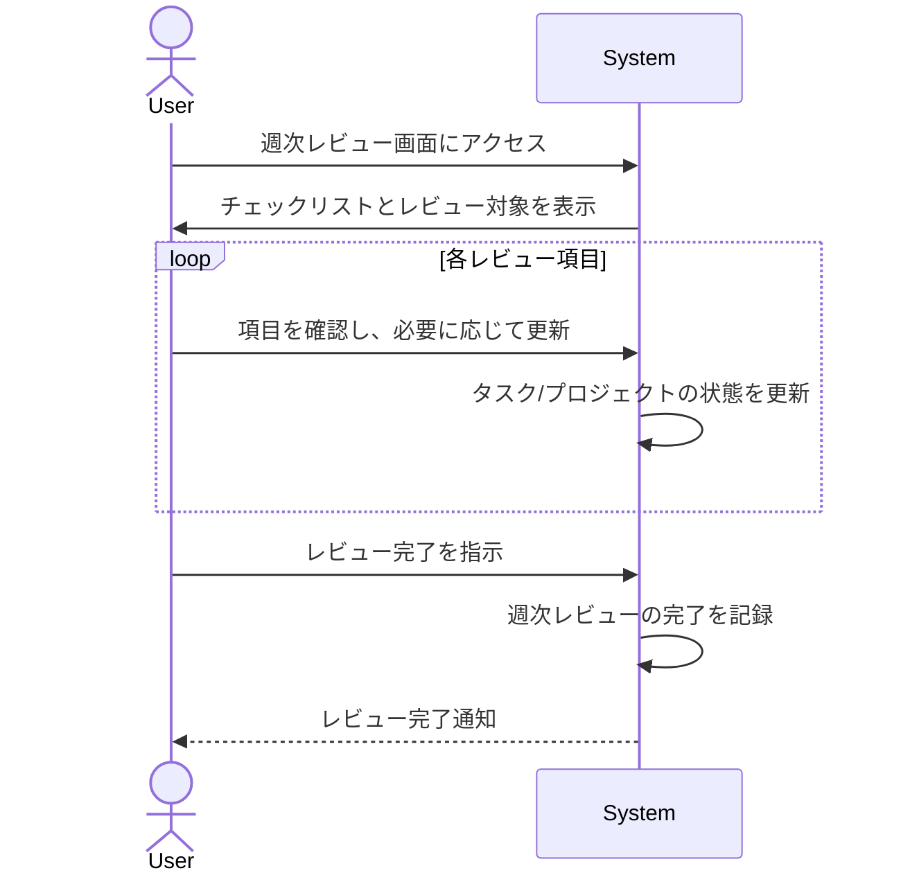

# ID: RDD-UCA-2025-004

# ユースケース: 週次レビューを実施する

## 概要

ユーザーがGTDの週次レビュープロセスを実行し、タスク、プロジェクト、およびシステム全体の状態を最新に保ちます。

### アクター

- 主アクター:
  [ACT-001 (ITプロジェクトメンバー)](../actors/act-001-it-project-member.md)
- 副アクター:
  [ACT-002 (ITプロジェクト管理者)](../actors/act-002-it-project-manager.md)

### 事前条件

- ユーザーがシステムにログインしていること。
- 週次レビュー画面にアクセスできること。

### 基本フロー

1. ユーザーは週次レビュー画面にアクセスする。
1. システムは週次レビューのチェックリストと、レビュー対象となるタスクやプロジェクトを表示する。
1. ユーザーは以下の項目を順にレビューする。
   - インボックスのクリア: 未処理のタスクがないか確認し、必要に応じて処理する。
   - 完了したタスクの確認: 過去1週間に完了したタスクを確認し、アーカイブする。
   - プロジェクトの確認: 各プロジェクトの進捗、次の行動、未解決の問題を確認し、必要に応じて更新する。
   - 次の行動リストの確認: 最新の状態か、実行可能かを確認し、必要に応じて更新する。
   - 連絡待ちリストの確認: 返信があったか、次のアクションが必要かを確認し、必要に応じて更新する。
   - いつか/多分リストの確認: 新しいアイデアやプロジェクトがないか確認し、必要に応じてインボックスに記録するか、リストを更新する。
   - カレンダーの確認: 今後の予定とタスクの整合性を確認する。
   - 新しいアイデアの収集: レビュー中に思いついたことをインボックスに記録する。
1. ユーザーはレビュー結果に基づいてタスクやプロジェクトの状態を更新する。
1. システムは週次レビューの完了を記録する。

週次レビューを実施するユースケースのシーケンスを示します。

### 代替フロー

- なし

### 例外フロー

- **システムエラー**: レビュー中にシステムエラーが発生した場合、システムはエラーを通知し、ユーザーは再試行できる。

### 事後条件

- 週次レビューが完了し、システムに記録されていること。
- タスクやプロジェクトの状態が最新に更新されていること。

### 関連する機能要件

- [FR-005 (週次レビュー機能)](../functional-requirements/fr-005-weekly-review-function.md)
- [FR-001 (タスク収集機能)](../functional-requirements/fr-001-task-collection-function.md)
- [FR-002 (タスク処理機能)](../functional-requirements/fr-002-task-processing-function.md)
- [FR-003 (タスク整理機能)](../functional-requirements/fr-003-task-organization-function.md)
- [FR-006 (プロジェクト管理機能)](../functional-requirements/fr-006-project-management-function.md)

### 関連する業務フロー

- [BF-004 (週次レビューフロー)](../business-flows/bf-004-weekly-review-flow.md)

### 関連する画面

- [SCR-005 (週次レビュー画面)](../screens/scr-005-weekly-review-screen.md)
- [SCR-002 (インボックス画面)](../screens/scr-002-inbox-screen.md)
- [SCR-003 (プロジェクト一覧画面)](../screens/scr-003-project-list-screen.md)
- [SCR-004 (次の行動リスト画面)](../screens/scr-004-next-action-list-screen.md)
