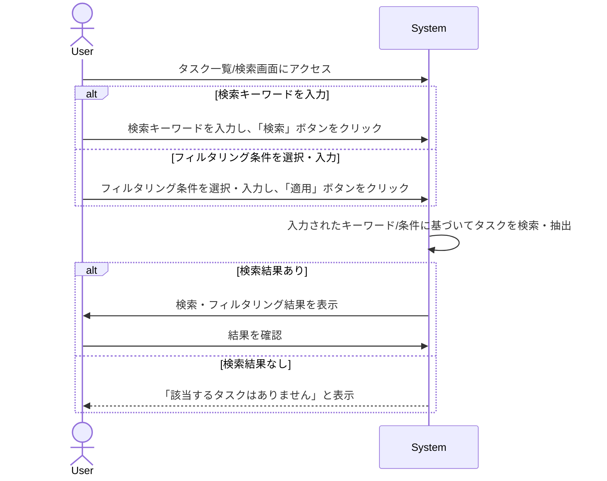

# ID: RDD-UCA-2025-015

# ユースケース: タスクを検索・フィルタリングする

## 概要

ユーザーがシステム内のタスクをキーワードで検索したり、様々な条件でフィルタリングしたりして、目的のタスクを効率的に見つけます。

### アクター

- 主アクター:
  [ACT-001 (ITプロジェクトメンバー)](../actors/act-001-it-project-member.md)
- 副アクター:
  [ACT-002 (ITプロジェクト管理者)](../actors/act-002-it-project-manager.md)

### 事前条件

- ユーザーがシステムにログインしていること。
- 検索・フィルタリング対象のタスクが存在すること。

### 基本フロー

1. ユーザーはタスク一覧画面、または検索画面にアクセスする。
1. ユーザーは以下のいずれかの操作を行う。
   - 検索キーワードを入力し、「検索」ボタンをクリックする。
   - フィルタリング条件（例: 期限、担当者、プロジェクト、コンテキスト、ステータスなど）を選択・入力し、「適用」ボタンをクリックする。
1. システムは入力されたキーワードまたはフィルタリング条件に基づいてタスクを検索・抽出し、結果を表示する。
1. ユーザーは検索・フィルタリング結果を確認する。

タスクを検索・フィルタリングするユースケースのシーケンスを示します。

### 代替フロー

- なし

### 例外フロー

- **検索結果なし**: 検索条件に合致するタスクが見つからない場合、システムは「該当するタスクはありません」というメッセージを表示する。
- **システムエラー**: システムが検索・フィルタリング処理に失敗した場合、システムはエラーを通知し、ユーザーは再試行できる。

### 事後条件

- ユーザーの指定した条件に合致するタスクが一覧表示されていること。

### 関連する機能要件

- [FR-030 (タスク検索機能)](../functional-requirements/fr-030-task-search-function.md)
- [FR-031 (タスクフィルタリング機能)](../functional-requirements/fr-031-task-filtering-function.md)

### 関連する業務フロー

- なし (直接的な業務フローは存在しないが、タスク管理の効率化に寄与)

### 関連する画面

- [SCR-008 (検索画面)](../screens/scr-008-search-screen.md)
- [SCR-007 (タスク詳細画面)](../screens/scr-007-task-detail-screen.md)
