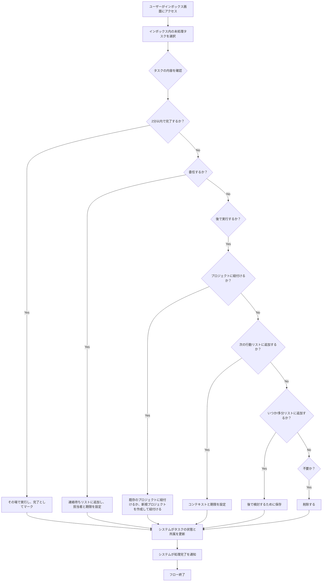

# ID: RDD-BFL-2025-002

# 業務フロー: タスク処理フロー

## 概要

GTDの「処理」フェーズをデジタルで支援するフローです。インボックスに収集されたタスクを、次の行動、プロジェクト、いつか/多分、連絡待ちなどに分類・処理します。

### アクター

- ACT-001 (ITプロジェクトメンバー)
- ACT-002 (ITプロジェクト管理者)

### トリガー

ユーザーがインボックスのタスクを処理しようとする時、または定期的な処理時間になった時。

### フロー

1. ユーザーがインボックス画面にアクセスする。
1. ユーザーがインボックス内の未処理タスクを選択する。
1. ユーザーはタスクの内容を確認し、以下のいずれかの処理を選択する。
   - **2分以内で完了する場合**: その場で実行し、完了としてマークする。
   - **委任する場合**: 連絡待ちリストに追加し、担当者と期限を設定する。
   - **後で実行する場合**:
     - プロジェクトに紐付ける場合: 既存のプロジェクトに紐付けるか、新規プロジェクトを作成して紐付ける。
     - 次の行動リストに追加する場合: コンテキストと期限を設定する。
     - いつか/多分リストに追加する場合: 後で検討するために保存する。
   - **不要な場合**: 削除する。
1. システムは選択された処理に基づいてタスクの状態と所属を更新する。
1. システムは処理完了をユーザーに通知する。

### 例外処理

- 必要な情報（例: 担当者、期限）が不足している場合、システムはエラーメッセージを表示し、入力を促す。
- システムエラーにより処理に失敗した場合、システムはエラーを通知し、ユーザーは再試行する。

### 関連する機能要件

- FR-002 (タスク処理機能)
- FR-006 (プロジェクト管理機能)
- FR-007 (コンテキスト管理機能)

### 関連するアクター

- ACT-001
- ACT-002

### 関連する画面

- SCR-002 (インボックス画面)
- SCR-007 (タスク詳細画面)
