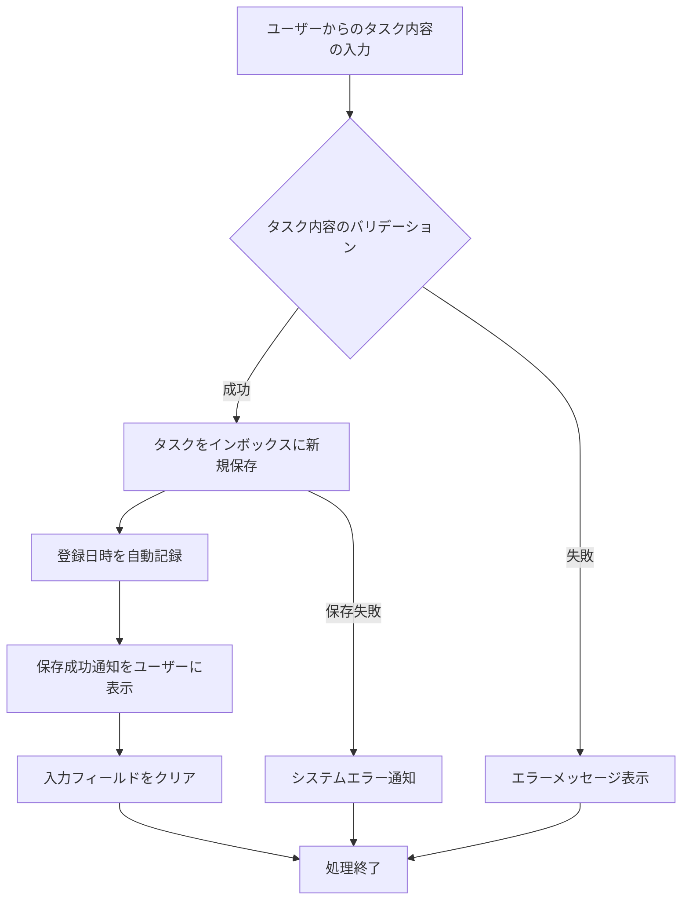

# ID: RDD-FRQ-2025-001

# 機能: タスク収集機能

## 概要

ユーザーが新しいタスクやアイデアをインボックスに迅速に記録するための機能です。GTDの「収集」フェーズをデジタルで支援し、ユーザーが思いついたことを漏らさず記録できるようにします。

### 入力

- タスク内容: 文字列, 最大255文字, 必須, インボックスに記録するタスクのタイトルまたは簡単な説明

### 処理内容

1. ユーザーからのタスク内容の入力を受け付ける。
1. 入力されたタスク内容のバリデーションを行う。
   - タスク内容が空でないこと。
   - タスク内容が255文字以内であること。
1. バリデーションが成功した場合、タスク内容をインボックスに新規タスクとして保存する。
   - 保存時、システムはタスクの登録日時を自動的に記録する。
1. タスクの保存が完了したら、ユーザーに保存成功の通知を行う。
1. 保存後、入力フィールドをクリアする。

### 出力

- 成功時: 「タスクをインボックスに保存しました。」というメッセージ
- エラー時: エラーメッセージ (後述)

### エラー処理

- タスク内容未入力: 「タスク内容を入力してください。」, 画面上の入力フィールドの下にメッセージを表示, タスクは保存されない。
- タスク内容文字数オーバー: 「タスク内容は255文字以内で入力してください。」, 画面上の入力フィールドの下にメッセージを表示, タスクは保存されない。
- システムエラー: 「タスクの保存中にエラーが発生しました。再度お試しください。」, 画面上部にメッセージを表示, タスクは保存されない。

### 関連するユースケース

- UC-001 (タスクをインボックスに記録する)

### 関連する業務フロー

- BF-001 (タスク収集フロー)

### 関連する非機能要件

- NFR-008 (ユーザビリティ): 迅速なタスク入力と保存が可能であること。
- NFR-003
  (信頼性): システムエラー発生時にもユーザーに適切なフィードバックを提供し、データの整合性を保つこと。

### 関連する画面

- SCR-002 (インボックス画面)
