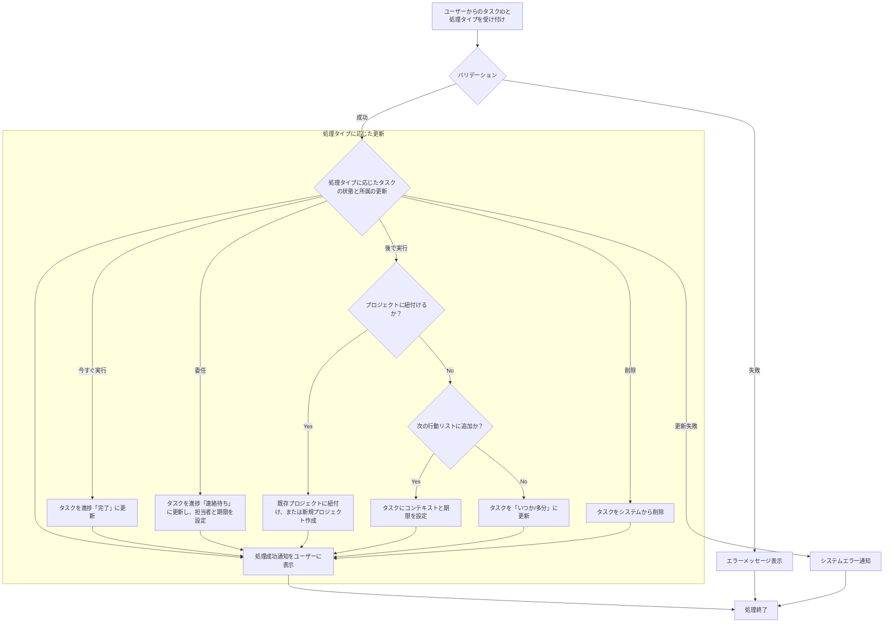

# ID: RDD-FRQ-2025-002

# 機能: タスク処理機能

## 概要

インボックスに収集されたタスクをGTDの原則に基づいて分類・処理するための機能です。ユーザーはタスクの内容に応じて、適切な状態（完了、委任、プロジェクト紐付け、次の行動、いつか/多分、削除）に更新できます。

### 入力

- 処理対象タスクID: 文字列, 必須, 処理するタスクの一意な識別子
- 処理タイプ: 文字列, 必須, 「今すぐ実行」「委任」「後で実行」「削除」のいずれか
- (処理タイプが「委任」の場合)
  - 担当者ID: 文字列, 必須, 委任先のユーザーID
  - 期限: 日付, 任意, 委任タスクの期限
- (処理タイプが「後で実行」でプロジェクト紐付けの場合)
  - プロジェクトID: 文字列, 必須, 紐付けるプロジェクトのID、または新規プロジェクト名
- (処理タイプが「後で実行」で次の行動リスト追加の場合)
  - コンテキストID: 文字列, 任意, 紐付けるコンテキストのID
  - 期限: 日付, 任意, 次の行動タスクの期限

### 処理内容

1. ユーザーからの処理対象タスクIDと処理タイプを受け付ける。
1. 処理タイプに応じて以下のバリデーションを行う。
   - 「委任」の場合: 担当者IDが指定されていること。
   - 「後で実行」でプロジェクト紐付けの場合: プロジェクトIDまたは新規プロジェクト名が指定されていること。
1. バリデーションが成功した場合、処理タイプに基づいてタスクの状態と所属を更新する。
   - **「今すぐ実行」**: タスクの進捗状況を「完了」に更新する。
   - **「委任」**: タスクの進捗状況を「連絡待ち」に更新し、担当者と期限を設定する。
   - **「後で実行」**:
     - プロジェクトに紐付ける場合: タスクを既存のプロジェクトに紐付けるか、新規プロジェクトを作成して紐付ける。
     - 次の行動リストに追加する場合: タスクにコンテキストと期限を設定する。
     - いつか/多分リストに追加する場合: タスクの所属を「いつか/多分」に更新する。
   - **「削除」**: タスクをシステムから削除する。
1. タスクの更新が完了したら、ユーザーに処理成功の通知を行う。

タスク処理機能の処理フローを示します。

### 出力

- 成功時: 「タスクを処理しました。」というメッセージ
- エラー時: エラーメッセージ (後述)

### エラー処理

- 必須項目不足: 「[項目名]を入力してください。」, 画面上の該当入力フィールドの下にメッセージを表示, タスクは処理されない。
- 無効なタスクID: 「指定されたタスクが見つかりません。」, 画面上部にメッセージを表示, タスクは処理されない。
- システムエラー: 「タスクの処理中にエラーが発生しました。再度お試しください。」, 画面上部にメッセージを表示, タスクは処理されない。

### 関連するユースケース

- UC-002 (インボックスのタスクを処理する)

### 関連する業務フロー

- BF-002 (タスク処理フロー)

### 関連する非機能要件

- NFR-008 (ユーザビリティ): 直感的な操作でタスクを分類・処理できること。
- NFR-003
  (信頼性): 処理中のエラー発生時にもユーザーに適切なフィードバックを提供し、データの整合性を保つこと。

### 関連する画面

- SCR-002 (インボックス画面)
- SCR-007 (タスク詳細画面)
