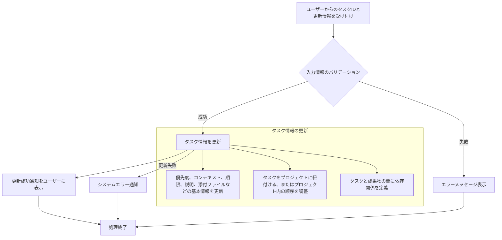

# ID: RDD-FRQ-2025-003

# 機能: タスク整理機能

## 概要

GTDの整理フェーズをデジタルで支援する機能です。ユーザーはタスクの優先順位、コンテキスト、期限、メモ、添付ファイル、プロジェクト内の順序、成果物との依存関係などを調整し、タスク情報を適切に管理できます。

### 入力

- 整理対象タスクID: 文字列, 必須, 整理するタスクの一意な識別子
- (オプション) 優先度: 文字列, オプション, 「高」「中」「低」のいずれか
- (オプション) コンテキストID: 文字列, オプション, 紐付けるコンテキストのID
- (オプション) 期限: 日付, オプション, タスクの期限
- (オプション) 説明: テキストエリア, オプション, タスクの詳細な説明
- (オプション) 添付ファイル: ファイルデータ, オプション, タスクに関連するファイル
- (オプション) プロジェクトID: 文字列, オプション, 紐付けるプロジェクトのID
- (オプション) プロジェクト内順序: 数値, オプション, プロジェクト内のタスクの表示順序
- (オプション) 成果物ID: 文字列, オプション, 紐付ける成果物のID
- (オプション) 依存関係タイプ: 文字列, オプション, 成果物とタスク間の依存関係のタイプ

### 処理内容

1. ユーザーからの整理対象タスクIDと更新情報を受け付ける。
1. 入力された更新情報のバリデーションを行う。
   - 各項目のデータ型、制約（例: 文字数制限、日付形式）に従っていること。
   - 存在しないID（コンテキストID、プロジェクトID、成果物ID）が指定されていないこと。
1. バリデーションが成功した場合、指定されたタスクの情報を更新する。
   - 優先度、コンテキスト、期限、説明、添付ファイルなどの基本情報を更新する。
   - タスクをプロジェクトに紐付ける、またはプロジェクト内の順序を調整する。
   - タスクと成果物の間に依存関係を定義する。
1. タスク情報の更新が完了したら、ユーザーに更新成功の通知を行う。

タスク整理機能の処理フローを示します。

### 出力

- 成功時: 「タスク情報を更新しました。」というメッセージ
- エラー時: エラーメッセージ (後述)

### エラー処理

- 無効な入力値: 「[項目名]の入力値が不正です。」, 画面上の該当入力フィールドの下にメッセージを表示, タスクは更新されない。
- 無効なタスクID: 「指定されたタスクが見つかりません。」, 画面上部にメッセージを表示, タスクは更新されない。
- システムエラー: 「タスク情報の更新中にエラーが発生しました。再度お試しください。」, 画面上部にメッセージを表示, タスクは更新されない。

### 関連するユースケース

- UC-003 (タスクをプロジェクトに紐付ける)
- UC-018 (タスク詳細を編集する)

### 関連する業務フロー

- BF-003 (タスク整理フロー)

### 関連する非機能要件

- NFR-008 (ユーザビリティ): 複数のタスク属性を効率的に整理できること。
- NFR-003
  (信頼性): データ更新時の整合性を保ち、エラー発生時に適切なフィードバックを提供すること。

### 関連する画面

- SCR-003 (プロジェクト一覧画面)
- SCR-004 (次の行動リスト画面)
- SCR-007 (タスク詳細画面)
- SCR-012 (成果物管理画面)
