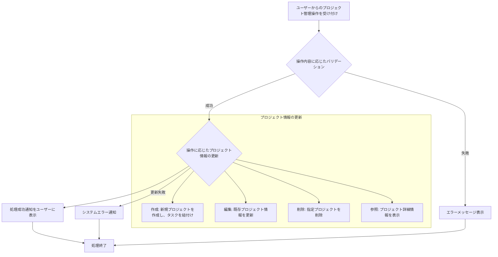

# ID: RDD-FRQ-2025-006

# 機能: プロジェクト管理機能

## 概要

ユーザーがプロジェクトの作成、編集、削除、およびプロジェクトに紐づくタスクの管理、進捗状況の確認を行える機能です。GTDの「プロジェクト」の概念をデジタルで支援し、複雑な目標達成を支援します。

### 入力

- プロジェクトID: 文字列, 必須, 処理対象のプロジェクトの一意な識別子
- プロジェクト名: 文字列, 最大255文字, 必須, プロジェクトの名称
- 概要: テキストエリア, 任意, プロジェクトの詳細な説明
- ステータス: 文字列, 必須, 「進行中」「完了」「保留」など
- 期日: 日付, 任意, プロジェクトの完了期限
- 紐付けるタスクID: 文字列配列, 任意, 新規作成時に紐付けるタスクのID

### 処理内容

1. ユーザーからのプロジェクト管理操作（作成、編集、削除、参照）を受け付ける。
1. 操作内容に応じて以下のバリデーションを行う。
   - 作成・編集時: プロジェクト名が空でないこと、255文字以内であること。
   - 参照・編集・削除時: 指定されたプロジェクトIDが存在すること。
1. バリデーションが成功した場合、操作に基づいてプロジェクト情報と関連するタスク情報を更新する。
   - **作成**: 新規プロジェクトを作成し、必要に応じてタスクを紐付ける。
   - **編集**: 既存プロジェクトの名称、概要、ステータス、期日などを更新する。
   - **削除**: 指定されたプロジェクトを削除する。関連するタスクのプロジェクト紐付けを解除するか、タスクも削除するかは別途定義する。
   - **参照**: プロジェクトの詳細情報（進捗率、完了タスク数、未完了タスク数、期限、担当者、関連する成果物など）を表示する。
1. プロジェクト情報の更新が完了したら、ユーザーに処理成功の通知を行う。

### 出力

- 成功時: 「プロジェクトを[作成/更新/削除]しました。」というメッセージ
- エラー時: エラーメッセージ (後述)

### エラー処理

- プロジェクト名未入力: 「プロジェクト名を入力してください。」, 画面上の該当入力フィールドの下にメッセージを表示, プロジェクトは作成/更新されない。
- 無効なプロジェクトID: 「指定されたプロジェクトが見つかりません。」, 画面上部にメッセージを表示, プロジェクトは処理されない。
- システムエラー: 「プロジェクトの[作成/更新/削除]中にエラーが発生しました。再度お試しください。」, 画面上部にメッセージを表示, プロジェクトは処理されない。

### 関連するユースケース

- UC-003 (タスクをプロジェクトに紐付ける)
- UC-008 (プロジェクトの状況を確認する)

### 関連する業務フロー

- BF-003 (タスク整理フロー)
- BF-004 (週次レビューフロー)

### 関連する非機能要件

- NFR-008 (ユーザビリティ): プロジェクトの作成・管理が容易であること。
- NFR-003
  (信頼性): データ更新時の整合性を保ち、エラー発生時に適切なフィードバックを提供すること。

### 関連する画面

- SCR-003 (プロジェクト一覧画面)
- SCR-009 (プロジェクト詳細画面)
- SCR-018 (新規プロジェクト作成画面)
