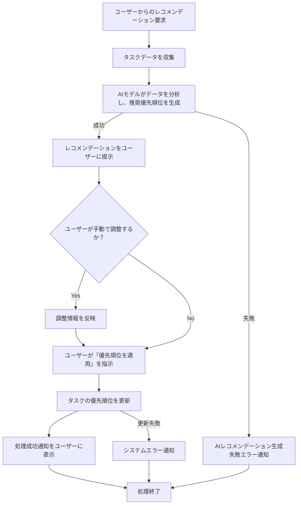

# ID: RDD-FRQ-2025-008

# 機能: AIによるタスク優先順位付け機能

## 概要

AIがタスクの期限、依存関係、重要度、ユーザーの過去の行動パターンなどを分析し、タスクの優先順位付けレコメンデーションを生成する機能です。ユーザーは提示されたレコメンデーションを確認し、必要に応じて手動で調整した後、タスクの優先順位を更新できます。

### 入力

- 優先順位付け対象タスクID: 文字列配列, 必須, 優先順位付けを行うタスクの一意な識別子
- (オプション) ユーザー調整後の優先順位: オブジェクト配列, 任意, ユーザーが手動で調整したタスクIDと優先順位のペア

### 処理内容

1. ユーザーからのAIによる優先順位付けレコメンデーション要求を受け付ける。
1. システムは指定されたタスクのデータ（期限、依存関係、重要度、過去のユーザー行動パターンなど）を収集する。
1. AIモデルが収集したデータを分析し、各タスクの推奨優先順位を生成する。
1. 生成されたレコメンデーションをユーザーに提示する。
1. ユーザーが手動で優先順位を調整した場合、その情報を反映する。
1. ユーザーが「優先順位を適用」を指示した場合、タスクの優先順位を更新する。
1. 優先順位の更新が完了したら、ユーザーに処理成功の通知を行う。

AIによるタスク優先順位付け機能の処理フローを示します。

### 出力

- 成功時: 「タスクの優先順位を更新しました。」というメッセージ
- エラー時: エラーメッセージ (後述)

### エラー処理

- AIレコメンデーション生成失敗: 「AIによる優先順位付けレコメンデーションの生成に失敗しました。手動で設定してください。」, 画面上部にメッセージを表示, ユーザーは手動で優先順位を設定できる。
- 無効なタスクID: 「指定されたタスクが見つかりません。」, 画面上部にメッセージを表示, 処理は行われない。
- システムエラー: 「タスクの優先順位更新中にエラーが発生しました。再度お試しください。」, 画面上部にメッセージを表示, 処理は行われない。

### 関連するユースケース

- UC-009 (タスクの優先順位をAIのレコメンデーションに基づいて決定する)

### 関連する業務フロー

- BF-003 (タスク整理フロー)

### 関連する非機能要件

- NFR-004 (パフォーマンス): AIレコメンデーションの生成が迅速であること。
- NFR-003 (信頼性):
  AIモデルの安定稼働と、エラー発生時の適切なフィードバックを提供すること。
- NFR-008 (ユーザビリティ): レコメンデーションの提示と手動調整が容易であること。

### 関連する画面

- SCR-003 (プロジェクト一覧画面)
- SCR-009 (プロジェクト詳細画面)
- SCR-008 (検索画面)
