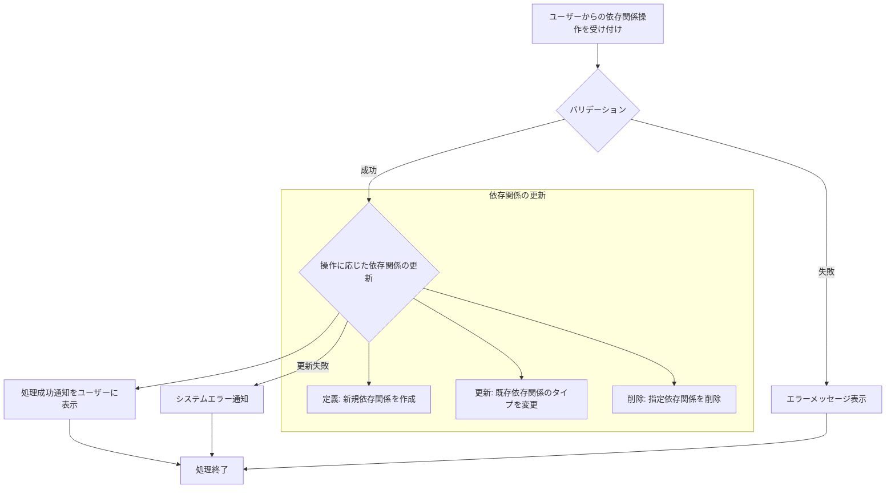

# ID: RDD-FRQ-2025-010

# 機能: タスク依存関係管理機能

## 概要

タスク間の依存関係（先行タスク、後続タスク）を定義、管理、および参照できる機能です。これにより、タスクの実行順序を明確にし、クリティカルパスを特定しやすくします。

### 入力

- 依存元タスクID: 文字列, 必須, 依存関係の起点となるタスクの一意な識別子
- 依存先タスクID: 文字列, 必須, 依存関係の終点となるタスクの一意な識別子
- 依存関係タイプ: 文字列, 必須, 「終了-開始 (FS)」「開始-開始 (SS)」「終了-終了 (FF)」「開始-終了 (SF)」のいずれか

### 処理内容

1. ユーザーからのタスク依存関係の定義、更新、削除要求を受け付ける。
1. 入力されたタスクIDと依存関係タイプのバリデーションを行う。
   - 指定されたタスクIDが存在すること。
   - 循環参照が発生しないこと。
1. バリデーションが成功した場合、操作に基づいてタスク間の依存関係を更新する。
   - **定義**: 指定されたタスク間に依存関係を新規作成する。
   - **更新**: 既存の依存関係のタイプを変更する。
   - **削除**: 指定された依存関係を削除する。
1. 依存関係の更新が完了したら、ユーザーに処理成功の通知を行う。

### 出力

- 成功時: 「タスク依存関係を[定義/更新/削除]しました。」というメッセージ
- エラー時: エラーメッセージ (後述)

### エラー処理

- 無効なタスクID: 「指定されたタスクが見つかりません。」, 画面上部にメッセージを表示, 処理は行われない。
- 循環参照の発生: 「循環参照が発生するため、この依存関係は定義できません。」, 画面上部にメッセージを表示, 処理は行われない。
- システムエラー: 「タスク依存関係の[定義/更新/削除]中にエラーが発生しました。再度お試しください。」, 画面上部にメッセージを表示, 処理は行われない。

### 関連するユースケース

- UC-010 (成果物とタスクの依存関係を可視化する)

### 関連する業務フロー

- BF-003 (タスク整理フロー)

### 関連する非機能要件

- NFR-003 (信頼性): 依存関係の整合性を保ち、循環参照を防止すること。
- NFR-008 (ユーザビリティ): 依存関係の定義・管理が容易であること。

### 関連する画面

- SCR-007 (タスク詳細画面)
- SCR-009 (プロジェクト詳細画面)
