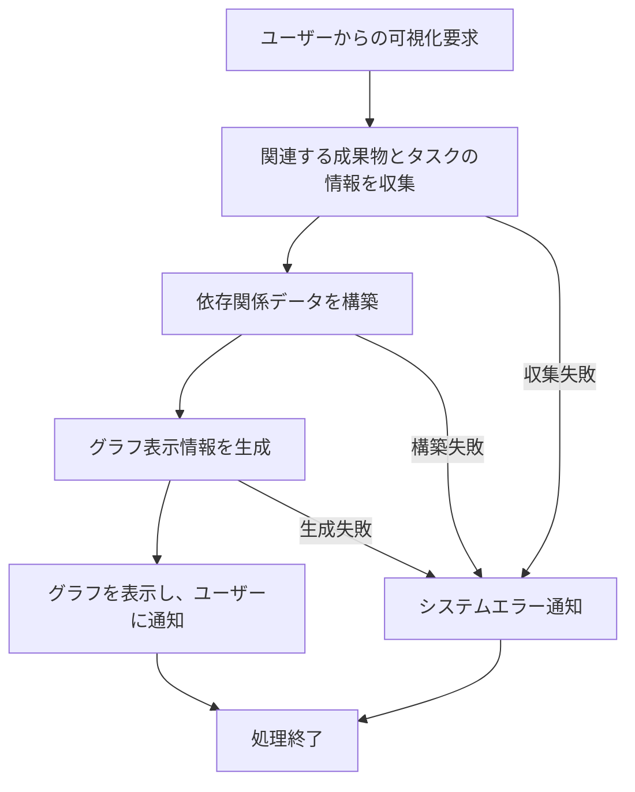

# ID: RDD-FRQ-2025-011

# 機能: 成果物依存関係可視化機能

## 概要

プロジェクト内の成果物と、それに関連するタスク間の複雑な依存関係をグラフ形式で視覚的に表示する機能です。これにより、プロジェクトの構造、ボトルネック、クリティカルパスを把握しやすくなります。

### 入力

- 可視化対象プロジェクトID: 文字列, 必須, 依存関係を可視化するプロジェクトの一意な識別子
- (オプション) 可視化対象成果物ID: 文字列, 任意, 特定の成果物とその関連タスクの依存関係を可視化する場合

### 処理内容

1. ユーザーからの成果物依存関係可視化要求を受け付ける。
1. 指定されたプロジェクト（または成果物）に関連する成果物とタスクの情報を収集する。
1. 収集した情報に基づいて、成果物とタスク間の依存関係データを構築する。
1. 構築した依存関係データをグラフ形式で表示するための情報を生成する。
1. グラフ表示が完了したら、ユーザーに通知を行う。

成果物依存関係可視化機能の処理フローを示します。

### 出力

- 成功時: 成果物とタスクの依存関係を示すグラフデータ
- エラー時: エラーメッセージ (後述)

### エラー処理

- 無効なプロジェクトID/成果物ID: 「指定されたプロジェクトまたは成果物が見つかりません。」, 画面上部にメッセージを表示, グラフは表示されない。
- 依存関係データ不足: 「依存関係データが不足しているため、完全なグラフを表示できません。」, 画面上部に警告メッセージを表示, 部分的なグラフが表示される。
- システムエラー: 「依存関係の可視化中にエラーが発生しました。再度お試しください。」, 画面上部にメッセージを表示, グラフは表示されない。

### 関連するユースケース

- UC-010 (成果物とタスクの依存関係を可視化する)

### 関連する業務フロー

- BF-003 (タスク整理フロー)

### 関連する非機能要件

- NFR-008
  (ユーザビリティ): 複雑な依存関係を直感的に理解できる視覚的な表現を提供すること。
- NFR-004
  (パフォーマンス): 大量の成果物やタスクが存在する場合でも、迅速にグラフを生成・表示できること。

### 関連する画面

- SCR-012 (成果物管理画面)
- SCR-009 (プロジェクト詳細画面)
- SCR-020 (成果物詳細画面)
